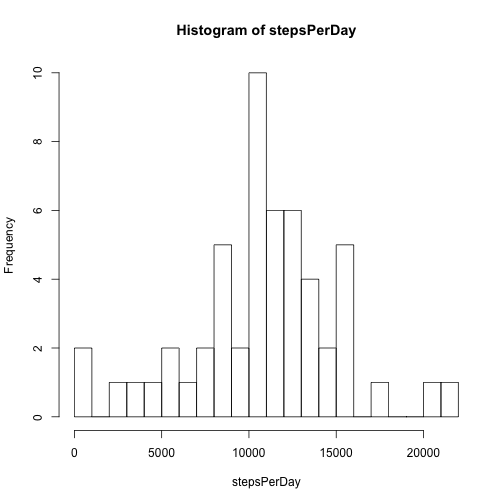
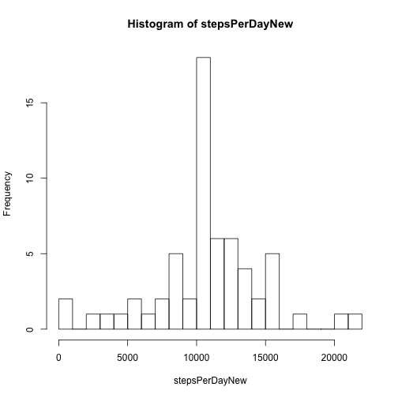
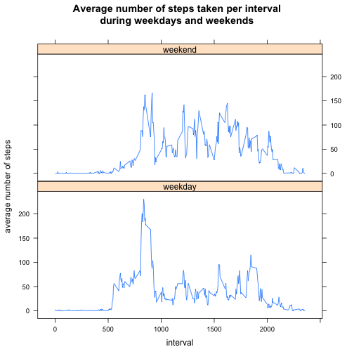

This is an R Markdown document done for an [assignment](https://github.com/KobaKhit/RepData_PeerAssessment1/blob/master/README.md) from the Reproducible Research Coursera class offered by John Hopkins University.

### Loading the data
First, I load the data from the github repository [RepData_PeerAssessment1](https://github.com/KobaKhit/RepData_PeerAssessment1) that I forked from [rdpeng](https://github.com/rdpeng), the class instructor.


```r
url <- "https://raw2.github.com/KobaKhit/RepData_PeerAssessment1/master/activity.zip"
download.file(url, "data.zip", method = "curl")
unzip("data.zip")
data <- read.csv("activity.csv", sep = ",", quote = "\"'", header = TRUE)
```


### Analysis
Below are the first six rows and the summary of the data set I am working with.

```r
head(data)
```

```
##   steps       date interval
## 1    NA 2012-10-01        0
## 2    NA 2012-10-01        5
## 3    NA 2012-10-01       10
## 4    NA 2012-10-01       15
## 5    NA 2012-10-01       20
## 6    NA 2012-10-01       25
```

```r
summary(data)
```

```
##      steps               date          interval   
##  Min.   :  0.0   2012-10-01:  288   Min.   :   0  
##  1st Qu.:  0.0   2012-10-02:  288   1st Qu.: 589  
##  Median :  0.0   2012-10-03:  288   Median :1178  
##  Mean   : 37.4   2012-10-04:  288   Mean   :1178  
##  3rd Qu.: 12.0   2012-10-05:  288   3rd Qu.:1766  
##  Max.   :806.0   2012-10-06:  288   Max.   :2355  
##  NA's   :2304    (Other)   :15840
```


#### What is mean total number of steps taken per day?
I start with calculating the total steps per day.

```r
stepsPerDay <- tapply(na.omit(data)$steps, list(na.omit(data)$date), sum)
```

Below is the histogram of total steps per day. It looks like the mean and the median are a little above 10 000.

```r
hist(stepsPerDay, breaks = 20)
```

 

To calculate the mean and median of total steps per day I have to ignore the NA values.

```r
mean(stepsPerDay, na.rm = TRUE)
median(stepsPerDay, na.rm = TRUE)
```

```
## [1] 10766
```

```
## [1] 10765
```


#### What is the average daily activity pattern?
To answer the question I average steps taken per interval over all days and then plot the resulting data.

```r
stepsPerInt <- tapply(na.omit(data)$steps, list(na.omit(data)$interval), mean)
plot(names(stepsPerInt), stepsPerInt, type = "l", xlab = "Interval", ylab = "Steps per interval")
```

 

Let's see which 5-minute interval, on average across all the days in the dataset, contains the maximum number of steps.

```r
names(stepsPerInt[stepsPerInt == max(stepsPerInt)])
```

```
## [1] "835"
```

Thus, on average the maximum number of steps is taken during the 8:30-8:35 am 5-minute interval.

#### Imputing missing values
There are a total of 2304 missing values which we can see from the data set summary above. Just to make sure  I calculate how many missing values there are again.

```r
# Calculate missing values
sum((!complete.cases(data)))
```

```
## [1] 2304
```

I am going to fill the missing values with the average steps taken per interval for which the value is missing.

```r
filledData <- data  #new data set where I will remove missing values
intervals <- as.numeric(levels(factor(filledData$interval)))  #vector of intervals
# Replaces the missing values with the average steps taken per that interval
for (i in intervals) {
    filledData[is.na(filledData$steps) & filledData$interval == i, 1] <- stepsPerInt[names(stepsPerInt) == 
        i][[1]]
}
summary(filledData)
nrow(filledData)
```

```
##      steps               date          interval   
##  Min.   :  0.0   2012-10-01:  288   Min.   :   0  
##  1st Qu.:  0.0   2012-10-02:  288   1st Qu.: 589  
##  Median :  0.0   2012-10-03:  288   Median :1178  
##  Mean   : 37.4   2012-10-04:  288   Mean   :1178  
##  3rd Qu.: 27.0   2012-10-05:  288   3rd Qu.:1766  
##  Max.   :806.0   2012-10-06:  288   Max.   :2355  
##                  (Other)   :15840
```

```
## [1] 17568
```

The resulting data frame `filledData` contains no missing values and has the same number of rows as the original data set.  
Now, I am going to examine whether filling the missing values has any impact on the summary statistics. Below is the histogram of total steps taken per day using `fiiledData` data set.

```r
stepsPerDayNew <- tapply(filledData$steps, list(filledData$date), sum)
hist(stepsPerDayNew, breaks = 20)
```

 

Looks like the shape of the distribution did not change at all, but the frequency of total steps per day increased equally for all days. Let's calculate the mean and the median of steps per day with filled data.

```r
mean(stepsPerDayNew, na.rm = TRUE)
median(stepsPerDayNew, na.rm = TRUE)
```

```
## [1] 10766
```

```
## [1] 10766
```

Mean remained the same while the median increased by a negligible 1 step per day. Therefore, filling the missing values with the average of steps per interval did not had any effect on the summary statistics.

#### Are there differences in activity patterns between weekdays and weekends?
To identify observations that were taken during the weekends I create a new factor column with levels weekend and weekday. 

```r
filledData <- data.frame(filledData, weekend = 0)
weekends <- weekdays(as.Date(filledData$date)) %in% c("Sunday", "Saturday")
filledData[weekends, ]$weekend <- 1
filledData$weekend <- factor(filledData$weekend, labels = c("weekday", "weekend"))
summary(filledData)
```

```
##      steps               date          interval       weekend     
##  Min.   :  0.0   2012-10-01:  288   Min.   :   0   weekday:12960  
##  1st Qu.:  0.0   2012-10-02:  288   1st Qu.: 589   weekend: 4608  
##  Median :  0.0   2012-10-03:  288   Median :1178                  
##  Mean   : 37.4   2012-10-04:  288   Mean   :1178                  
##  3rd Qu.: 27.0   2012-10-05:  288   3rd Qu.:1766                  
##  Max.   :806.0   2012-10-06:  288   Max.   :2355                  
##                  (Other)   :15840
```

To see differences in activity patterns I make a panel plot containing a time series plot (i.e. type = "l") of the 5-minute interval (x-axis) and the average number of steps taken, averaged across all weekday days or weekend days (y-axis).

```r
require(reshape)
require(lattice)
# Calculate average steps taken per interval by weekdays and weekends
stepsPerIntWeek <- tapply(filledData$steps, list(filledData$interval, filledData$weekend), 
    mean)
# Panel plot the weekend weekday activity
stepsPerIntWeek <- melt(stepsPerIntWeek, varnames = c("interval", "weekday"))
xyplot(value ~ interval | factor(weekday), stepsPerIntWeek, type = "l", layout = c(1, 
    2), main = "Average number of steps taken per interval\nduring weekdays and weekends", 
    ylab = "average number of steps")
```

 

Apparently, people take fewer steps in the morning during the weekends, but more steps in the afternoon and in the evening.


