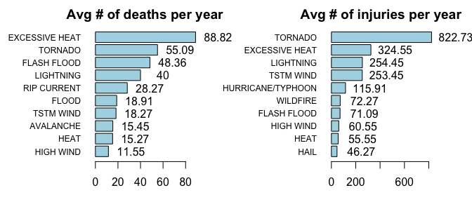
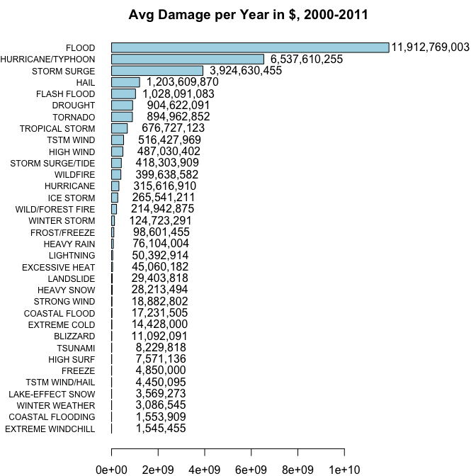

# Impact of Weather Events on Population Health and Economy in the US
[Koba Khitalishvili](http://www.kobakhit.com/about.html)  
May 17, 2015  
## Synopsis
Using the U.S. National Oceanic and Atmospheric Administration's (NOAA) storm database I explore which weather events are most harmful to population health and economy in the US. Regarding the population health, the most frequent events are usually the most harmful ones such as tornadoes, floods, thunderstorm winds, hurricanes and lightnings. An exception is the excessive heat event which is the 20th most frequent, but the deadliest with 88 deaths per year on average during the 2000-2011 period. Regarding the economy, the most frequent events are not necessarily the most harmful. The first four most harmful economically events are hydro-meteorological events such as floods, hail, storms, hurricanes. During 2000-2011 damage done to property was 14 times greater than the damage done to crops. Below is a detailed analysis. 

## Data processing
I start with downloading the data, unzipping it, and reading it in.


```r
if(!file.exists("data.csv")) {
  
  if(!file.exists("data.bz2")){
    #Download
    url<-"https://d396qusza40orc.cloudfront.net/repdata%2Fdata%2FStormData.csv.bz2"
    download.file(url,"data.bz2",method="curl")
    }
  
  # Unzip
  zz <- readLines(gzfile("data.bz2"))
  zz <- iconv(zz, "latin1", "ASCII", sub="")
  writeLines(zz, "data.csv")
  rm(zz)
  }

## Read data in
data<-read.csv("data.csv", sep=",", quote = "\"", header=TRUE)
```

The data set has 902297 observations and 37 variables (columns). Below are the first six rows of the first 5 columns of the data set I am working with as well as the names of all columns.


```r
head(data[,1:5])
```

```
##   STATE__           BGN_DATE BGN_TIME TIME_ZONE COUNTY
## 1       1  4/18/1950 0:00:00     0130       CST     97
## 2       1  4/18/1950 0:00:00     0145       CST      3
## 3       1  2/20/1951 0:00:00     1600       CST     57
## 4       1   6/8/1951 0:00:00     0900       CST     89
## 5       1 11/15/1951 0:00:00     1500       CST     43
## 6       1 11/15/1951 0:00:00     2000       CST     77
```

```r
names(data)
```

```
##  [1] "STATE__"    "BGN_DATE"   "BGN_TIME"   "TIME_ZONE"  "COUNTY"    
##  [6] "COUNTYNAME" "STATE"      "EVTYPE"     "BGN_RANGE"  "BGN_AZI"   
## [11] "BGN_LOCATI" "END_DATE"   "END_TIME"   "COUNTY_END" "COUNTYENDN"
## [16] "END_RANGE"  "END_AZI"    "END_LOCATI" "LENGTH"     "WIDTH"     
## [21] "F"          "MAG"        "FATALITIES" "INJURIES"   "PROPDMG"   
## [26] "PROPDMGEXP" "CROPDMG"    "CROPDMGEXP" "WFO"        "STATEOFFIC"
## [31] "ZONENAMES"  "LATITUDE"   "LONGITUDE"  "LATITUDE_E" "LONGITUDE_"
## [36] "REMARKS"    "REFNUM"
```

For my analysis I needed to extract the year information from the `BGN_DATE` column.


```r
# Add a new year column to the dataset
data<-data.frame(Year=format(as.Date(data$BGN_DATE,format="%m/%d/%Y"),"%Y"),data)

head(data[,1:5])
```

```
##   Year STATE__           BGN_DATE BGN_TIME TIME_ZONE
## 1 1950       1  4/18/1950 0:00:00     0130       CST
## 2 1950       1  4/18/1950 0:00:00     0145       CST
## 3 1951       1  2/20/1951 0:00:00     1600       CST
## 4 1951       1   6/8/1951 0:00:00     0900       CST
## 5 1951       1 11/15/1951 0:00:00     1500       CST
## 6 1951       1 11/15/1951 0:00:00     2000       CST
```

After looking at the most frequent events I noticed duplicates THUNDERSTORM WIND, THUNDERSTORM WINDS, TSTM WIND, MARINE TSTM WIND. These are obviously the same thing, so I replaced them with TSTM WIND.


```r
# Replace duplicate THUDNDERSTORM WIND, etc. with TTSM WIND
data$EVTYPE = sapply(data$EVTYPE,function(x) gsub("THUNDERSTORM WINDS|MARINE TSTM WIND|THUNDERSTORM WIND","TSTM WIND",x))
```

The data set has scaling factors for two variables which are needed for analysis. Namely, property damage `PROPDMG` and crop damage `CROPDMG`. They have corresponding scaling columns `PROPDMGEXP` and `CROPDMGEXP`. The scaling columns contain information about how to scale the values in the columns `PROPDMG` and `CROPDMG`. For example, a value in the `PROPDMG` column that has a scaling factor "k" in the `PROPDMGEXP` column should be multiplied by $10^3$. I use the following scheme for the scaling factors. 


```
##    Scaling exponent Occurences Scaling factor
## 1                       465934           10^0
## 2                 -          1           10^0
## 3                 ?          8           10^0
## 4                 +          5           10^0
## 5                 0        216           10^0
## 6                 1         25           10^1
## 7                 2         13           10^2
## 8                 3          4           10^3
## 9                 4          4           10^4
## 10                5         28           10^5
## 11                6          4           10^6
## 12                7          5           10^7
## 13                8          1           10^8
## 14                B         40           10^9
## 15                h          1           10^2
## 16                H          6           10^2
## 17                K     424665           10^3
## 18                m          7           10^6
## 19                M      11330           10^6
```

Some values in the `PROPDMG` and `CROPDMG` did not have scaling factors specified or had symbols like `+,-,?`. I decided not to scale the values that had those symbols. The rest is intuitive, namely, "b" and "B" stand for billion and etc. In the code below I create two new columns, `PROPDMGSCALE` and `CROPDMGSCALE`, with property damage and crop damage scaled. 


```r
scale.func <- function(x) {
  # Function that replaces a factor with a numeric
   if(x %in% 0:8) {x<-as.numeric(x)}
   else if(x %in% c("b","B")) {x<-10^9}    # billion
   else if(x %in% c("m","M")) {x<-10^6}    # million/mega
   else if(x %in% c("k","K")) {x<-10^3}   # kilo   
   else if(x %in% c("h","H")) {x<-10^2}   # hundred
   else x<-10^0
   }

# Apply scale.func with sapply
data$PROPDMGSCALE <- sapply(data$PROPDMGEXP,scale.func) * data$PROPDMG
data$CROPDMGSCALE <- sapply(data$CROPDMGEXP,scale.func) * data$CROPDMG
```

I also created a plotting function for horizontal barplots, so I dont have to repeat code:


```r
plot.k<- function(df,title){
  # A function that plots a barplot with presets. Arguments are a matrix-like dataset and a plot title
  barplot(main=title,sort(df,decreasing=FALSE),las=1,horiz=TRUE,cex.names=0.75,col=c("lightblue"))
}
```

## Results

According to the project instructions, with time the recording of the weather events improved. In the multiline graph I show the number of occurences of 10 most frequent weather events by year during 1950-2011. The number of occurences of the events increased drastically due to improvements in the process of recording those events.


```r
# Get table of counts of events by year
dat = as.data.frame(table(data[,c("Year","EVTYPE")]))

# 10 most frequent events
a = sort(apply(table(data[,c("Year","EVTYPE")]),2,sum),decreasing=TRUE)[1:10]
dat = dat[dat$EVTYPE %in% names(a),]

# Modify year column to be in the unambiguos date format %Y-%m-%d
dat$Year = paste0(dat$Year,"-01-01")
dat$Year = as.numeric(as.POSIXct(dat$Year))

# Create Rickshaw graph
# require(devtools)
# install_github('rCharts', 'ramnathv')
require(rCharts)

r2 <- Rickshaw$new()
r2$layer(
  Freq ~ Year,
  data = dat,
  type = "line",
  groups = "EVTYPE",
  height = 340,
  width = 700
)
# turn on built in features
r2$set(
  hoverDetail = TRUE,
  xAxis = TRUE,
  yAxis = TRUE,
  shelving = FALSE,
  legend = TRUE,
  slider = TRUE,
  highlight = TRUE
)
r2$show('iframesrc', cdn = TRUE)
```

<iframe srcdoc=' &lt;!doctype HTML&gt;
&lt;html&gt;
  &lt;head&gt;
    &lt;link rel=&#039;stylesheet&#039; href=&#039;//cdn.strategiqcommerce.com/ajax/libs/rickshaw/1.2.1/rickshaw.min.css&#039;&gt;
    &lt;link rel=&#039;stylesheet&#039; href=&#039;//ajax.googleapis.com/ajax/libs/jqueryui/1.8/themes/base/jquery-ui.css&#039;&gt;
    
    &lt;script src=&#039;//d3js.org/d3.v2.min.js&#039; type=&#039;text/javascript&#039;&gt;&lt;/script&gt;
    &lt;script src=&#039;//cdn.strategiqcommerce.com/ajax/libs/rickshaw/1.2.1/rickshaw.min.js&#039; type=&#039;text/javascript&#039;&gt;&lt;/script&gt;
    &lt;script src=&#039;//ajax.googleapis.com/ajax/libs/jquery/1.6.2/jquery.min.js&#039; type=&#039;text/javascript&#039;&gt;&lt;/script&gt;
    &lt;script src=&#039;//ajax.googleapis.com/ajax/libs/jqueryui/1.8.15/jquery-ui.min.js&#039; type=&#039;text/javascript&#039;&gt;&lt;/script&gt;
    
    &lt;style&gt;
    .chart_container {
        position: relative;
        display: inline-block;
        font-family: Arial, Helvetica, sans-serif;
    }
    .rChart {
        display: inline-block;
        margin-left: 40px;
    }
   .yAxis {
        position: absolute;
        top: 0;
        bottom: 0;
        width: 40px;
   }
   .legend {
        position: absolute;
        top: 0;
        right: -160px;
        vertical-align: top;
    }
    .slider {
      margin-left: 40px;
      margin-top: 12px;
    }
    &lt;/style&gt;
    
  &lt;/head&gt;
  &lt;body&gt;
    &lt;div class=&#039;chart_container&#039;&gt;
      &lt;div id=&#039;yAxischart33a438f05be0&#039; class=&#039;yAxis&#039;&gt;&lt;/div&gt;
      &lt;div id=&#039;chart33a438f05be0&#039; class=&#039;rChart rickshaw&#039;&gt;&lt;/div&gt;
      &lt;div id=&#039;xAxischart33a438f05be0&#039; class=&#039;xAxis&#039;&gt;&lt;/div&gt;
      &lt;div id=&#039;legendchart33a438f05be0&#039; class=&#039;legend&#039;&gt;&lt;/div&gt;
      &lt;div id=&#039;sliderchart33a438f05be0&#039; class=&#039;slider&#039;&gt;&lt;/div&gt;
    &lt;/div&gt;
    
    &lt;script type=&#039;text/javascript&#039;&gt; 
  var palette = new Rickshaw.Color.Palette({ scheme: &quot;colorwheel&quot; });
  var chartParams = {
 &quot;dom&quot;: &quot;chart33a438f05be0&quot;,
&quot;width&quot;:            700,
&quot;height&quot;:            340,
&quot;scheme&quot;: &quot;colorwheel&quot;,
&quot;groups&quot;: &quot;EVTYPE&quot;,
&quot;series&quot;: [
 {
 &quot;data&quot;: [
 {
 &quot;x&quot;:     -631155600,
&quot;y&quot;: 0 
},
{
 &quot;x&quot;:     -599619600,
&quot;y&quot;: 0 
},
{
 &quot;x&quot;:     -568083600,
&quot;y&quot;: 0 
},
{
 &quot;x&quot;:     -536461200,
&quot;y&quot;: 0 
},
{
 &quot;x&quot;:     -504925200,
&quot;y&quot;: 0 
},
{
 &quot;x&quot;:     -473389200,
&quot;y&quot;: 0 
},
{
 &quot;x&quot;:     -441853200,
&quot;y&quot;: 0 
},
{
 &quot;x&quot;:     -410230800,
&quot;y&quot;: 0 
},
{
 &quot;x&quot;:     -378694800,
&quot;y&quot;: 0 
},
{
 &quot;x&quot;:     -347158800,
&quot;y&quot;: 0 
},
{
 &quot;x&quot;:     -315622800,
&quot;y&quot;: 0 
},
{
 &quot;x&quot;:     -284000400,
&quot;y&quot;: 0 
},
{
 &quot;x&quot;:     -252464400,
&quot;y&quot;: 0 
},
{
 &quot;x&quot;:     -220928400,
&quot;y&quot;: 0 
},
{
 &quot;x&quot;:     -189392400,
&quot;y&quot;: 0 
},
{
 &quot;x&quot;:     -157770000,
&quot;y&quot;: 0 
},
{
 &quot;x&quot;:     -126234000,
&quot;y&quot;: 0 
},
{
 &quot;x&quot;:      -94698000,
&quot;y&quot;: 0 
},
{
 &quot;x&quot;:      -63162000,
&quot;y&quot;: 0 
},
{
 &quot;x&quot;:      -31539600,
&quot;y&quot;: 0 
},
{
 &quot;x&quot;:          -3600,
&quot;y&quot;: 0 
},
{
 &quot;x&quot;:       31532400,
&quot;y&quot;: 0 
},
{
 &quot;x&quot;:       63068400,
&quot;y&quot;: 0 
},
{
 &quot;x&quot;:       94690800,
&quot;y&quot;: 0 
},
{
 &quot;x&quot;:      126226800,
&quot;y&quot;: 0 
},
{
 &quot;x&quot;:      157762800,
&quot;y&quot;: 0 
},
{
 &quot;x&quot;:      189298800,
&quot;y&quot;: 0 
},
{
 &quot;x&quot;:      220921200,
&quot;y&quot;: 0 
},
{
 &quot;x&quot;:      252457200,
&quot;y&quot;: 0 
},
{
 &quot;x&quot;:      283993200,
&quot;y&quot;: 0 
},
{
 &quot;x&quot;:      315529200,
&quot;y&quot;: 0 
},
{
 &quot;x&quot;:      347151600,
&quot;y&quot;: 0 
},
{
 &quot;x&quot;:      378687600,
&quot;y&quot;: 0 
},
{
 &quot;x&quot;:      410223600,
&quot;y&quot;: 0 
},
{
 &quot;x&quot;:      441759600,
&quot;y&quot;: 0 
},
{
 &quot;x&quot;:      473382000,
&quot;y&quot;: 0 
},
{
 &quot;x&quot;:      504918000,
&quot;y&quot;: 0 
},
{
 &quot;x&quot;:      536454000,
&quot;y&quot;: 0 
},
{
 &quot;x&quot;:      567990000,
&quot;y&quot;: 0 
},
{
 &quot;x&quot;:      599612400,
&quot;y&quot;: 0 
},
{
 &quot;x&quot;:      631148400,
&quot;y&quot;: 0 
},
{
 &quot;x&quot;:      662684400,
&quot;y&quot;: 0 
},
{
 &quot;x&quot;:      694220400,
&quot;y&quot;: 0 
},
{
 &quot;x&quot;:      725842800,
&quot;y&quot;: 881 
},
{
 &quot;x&quot;:      757378800,
&quot;y&quot;: 723 
},
{
 &quot;x&quot;:      788914800,
&quot;y&quot;: 1674 
},
{
 &quot;x&quot;:      820450800,
&quot;y&quot;: 3245 
},
{
 &quot;x&quot;:      852073200,
&quot;y&quot;: 2593 
},
{
 &quot;x&quot;:      883609200,
&quot;y&quot;: 2611 
},
{
 &quot;x&quot;:      915145200,
&quot;y&quot;: 1965 
},
{
 &quot;x&quot;:      946681200,
&quot;y&quot;: 2173 
},
{
 &quot;x&quot;:      978303600,
&quot;y&quot;: 2380 
},
{
 &quot;x&quot;:     1009839600,
&quot;y&quot;: 3003 
},
{
 &quot;x&quot;:     1041375600,
&quot;y&quot;: 3936 
},
{
 &quot;x&quot;:     1072911600,
&quot;y&quot;: 4375 
},
{
 &quot;x&quot;:     1104534000,
&quot;y&quot;: 2981 
},
{
 &quot;x&quot;:     1136070000,
&quot;y&quot;: 2641 
},
{
 &quot;x&quot;:     1167606000,
&quot;y&quot;: 3688 
},
{
 &quot;x&quot;:     1199142000,
&quot;y&quot;: 3721 
},
{
 &quot;x&quot;:     1230764400,
&quot;y&quot;: 4091 
},
{
 &quot;x&quot;:     1262300400,
&quot;y&quot;: 4044 
},
{
 &quot;x&quot;:     1293836400,
&quot;y&quot;: 3552 
} 
],
&quot;name&quot;: &quot;FLASH FLOOD&quot;,
&quot;info&quot;: {
 &quot;-631155600&quot;: {
 &quot;Year&quot;:     -631155600,
&quot;EVTYPE&quot;: &quot;FLASH FLOOD&quot; 
},
&quot;-599619600&quot;: {
 &quot;Year&quot;:     -599619600,
&quot;EVTYPE&quot;: &quot;FLASH FLOOD&quot; 
},
&quot;-568083600&quot;: {
 &quot;Year&quot;:     -568083600,
&quot;EVTYPE&quot;: &quot;FLASH FLOOD&quot; 
},
&quot;-536461200&quot;: {
 &quot;Year&quot;:     -536461200,
&quot;EVTYPE&quot;: &quot;FLASH FLOOD&quot; 
},
&quot;-504925200&quot;: {
 &quot;Year&quot;:     -504925200,
&quot;EVTYPE&quot;: &quot;FLASH FLOOD&quot; 
},
&quot;-473389200&quot;: {
 &quot;Year&quot;:     -473389200,
&quot;EVTYPE&quot;: &quot;FLASH FLOOD&quot; 
},
&quot;-441853200&quot;: {
 &quot;Year&quot;:     -441853200,
&quot;EVTYPE&quot;: &quot;FLASH FLOOD&quot; 
},
&quot;-410230800&quot;: {
 &quot;Year&quot;:     -410230800,
&quot;EVTYPE&quot;: &quot;FLASH FLOOD&quot; 
},
&quot;-378694800&quot;: {
 &quot;Year&quot;:     -378694800,
&quot;EVTYPE&quot;: &quot;FLASH FLOOD&quot; 
},
&quot;-347158800&quot;: {
 &quot;Year&quot;:     -347158800,
&quot;EVTYPE&quot;: &quot;FLASH FLOOD&quot; 
},
&quot;-315622800&quot;: {
 &quot;Year&quot;:     -315622800,
&quot;EVTYPE&quot;: &quot;FLASH FLOOD&quot; 
},
&quot;-284000400&quot;: {
 &quot;Year&quot;:     -284000400,
&quot;EVTYPE&quot;: &quot;FLASH FLOOD&quot; 
},
&quot;-252464400&quot;: {
 &quot;Year&quot;:     -252464400,
&quot;EVTYPE&quot;: &quot;FLASH FLOOD&quot; 
},
&quot;-220928400&quot;: {
 &quot;Year&quot;:     -220928400,
&quot;EVTYPE&quot;: &quot;FLASH FLOOD&quot; 
},
&quot;-189392400&quot;: {
 &quot;Year&quot;:     -189392400,
&quot;EVTYPE&quot;: &quot;FLASH FLOOD&quot; 
},
&quot;-157770000&quot;: {
 &quot;Year&quot;:     -157770000,
&quot;EVTYPE&quot;: &quot;FLASH FLOOD&quot; 
},
&quot;-126234000&quot;: {
 &quot;Year&quot;:     -126234000,
&quot;EVTYPE&quot;: &quot;FLASH FLOOD&quot; 
},
&quot;-94698000&quot;: {
 &quot;Year&quot;:      -94698000,
&quot;EVTYPE&quot;: &quot;FLASH FLOOD&quot; 
},
&quot;-63162000&quot;: {
 &quot;Year&quot;:      -63162000,
&quot;EVTYPE&quot;: &quot;FLASH FLOOD&quot; 
},
&quot;-31539600&quot;: {
 &quot;Year&quot;:      -31539600,
&quot;EVTYPE&quot;: &quot;FLASH FLOOD&quot; 
},
&quot;-3600&quot;: {
 &quot;Year&quot;:          -3600,
&quot;EVTYPE&quot;: &quot;FLASH FLOOD&quot; 
},
&quot;31532400&quot;: {
 &quot;Year&quot;:       31532400,
&quot;EVTYPE&quot;: &quot;FLASH FLOOD&quot; 
},
&quot;63068400&quot;: {
 &quot;Year&quot;:       63068400,
&quot;EVTYPE&quot;: &quot;FLASH FLOOD&quot; 
},
&quot;94690800&quot;: {
 &quot;Year&quot;:       94690800,
&quot;EVTYPE&quot;: &quot;FLASH FLOOD&quot; 
},
&quot;126226800&quot;: {
 &quot;Year&quot;:      126226800,
&quot;EVTYPE&quot;: &quot;FLASH FLOOD&quot; 
},
&quot;157762800&quot;: {
 &quot;Year&quot;:      157762800,
&quot;EVTYPE&quot;: &quot;FLASH FLOOD&quot; 
},
&quot;189298800&quot;: {
 &quot;Year&quot;:      189298800,
&quot;EVTYPE&quot;: &quot;FLASH FLOOD&quot; 
},
&quot;220921200&quot;: {
 &quot;Year&quot;:      220921200,
&quot;EVTYPE&quot;: &quot;FLASH FLOOD&quot; 
},
&quot;252457200&quot;: {
 &quot;Year&quot;:      252457200,
&quot;EVTYPE&quot;: &quot;FLASH FLOOD&quot; 
},
&quot;283993200&quot;: {
 &quot;Year&quot;:      283993200,
&quot;EVTYPE&quot;: &quot;FLASH FLOOD&quot; 
},
&quot;315529200&quot;: {
 &quot;Year&quot;:      315529200,
&quot;EVTYPE&quot;: &quot;FLASH FLOOD&quot; 
},
&quot;347151600&quot;: {
 &quot;Year&quot;:      347151600,
&quot;EVTYPE&quot;: &quot;FLASH FLOOD&quot; 
},
&quot;378687600&quot;: {
 &quot;Year&quot;:      378687600,
&quot;EVTYPE&quot;: &quot;FLASH FLOOD&quot; 
},
&quot;410223600&quot;: {
 &quot;Year&quot;:      410223600,
&quot;EVTYPE&quot;: &quot;FLASH FLOOD&quot; 
},
&quot;441759600&quot;: {
 &quot;Year&quot;:      441759600,
&quot;EVTYPE&quot;: &quot;FLASH FLOOD&quot; 
},
&quot;473382000&quot;: {
 &quot;Year&quot;:      473382000,
&quot;EVTYPE&quot;: &quot;FLASH FLOOD&quot; 
},
&quot;504918000&quot;: {
 &quot;Year&quot;:      504918000,
&quot;EVTYPE&quot;: &quot;FLASH FLOOD&quot; 
},
&quot;536454000&quot;: {
 &quot;Year&quot;:      536454000,
&quot;EVTYPE&quot;: &quot;FLASH FLOOD&quot; 
},
&quot;567990000&quot;: {
 &quot;Year&quot;:      567990000,
&quot;EVTYPE&quot;: &quot;FLASH FLOOD&quot; 
},
&quot;599612400&quot;: {
 &quot;Year&quot;:      599612400,
&quot;EVTYPE&quot;: &quot;FLASH FLOOD&quot; 
},
&quot;631148400&quot;: {
 &quot;Year&quot;:      631148400,
&quot;EVTYPE&quot;: &quot;FLASH FLOOD&quot; 
},
&quot;662684400&quot;: {
 &quot;Year&quot;:      662684400,
&quot;EVTYPE&quot;: &quot;FLASH FLOOD&quot; 
},
&quot;694220400&quot;: {
 &quot;Year&quot;:      694220400,
&quot;EVTYPE&quot;: &quot;FLASH FLOOD&quot; 
},
&quot;725842800&quot;: {
 &quot;Year&quot;:      725842800,
&quot;EVTYPE&quot;: &quot;FLASH FLOOD&quot; 
},
&quot;757378800&quot;: {
 &quot;Year&quot;:      757378800,
&quot;EVTYPE&quot;: &quot;FLASH FLOOD&quot; 
},
&quot;788914800&quot;: {
 &quot;Year&quot;:      788914800,
&quot;EVTYPE&quot;: &quot;FLASH FLOOD&quot; 
},
&quot;820450800&quot;: {
 &quot;Year&quot;:      820450800,
&quot;EVTYPE&quot;: &quot;FLASH FLOOD&quot; 
},
&quot;852073200&quot;: {
 &quot;Year&quot;:      852073200,
&quot;EVTYPE&quot;: &quot;FLASH FLOOD&quot; 
},
&quot;883609200&quot;: {
 &quot;Year&quot;:      883609200,
&quot;EVTYPE&quot;: &quot;FLASH FLOOD&quot; 
},
&quot;915145200&quot;: {
 &quot;Year&quot;:      915145200,
&quot;EVTYPE&quot;: &quot;FLASH FLOOD&quot; 
},
&quot;946681200&quot;: {
 &quot;Year&quot;:      946681200,
&quot;EVTYPE&quot;: &quot;FLASH FLOOD&quot; 
},
&quot;978303600&quot;: {
 &quot;Year&quot;:      978303600,
&quot;EVTYPE&quot;: &quot;FLASH FLOOD&quot; 
},
&quot;1009839600&quot;: {
 &quot;Year&quot;:     1009839600,
&quot;EVTYPE&quot;: &quot;FLASH FLOOD&quot; 
},
&quot;1041375600&quot;: {
 &quot;Year&quot;:     1041375600,
&quot;EVTYPE&quot;: &quot;FLASH FLOOD&quot; 
},
&quot;1072911600&quot;: {
 &quot;Year&quot;:     1072911600,
&quot;EVTYPE&quot;: &quot;FLASH FLOOD&quot; 
},
&quot;1104534000&quot;: {
 &quot;Year&quot;:     1104534000,
&quot;EVTYPE&quot;: &quot;FLASH FLOOD&quot; 
},
&quot;1136070000&quot;: {
 &quot;Year&quot;:     1136070000,
&quot;EVTYPE&quot;: &quot;FLASH FLOOD&quot; 
},
&quot;1167606000&quot;: {
 &quot;Year&quot;:     1167606000,
&quot;EVTYPE&quot;: &quot;FLASH FLOOD&quot; 
},
&quot;1199142000&quot;: {
 &quot;Year&quot;:     1199142000,
&quot;EVTYPE&quot;: &quot;FLASH FLOOD&quot; 
},
&quot;1230764400&quot;: {
 &quot;Year&quot;:     1230764400,
&quot;EVTYPE&quot;: &quot;FLASH FLOOD&quot; 
},
&quot;1262300400&quot;: {
 &quot;Year&quot;:     1262300400,
&quot;EVTYPE&quot;: &quot;FLASH FLOOD&quot; 
},
&quot;1293836400&quot;: {
 &quot;Year&quot;:     1293836400,
&quot;EVTYPE&quot;: &quot;FLASH FLOOD&quot; 
} 
},
&quot;color&quot;:  palette.color()  
},
{
 &quot;data&quot;: [
 {
 &quot;x&quot;:     -631155600,
&quot;y&quot;: 0 
},
{
 &quot;x&quot;:     -599619600,
&quot;y&quot;: 0 
},
{
 &quot;x&quot;:     -568083600,
&quot;y&quot;: 0 
},
{
 &quot;x&quot;:     -536461200,
&quot;y&quot;: 0 
},
{
 &quot;x&quot;:     -504925200,
&quot;y&quot;: 0 
},
{
 &quot;x&quot;:     -473389200,
&quot;y&quot;: 0 
},
{
 &quot;x&quot;:     -441853200,
&quot;y&quot;: 0 
},
{
 &quot;x&quot;:     -410230800,
&quot;y&quot;: 0 
},
{
 &quot;x&quot;:     -378694800,
&quot;y&quot;: 0 
},
{
 &quot;x&quot;:     -347158800,
&quot;y&quot;: 0 
},
{
 &quot;x&quot;:     -315622800,
&quot;y&quot;: 0 
},
{
 &quot;x&quot;:     -284000400,
&quot;y&quot;: 0 
},
{
 &quot;x&quot;:     -252464400,
&quot;y&quot;: 0 
},
{
 &quot;x&quot;:     -220928400,
&quot;y&quot;: 0 
},
{
 &quot;x&quot;:     -189392400,
&quot;y&quot;: 0 
},
{
 &quot;x&quot;:     -157770000,
&quot;y&quot;: 0 
},
{
 &quot;x&quot;:     -126234000,
&quot;y&quot;: 0 
},
{
 &quot;x&quot;:      -94698000,
&quot;y&quot;: 0 
},
{
 &quot;x&quot;:      -63162000,
&quot;y&quot;: 0 
},
{
 &quot;x&quot;:      -31539600,
&quot;y&quot;: 0 
},
{
 &quot;x&quot;:          -3600,
&quot;y&quot;: 0 
},
{
 &quot;x&quot;:       31532400,
&quot;y&quot;: 0 
},
{
 &quot;x&quot;:       63068400,
&quot;y&quot;: 0 
},
{
 &quot;x&quot;:       94690800,
&quot;y&quot;: 0 
},
{
 &quot;x&quot;:      126226800,
&quot;y&quot;: 0 
},
{
 &quot;x&quot;:      157762800,
&quot;y&quot;: 0 
},
{
 &quot;x&quot;:      189298800,
&quot;y&quot;: 0 
},
{
 &quot;x&quot;:      220921200,
&quot;y&quot;: 0 
},
{
 &quot;x&quot;:      252457200,
&quot;y&quot;: 0 
},
{
 &quot;x&quot;:      283993200,
&quot;y&quot;: 0 
},
{
 &quot;x&quot;:      315529200,
&quot;y&quot;: 0 
},
{
 &quot;x&quot;:      347151600,
&quot;y&quot;: 0 
},
{
 &quot;x&quot;:      378687600,
&quot;y&quot;: 0 
},
{
 &quot;x&quot;:      410223600,
&quot;y&quot;: 0 
},
{
 &quot;x&quot;:      441759600,
&quot;y&quot;: 0 
},
{
 &quot;x&quot;:      473382000,
&quot;y&quot;: 0 
},
{
 &quot;x&quot;:      504918000,
&quot;y&quot;: 0 
},
{
 &quot;x&quot;:      536454000,
&quot;y&quot;: 0 
},
{
 &quot;x&quot;:      567990000,
&quot;y&quot;: 0 
},
{
 &quot;x&quot;:      599612400,
&quot;y&quot;: 0 
},
{
 &quot;x&quot;:      631148400,
&quot;y&quot;: 0 
},
{
 &quot;x&quot;:      662684400,
&quot;y&quot;: 0 
},
{
 &quot;x&quot;:      694220400,
&quot;y&quot;: 0 
},
{
 &quot;x&quot;:      725842800,
&quot;y&quot;: 420 
},
{
 &quot;x&quot;:      757378800,
&quot;y&quot;: 265 
},
{
 &quot;x&quot;:      788914800,
&quot;y&quot;: 394 
},
{
 &quot;x&quot;:      820450800,
&quot;y&quot;: 914 
},
{
 &quot;x&quot;:      852073200,
&quot;y&quot;: 949 
},
{
 &quot;x&quot;:      883609200,
&quot;y&quot;: 1503 
},
{
 &quot;x&quot;:      915145200,
&quot;y&quot;: 920 
},
{
 &quot;x&quot;:      946681200,
&quot;y&quot;: 927 
},
{
 &quot;x&quot;:      978303600,
&quot;y&quot;: 963 
},
{
 &quot;x&quot;:     1009839600,
&quot;y&quot;: 774 
},
{
 &quot;x&quot;:     1041375600,
&quot;y&quot;: 965 
},
{
 &quot;x&quot;:     1072911600,
&quot;y&quot;: 1329 
},
{
 &quot;x&quot;:     1104534000,
&quot;y&quot;: 1344 
},
{
 &quot;x&quot;:     1136070000,
&quot;y&quot;: 1209 
},
{
 &quot;x&quot;:     1167606000,
&quot;y&quot;: 1804 
},
{
 &quot;x&quot;:     1199142000,
&quot;y&quot;: 2402 
},
{
 &quot;x&quot;:     1230764400,
&quot;y&quot;: 1978 
},
{
 &quot;x&quot;:     1262300400,
&quot;y&quot;: 2649 
},
{
 &quot;x&quot;:     1293836400,
&quot;y&quot;: 3617 
} 
],
&quot;name&quot;: &quot;FLOOD&quot;,
&quot;info&quot;: {
 &quot;-631155600&quot;: {
 &quot;Year&quot;:     -631155600,
&quot;EVTYPE&quot;: &quot;FLOOD&quot; 
},
&quot;-599619600&quot;: {
 &quot;Year&quot;:     -599619600,
&quot;EVTYPE&quot;: &quot;FLOOD&quot; 
},
&quot;-568083600&quot;: {
 &quot;Year&quot;:     -568083600,
&quot;EVTYPE&quot;: &quot;FLOOD&quot; 
},
&quot;-536461200&quot;: {
 &quot;Year&quot;:     -536461200,
&quot;EVTYPE&quot;: &quot;FLOOD&quot; 
},
&quot;-504925200&quot;: {
 &quot;Year&quot;:     -504925200,
&quot;EVTYPE&quot;: &quot;FLOOD&quot; 
},
&quot;-473389200&quot;: {
 &quot;Year&quot;:     -473389200,
&quot;EVTYPE&quot;: &quot;FLOOD&quot; 
},
&quot;-441853200&quot;: {
 &quot;Year&quot;:     -441853200,
&quot;EVTYPE&quot;: &quot;FLOOD&quot; 
},
&quot;-410230800&quot;: {
 &quot;Year&quot;:     -410230800,
&quot;EVTYPE&quot;: &quot;FLOOD&quot; 
},
&quot;-378694800&quot;: {
 &quot;Year&quot;:     -378694800,
&quot;EVTYPE&quot;: &quot;FLOOD&quot; 
},
&quot;-347158800&quot;: {
 &quot;Year&quot;:     -347158800,
&quot;EVTYPE&quot;: &quot;FLOOD&quot; 
},
&quot;-315622800&quot;: {
 &quot;Year&quot;:     -315622800,
&quot;EVTYPE&quot;: &quot;FLOOD&quot; 
},
&quot;-284000400&quot;: {
 &quot;Year&quot;:     -284000400,
&quot;EVTYPE&quot;: &quot;FLOOD&quot; 
},
&quot;-252464400&quot;: {
 &quot;Year&quot;:     -252464400,
&quot;EVTYPE&quot;: &quot;FLOOD&quot; 
},
&quot;-220928400&quot;: {
 &quot;Year&quot;:     -220928400,
&quot;EVTYPE&quot;: &quot;FLOOD&quot; 
},
&quot;-189392400&quot;: {
 &quot;Year&quot;:     -189392400,
&quot;EVTYPE&quot;: &quot;FLOOD&quot; 
},
&quot;-157770000&quot;: {
 &quot;Year&quot;:     -157770000,
&quot;EVTYPE&quot;: &quot;FLOOD&quot; 
},
&quot;-126234000&quot;: {
 &quot;Year&quot;:     -126234000,
&quot;EVTYPE&quot;: &quot;FLOOD&quot; 
},
&quot;-94698000&quot;: {
 &quot;Year&quot;:      -94698000,
&quot;EVTYPE&quot;: &quot;FLOOD&quot; 
},
&quot;-63162000&quot;: {
 &quot;Year&quot;:      -63162000,
&quot;EVTYPE&quot;: &quot;FLOOD&quot; 
},
&quot;-31539600&quot;: {
 &quot;Year&quot;:      -31539600,
&quot;EVTYPE&quot;: &quot;FLOOD&quot; 
},
&quot;-3600&quot;: {
 &quot;Year&quot;:          -3600,
&quot;EVTYPE&quot;: &quot;FLOOD&quot; 
},
&quot;31532400&quot;: {
 &quot;Year&quot;:       31532400,
&quot;EVTYPE&quot;: &quot;FLOOD&quot; 
},
&quot;63068400&quot;: {
 &quot;Year&quot;:       63068400,
&quot;EVTYPE&quot;: &quot;FLOOD&quot; 
},
&quot;94690800&quot;: {
 &quot;Year&quot;:       94690800,
&quot;EVTYPE&quot;: &quot;FLOOD&quot; 
},
&quot;126226800&quot;: {
 &quot;Year&quot;:      126226800,
&quot;EVTYPE&quot;: &quot;FLOOD&quot; 
},
&quot;157762800&quot;: {
 &quot;Year&quot;:      157762800,
&quot;EVTYPE&quot;: &quot;FLOOD&quot; 
},
&quot;189298800&quot;: {
 &quot;Year&quot;:      189298800,
&quot;EVTYPE&quot;: &quot;FLOOD&quot; 
},
&quot;220921200&quot;: {
 &quot;Year&quot;:      220921200,
&quot;EVTYPE&quot;: &quot;FLOOD&quot; 
},
&quot;252457200&quot;: {
 &quot;Year&quot;:      252457200,
&quot;EVTYPE&quot;: &quot;FLOOD&quot; 
},
&quot;283993200&quot;: {
 &quot;Year&quot;:      283993200,
&quot;EVTYPE&quot;: &quot;FLOOD&quot; 
},
&quot;315529200&quot;: {
 &quot;Year&quot;:      315529200,
&quot;EVTYPE&quot;: &quot;FLOOD&quot; 
},
&quot;347151600&quot;: {
 &quot;Year&quot;:      347151600,
&quot;EVTYPE&quot;: &quot;FLOOD&quot; 
},
&quot;378687600&quot;: {
 &quot;Year&quot;:      378687600,
&quot;EVTYPE&quot;: &quot;FLOOD&quot; 
},
&quot;410223600&quot;: {
 &quot;Year&quot;:      410223600,
&quot;EVTYPE&quot;: &quot;FLOOD&quot; 
},
&quot;441759600&quot;: {
 &quot;Year&quot;:      441759600,
&quot;EVTYPE&quot;: &quot;FLOOD&quot; 
},
&quot;473382000&quot;: {
 &quot;Year&quot;:      473382000,
&quot;EVTYPE&quot;: &quot;FLOOD&quot; 
},
&quot;504918000&quot;: {
 &quot;Year&quot;:      504918000,
&quot;EVTYPE&quot;: &quot;FLOOD&quot; 
},
&quot;536454000&quot;: {
 &quot;Year&quot;:      536454000,
&quot;EVTYPE&quot;: &quot;FLOOD&quot; 
},
&quot;567990000&quot;: {
 &quot;Year&quot;:      567990000,
&quot;EVTYPE&quot;: &quot;FLOOD&quot; 
},
&quot;599612400&quot;: {
 &quot;Year&quot;:      599612400,
&quot;EVTYPE&quot;: &quot;FLOOD&quot; 
},
&quot;631148400&quot;: {
 &quot;Year&quot;:      631148400,
&quot;EVTYPE&quot;: &quot;FLOOD&quot; 
},
&quot;662684400&quot;: {
 &quot;Year&quot;:      662684400,
&quot;EVTYPE&quot;: &quot;FLOOD&quot; 
},
&quot;694220400&quot;: {
 &quot;Year&quot;:      694220400,
&quot;EVTYPE&quot;: &quot;FLOOD&quot; 
},
&quot;725842800&quot;: {
 &quot;Year&quot;:      725842800,
&quot;EVTYPE&quot;: &quot;FLOOD&quot; 
},
&quot;757378800&quot;: {
 &quot;Year&quot;:      757378800,
&quot;EVTYPE&quot;: &quot;FLOOD&quot; 
},
&quot;788914800&quot;: {
 &quot;Year&quot;:      788914800,
&quot;EVTYPE&quot;: &quot;FLOOD&quot; 
},
&quot;820450800&quot;: {
 &quot;Year&quot;:      820450800,
&quot;EVTYPE&quot;: &quot;FLOOD&quot; 
},
&quot;852073200&quot;: {
 &quot;Year&quot;:      852073200,
&quot;EVTYPE&quot;: &quot;FLOOD&quot; 
},
&quot;883609200&quot;: {
 &quot;Year&quot;:      883609200,
&quot;EVTYPE&quot;: &quot;FLOOD&quot; 
},
&quot;915145200&quot;: {
 &quot;Year&quot;:      915145200,
&quot;EVTYPE&quot;: &quot;FLOOD&quot; 
},
&quot;946681200&quot;: {
 &quot;Year&quot;:      946681200,
&quot;EVTYPE&quot;: &quot;FLOOD&quot; 
},
&quot;978303600&quot;: {
 &quot;Year&quot;:      978303600,
&quot;EVTYPE&quot;: &quot;FLOOD&quot; 
},
&quot;1009839600&quot;: {
 &quot;Year&quot;:     1009839600,
&quot;EVTYPE&quot;: &quot;FLOOD&quot; 
},
&quot;1041375600&quot;: {
 &quot;Year&quot;:     1041375600,
&quot;EVTYPE&quot;: &quot;FLOOD&quot; 
},
&quot;1072911600&quot;: {
 &quot;Year&quot;:     1072911600,
&quot;EVTYPE&quot;: &quot;FLOOD&quot; 
},
&quot;1104534000&quot;: {
 &quot;Year&quot;:     1104534000,
&quot;EVTYPE&quot;: &quot;FLOOD&quot; 
},
&quot;1136070000&quot;: {
 &quot;Year&quot;:     1136070000,
&quot;EVTYPE&quot;: &quot;FLOOD&quot; 
},
&quot;1167606000&quot;: {
 &quot;Year&quot;:     1167606000,
&quot;EVTYPE&quot;: &quot;FLOOD&quot; 
},
&quot;1199142000&quot;: {
 &quot;Year&quot;:     1199142000,
&quot;EVTYPE&quot;: &quot;FLOOD&quot; 
},
&quot;1230764400&quot;: {
 &quot;Year&quot;:     1230764400,
&quot;EVTYPE&quot;: &quot;FLOOD&quot; 
},
&quot;1262300400&quot;: {
 &quot;Year&quot;:     1262300400,
&quot;EVTYPE&quot;: &quot;FLOOD&quot; 
},
&quot;1293836400&quot;: {
 &quot;Year&quot;:     1293836400,
&quot;EVTYPE&quot;: &quot;FLOOD&quot; 
} 
},
&quot;color&quot;:  palette.color()  
},
{
 &quot;data&quot;: [
 {
 &quot;x&quot;:     -631155600,
&quot;y&quot;: 0 
},
{
 &quot;x&quot;:     -599619600,
&quot;y&quot;: 0 
},
{
 &quot;x&quot;:     -568083600,
&quot;y&quot;: 0 
},
{
 &quot;x&quot;:     -536461200,
&quot;y&quot;: 0 
},
{
 &quot;x&quot;:     -504925200,
&quot;y&quot;: 0 
},
{
 &quot;x&quot;:     -473389200,
&quot;y&quot;: 360 
},
{
 &quot;x&quot;:     -441853200,
&quot;y&quot;: 401 
},
{
 &quot;x&quot;:     -410230800,
&quot;y&quot;: 479 
},
{
 &quot;x&quot;:     -378694800,
&quot;y&quot;: 706 
},
{
 &quot;x&quot;:     -347158800,
&quot;y&quot;: 531 
},
{
 &quot;x&quot;:     -315622800,
&quot;y&quot;: 581 
},
{
 &quot;x&quot;:     -284000400,
&quot;y&quot;: 722 
},
{
 &quot;x&quot;:     -252464400,
&quot;y&quot;: 886 
},
{
 &quot;x&quot;:     -220928400,
&quot;y&quot;: 652 
},
{
 &quot;x&quot;:     -189392400,
&quot;y&quot;: 679 
},
{
 &quot;x&quot;:     -157770000,
&quot;y&quot;: 805 
},
{
 &quot;x&quot;:     -126234000,
&quot;y&quot;: 732 
},
{
 &quot;x&quot;:      -94698000,
&quot;y&quot;: 764 
},
{
 &quot;x&quot;:      -63162000,
&quot;y&quot;: 1068 
},
{
 &quot;x&quot;:      -31539600,
&quot;y&quot;: 766 
},
{
 &quot;x&quot;:          -3600,
&quot;y&quot;: 721 
},
{
 &quot;x&quot;:       31532400,
&quot;y&quot;: 964 
},
{
 &quot;x&quot;:       63068400,
&quot;y&quot;: 681 
},
{
 &quot;x&quot;:       94690800,
&quot;y&quot;: 1098 
},
{
 &quot;x&quot;:      126226800,
&quot;y&quot;: 1660 
},
{
 &quot;x&quot;:      157762800,
&quot;y&quot;: 1374 
},
{
 &quot;x&quot;:      189298800,
&quot;y&quot;: 1091 
},
{
 &quot;x&quot;:      220921200,
&quot;y&quot;: 1083 
},
{
 &quot;x&quot;:      252457200,
&quot;y&quot;: 1024 
},
{
 &quot;x&quot;:      283993200,
&quot;y&quot;: 1315 
},
{
 &quot;x&quot;:      315529200,
&quot;y&quot;: 1993 
},
{
 &quot;x&quot;:      347151600,
&quot;y&quot;: 1494 
},
{
 &quot;x&quot;:      378687600,
&quot;y&quot;: 2381 
},
{
 &quot;x&quot;:      410223600,
&quot;y&quot;: 2334 
},
{
 &quot;x&quot;:      441759600,
&quot;y&quot;: 2749 
},
{
 &quot;x&quot;:      473382000,
&quot;y&quot;: 3379 
},
{
 &quot;x&quot;:      504918000,
&quot;y&quot;: 3512 
},
{
 &quot;x&quot;:      536454000,
&quot;y&quot;: 2416 
},
{
 &quot;x&quot;:      567990000,
&quot;y&quot;: 2537 
},
{
 &quot;x&quot;:      599612400,
&quot;y&quot;: 3778 
},
{
 &quot;x&quot;:      631148400,
&quot;y&quot;: 3618 
},
{
 &quot;x&quot;:      662684400,
&quot;y&quot;: 4811 
},
{
 &quot;x&quot;:      694220400,
&quot;y&quot;: 5687 
},
{
 &quot;x&quot;:      725842800,
&quot;y&quot;: 4213 
},
{
 &quot;x&quot;:      757378800,
&quot;y&quot;: 6684 
},
{
 &quot;x&quot;:      788914800,
&quot;y&quot;: 8217 
},
{
 &quot;x&quot;:      820450800,
&quot;y&quot;: 10734 
},
{
 &quot;x&quot;:      852073200,
&quot;y&quot;: 8596 
},
{
 &quot;x&quot;:      883609200,
&quot;y&quot;: 12541 
},
{
 &quot;x&quot;:      915145200,
&quot;y&quot;: 10125 
},
{
 &quot;x&quot;:      946681200,
&quot;y&quot;: 11261 
},
{
 &quot;x&quot;:      978303600,
&quot;y&quot;: 12201 
},
{
 &quot;x&quot;:     1009839600,
&quot;y&quot;: 12529 
},
{
 &quot;x&quot;:     1041375600,
&quot;y&quot;: 13907 
},
{
 &quot;x&quot;:     1072911600,
&quot;y&quot;: 13142 
},
{
 &quot;x&quot;:     1104534000,
&quot;y&quot;: 13788 
},
{
 &quot;x&quot;:     1136070000,
&quot;y&quot;: 16638 
},
{
 &quot;x&quot;:     1167606000,
&quot;y&quot;: 12711 
},
{
 &quot;x&quot;:     1199142000,
&quot;y&quot;: 17546 
},
{
 &quot;x&quot;:     1230764400,
&quot;y&quot;: 13313 
},
{
 &quot;x&quot;:     1262300400,
&quot;y&quot;: 10922 
},
{
 &quot;x&quot;:     1293836400,
&quot;y&quot;: 17761 
} 
],
&quot;name&quot;: &quot;HAIL&quot;,
&quot;info&quot;: {
 &quot;-631155600&quot;: {
 &quot;Year&quot;:     -631155600,
&quot;EVTYPE&quot;: &quot;HAIL&quot; 
},
&quot;-599619600&quot;: {
 &quot;Year&quot;:     -599619600,
&quot;EVTYPE&quot;: &quot;HAIL&quot; 
},
&quot;-568083600&quot;: {
 &quot;Year&quot;:     -568083600,
&quot;EVTYPE&quot;: &quot;HAIL&quot; 
},
&quot;-536461200&quot;: {
 &quot;Year&quot;:     -536461200,
&quot;EVTYPE&quot;: &quot;HAIL&quot; 
},
&quot;-504925200&quot;: {
 &quot;Year&quot;:     -504925200,
&quot;EVTYPE&quot;: &quot;HAIL&quot; 
},
&quot;-473389200&quot;: {
 &quot;Year&quot;:     -473389200,
&quot;EVTYPE&quot;: &quot;HAIL&quot; 
},
&quot;-441853200&quot;: {
 &quot;Year&quot;:     -441853200,
&quot;EVTYPE&quot;: &quot;HAIL&quot; 
},
&quot;-410230800&quot;: {
 &quot;Year&quot;:     -410230800,
&quot;EVTYPE&quot;: &quot;HAIL&quot; 
},
&quot;-378694800&quot;: {
 &quot;Year&quot;:     -378694800,
&quot;EVTYPE&quot;: &quot;HAIL&quot; 
},
&quot;-347158800&quot;: {
 &quot;Year&quot;:     -347158800,
&quot;EVTYPE&quot;: &quot;HAIL&quot; 
},
&quot;-315622800&quot;: {
 &quot;Year&quot;:     -315622800,
&quot;EVTYPE&quot;: &quot;HAIL&quot; 
},
&quot;-284000400&quot;: {
 &quot;Year&quot;:     -284000400,
&quot;EVTYPE&quot;: &quot;HAIL&quot; 
},
&quot;-252464400&quot;: {
 &quot;Year&quot;:     -252464400,
&quot;EVTYPE&quot;: &quot;HAIL&quot; 
},
&quot;-220928400&quot;: {
 &quot;Year&quot;:     -220928400,
&quot;EVTYPE&quot;: &quot;HAIL&quot; 
},
&quot;-189392400&quot;: {
 &quot;Year&quot;:     -189392400,
&quot;EVTYPE&quot;: &quot;HAIL&quot; 
},
&quot;-157770000&quot;: {
 &quot;Year&quot;:     -157770000,
&quot;EVTYPE&quot;: &quot;HAIL&quot; 
},
&quot;-126234000&quot;: {
 &quot;Year&quot;:     -126234000,
&quot;EVTYPE&quot;: &quot;HAIL&quot; 
},
&quot;-94698000&quot;: {
 &quot;Year&quot;:      -94698000,
&quot;EVTYPE&quot;: &quot;HAIL&quot; 
},
&quot;-63162000&quot;: {
 &quot;Year&quot;:      -63162000,
&quot;EVTYPE&quot;: &quot;HAIL&quot; 
},
&quot;-31539600&quot;: {
 &quot;Year&quot;:      -31539600,
&quot;EVTYPE&quot;: &quot;HAIL&quot; 
},
&quot;-3600&quot;: {
 &quot;Year&quot;:          -3600,
&quot;EVTYPE&quot;: &quot;HAIL&quot; 
},
&quot;31532400&quot;: {
 &quot;Year&quot;:       31532400,
&quot;EVTYPE&quot;: &quot;HAIL&quot; 
},
&quot;63068400&quot;: {
 &quot;Year&quot;:       63068400,
&quot;EVTYPE&quot;: &quot;HAIL&quot; 
},
&quot;94690800&quot;: {
 &quot;Year&quot;:       94690800,
&quot;EVTYPE&quot;: &quot;HAIL&quot; 
},
&quot;126226800&quot;: {
 &quot;Year&quot;:      126226800,
&quot;EVTYPE&quot;: &quot;HAIL&quot; 
},
&quot;157762800&quot;: {
 &quot;Year&quot;:      157762800,
&quot;EVTYPE&quot;: &quot;HAIL&quot; 
},
&quot;189298800&quot;: {
 &quot;Year&quot;:      189298800,
&quot;EVTYPE&quot;: &quot;HAIL&quot; 
},
&quot;220921200&quot;: {
 &quot;Year&quot;:      220921200,
&quot;EVTYPE&quot;: &quot;HAIL&quot; 
},
&quot;252457200&quot;: {
 &quot;Year&quot;:      252457200,
&quot;EVTYPE&quot;: &quot;HAIL&quot; 
},
&quot;283993200&quot;: {
 &quot;Year&quot;:      283993200,
&quot;EVTYPE&quot;: &quot;HAIL&quot; 
},
&quot;315529200&quot;: {
 &quot;Year&quot;:      315529200,
&quot;EVTYPE&quot;: &quot;HAIL&quot; 
},
&quot;347151600&quot;: {
 &quot;Year&quot;:      347151600,
&quot;EVTYPE&quot;: &quot;HAIL&quot; 
},
&quot;378687600&quot;: {
 &quot;Year&quot;:      378687600,
&quot;EVTYPE&quot;: &quot;HAIL&quot; 
},
&quot;410223600&quot;: {
 &quot;Year&quot;:      410223600,
&quot;EVTYPE&quot;: &quot;HAIL&quot; 
},
&quot;441759600&quot;: {
 &quot;Year&quot;:      441759600,
&quot;EVTYPE&quot;: &quot;HAIL&quot; 
},
&quot;473382000&quot;: {
 &quot;Year&quot;:      473382000,
&quot;EVTYPE&quot;: &quot;HAIL&quot; 
},
&quot;504918000&quot;: {
 &quot;Year&quot;:      504918000,
&quot;EVTYPE&quot;: &quot;HAIL&quot; 
},
&quot;536454000&quot;: {
 &quot;Year&quot;:      536454000,
&quot;EVTYPE&quot;: &quot;HAIL&quot; 
},
&quot;567990000&quot;: {
 &quot;Year&quot;:      567990000,
&quot;EVTYPE&quot;: &quot;HAIL&quot; 
},
&quot;599612400&quot;: {
 &quot;Year&quot;:      599612400,
&quot;EVTYPE&quot;: &quot;HAIL&quot; 
},
&quot;631148400&quot;: {
 &quot;Year&quot;:      631148400,
&quot;EVTYPE&quot;: &quot;HAIL&quot; 
},
&quot;662684400&quot;: {
 &quot;Year&quot;:      662684400,
&quot;EVTYPE&quot;: &quot;HAIL&quot; 
},
&quot;694220400&quot;: {
 &quot;Year&quot;:      694220400,
&quot;EVTYPE&quot;: &quot;HAIL&quot; 
},
&quot;725842800&quot;: {
 &quot;Year&quot;:      725842800,
&quot;EVTYPE&quot;: &quot;HAIL&quot; 
},
&quot;757378800&quot;: {
 &quot;Year&quot;:      757378800,
&quot;EVTYPE&quot;: &quot;HAIL&quot; 
},
&quot;788914800&quot;: {
 &quot;Year&quot;:      788914800,
&quot;EVTYPE&quot;: &quot;HAIL&quot; 
},
&quot;820450800&quot;: {
 &quot;Year&quot;:      820450800,
&quot;EVTYPE&quot;: &quot;HAIL&quot; 
},
&quot;852073200&quot;: {
 &quot;Year&quot;:      852073200,
&quot;EVTYPE&quot;: &quot;HAIL&quot; 
},
&quot;883609200&quot;: {
 &quot;Year&quot;:      883609200,
&quot;EVTYPE&quot;: &quot;HAIL&quot; 
},
&quot;915145200&quot;: {
 &quot;Year&quot;:      915145200,
&quot;EVTYPE&quot;: &quot;HAIL&quot; 
},
&quot;946681200&quot;: {
 &quot;Year&quot;:      946681200,
&quot;EVTYPE&quot;: &quot;HAIL&quot; 
},
&quot;978303600&quot;: {
 &quot;Year&quot;:      978303600,
&quot;EVTYPE&quot;: &quot;HAIL&quot; 
},
&quot;1009839600&quot;: {
 &quot;Year&quot;:     1009839600,
&quot;EVTYPE&quot;: &quot;HAIL&quot; 
},
&quot;1041375600&quot;: {
 &quot;Year&quot;:     1041375600,
&quot;EVTYPE&quot;: &quot;HAIL&quot; 
},
&quot;1072911600&quot;: {
 &quot;Year&quot;:     1072911600,
&quot;EVTYPE&quot;: &quot;HAIL&quot; 
},
&quot;1104534000&quot;: {
 &quot;Year&quot;:     1104534000,
&quot;EVTYPE&quot;: &quot;HAIL&quot; 
},
&quot;1136070000&quot;: {
 &quot;Year&quot;:     1136070000,
&quot;EVTYPE&quot;: &quot;HAIL&quot; 
},
&quot;1167606000&quot;: {
 &quot;Year&quot;:     1167606000,
&quot;EVTYPE&quot;: &quot;HAIL&quot; 
},
&quot;1199142000&quot;: {
 &quot;Year&quot;:     1199142000,
&quot;EVTYPE&quot;: &quot;HAIL&quot; 
},
&quot;1230764400&quot;: {
 &quot;Year&quot;:     1230764400,
&quot;EVTYPE&quot;: &quot;HAIL&quot; 
},
&quot;1262300400&quot;: {
 &quot;Year&quot;:     1262300400,
&quot;EVTYPE&quot;: &quot;HAIL&quot; 
},
&quot;1293836400&quot;: {
 &quot;Year&quot;:     1293836400,
&quot;EVTYPE&quot;: &quot;HAIL&quot; 
} 
},
&quot;color&quot;:  palette.color()  
},
{
 &quot;data&quot;: [
 {
 &quot;x&quot;:     -631155600,
&quot;y&quot;: 0 
},
{
 &quot;x&quot;:     -599619600,
&quot;y&quot;: 0 
},
{
 &quot;x&quot;:     -568083600,
&quot;y&quot;: 0 
},
{
 &quot;x&quot;:     -536461200,
&quot;y&quot;: 0 
},
{
 &quot;x&quot;:     -504925200,
&quot;y&quot;: 0 
},
{
 &quot;x&quot;:     -473389200,
&quot;y&quot;: 0 
},
{
 &quot;x&quot;:     -441853200,
&quot;y&quot;: 0 
},
{
 &quot;x&quot;:     -410230800,
&quot;y&quot;: 0 
},
{
 &quot;x&quot;:     -378694800,
&quot;y&quot;: 0 
},
{
 &quot;x&quot;:     -347158800,
&quot;y&quot;: 0 
},
{
 &quot;x&quot;:     -315622800,
&quot;y&quot;: 0 
},
{
 &quot;x&quot;:     -284000400,
&quot;y&quot;: 0 
},
{
 &quot;x&quot;:     -252464400,
&quot;y&quot;: 0 
},
{
 &quot;x&quot;:     -220928400,
&quot;y&quot;: 0 
},
{
 &quot;x&quot;:     -189392400,
&quot;y&quot;: 0 
},
{
 &quot;x&quot;:     -157770000,
&quot;y&quot;: 0 
},
{
 &quot;x&quot;:     -126234000,
&quot;y&quot;: 0 
},
{
 &quot;x&quot;:      -94698000,
&quot;y&quot;: 0 
},
{
 &quot;x&quot;:      -63162000,
&quot;y&quot;: 0 
},
{
 &quot;x&quot;:      -31539600,
&quot;y&quot;: 0 
},
{
 &quot;x&quot;:          -3600,
&quot;y&quot;: 0 
},
{
 &quot;x&quot;:       31532400,
&quot;y&quot;: 0 
},
{
 &quot;x&quot;:       63068400,
&quot;y&quot;: 0 
},
{
 &quot;x&quot;:       94690800,
&quot;y&quot;: 0 
},
{
 &quot;x&quot;:      126226800,
&quot;y&quot;: 0 
},
{
 &quot;x&quot;:      157762800,
&quot;y&quot;: 0 
},
{
 &quot;x&quot;:      189298800,
&quot;y&quot;: 0 
},
{
 &quot;x&quot;:      220921200,
&quot;y&quot;: 0 
},
{
 &quot;x&quot;:      252457200,
&quot;y&quot;: 0 
},
{
 &quot;x&quot;:      283993200,
&quot;y&quot;: 0 
},
{
 &quot;x&quot;:      315529200,
&quot;y&quot;: 0 
},
{
 &quot;x&quot;:      347151600,
&quot;y&quot;: 0 
},
{
 &quot;x&quot;:      378687600,
&quot;y&quot;: 0 
},
{
 &quot;x&quot;:      410223600,
&quot;y&quot;: 0 
},
{
 &quot;x&quot;:      441759600,
&quot;y&quot;: 0 
},
{
 &quot;x&quot;:      473382000,
&quot;y&quot;: 0 
},
{
 &quot;x&quot;:      504918000,
&quot;y&quot;: 0 
},
{
 &quot;x&quot;:      536454000,
&quot;y&quot;: 0 
},
{
 &quot;x&quot;:      567990000,
&quot;y&quot;: 0 
},
{
 &quot;x&quot;:      599612400,
&quot;y&quot;: 0 
},
{
 &quot;x&quot;:      631148400,
&quot;y&quot;: 0 
},
{
 &quot;x&quot;:      662684400,
&quot;y&quot;: 0 
},
{
 &quot;x&quot;:      694220400,
&quot;y&quot;: 0 
},
{
 &quot;x&quot;:      725842800,
&quot;y&quot;: 21 
},
{
 &quot;x&quot;:      757378800,
&quot;y&quot;: 81 
},
{
 &quot;x&quot;:      788914800,
&quot;y&quot;: 112 
},
{
 &quot;x&quot;:      820450800,
&quot;y&quot;: 344 
},
{
 &quot;x&quot;:      852073200,
&quot;y&quot;: 341 
},
{
 &quot;x&quot;:      883609200,
&quot;y&quot;: 678 
},
{
 &quot;x&quot;:      915145200,
&quot;y&quot;: 482 
},
{
 &quot;x&quot;:      946681200,
&quot;y&quot;: 564 
},
{
 &quot;x&quot;:      978303600,
&quot;y&quot;: 450 
},
{
 &quot;x&quot;:     1009839600,
&quot;y&quot;: 336 
},
{
 &quot;x&quot;:     1041375600,
&quot;y&quot;: 934 
},
{
 &quot;x&quot;:     1072911600,
&quot;y&quot;: 715 
},
{
 &quot;x&quot;:     1104534000,
&quot;y&quot;: 854 
},
{
 &quot;x&quot;:     1136070000,
&quot;y&quot;: 810 
},
{
 &quot;x&quot;:     1167606000,
&quot;y&quot;: 874 
},
{
 &quot;x&quot;:     1199142000,
&quot;y&quot;: 854 
},
{
 &quot;x&quot;:     1230764400,
&quot;y&quot;: 1087 
},
{
 &quot;x&quot;:     1262300400,
&quot;y&quot;: 1121 
},
{
 &quot;x&quot;:     1293836400,
&quot;y&quot;: 1065 
} 
],
&quot;name&quot;: &quot;HEAVY RAIN&quot;,
&quot;info&quot;: {
 &quot;-631155600&quot;: {
 &quot;Year&quot;:     -631155600,
&quot;EVTYPE&quot;: &quot;HEAVY RAIN&quot; 
},
&quot;-599619600&quot;: {
 &quot;Year&quot;:     -599619600,
&quot;EVTYPE&quot;: &quot;HEAVY RAIN&quot; 
},
&quot;-568083600&quot;: {
 &quot;Year&quot;:     -568083600,
&quot;EVTYPE&quot;: &quot;HEAVY RAIN&quot; 
},
&quot;-536461200&quot;: {
 &quot;Year&quot;:     -536461200,
&quot;EVTYPE&quot;: &quot;HEAVY RAIN&quot; 
},
&quot;-504925200&quot;: {
 &quot;Year&quot;:     -504925200,
&quot;EVTYPE&quot;: &quot;HEAVY RAIN&quot; 
},
&quot;-473389200&quot;: {
 &quot;Year&quot;:     -473389200,
&quot;EVTYPE&quot;: &quot;HEAVY RAIN&quot; 
},
&quot;-441853200&quot;: {
 &quot;Year&quot;:     -441853200,
&quot;EVTYPE&quot;: &quot;HEAVY RAIN&quot; 
},
&quot;-410230800&quot;: {
 &quot;Year&quot;:     -410230800,
&quot;EVTYPE&quot;: &quot;HEAVY RAIN&quot; 
},
&quot;-378694800&quot;: {
 &quot;Year&quot;:     -378694800,
&quot;EVTYPE&quot;: &quot;HEAVY RAIN&quot; 
},
&quot;-347158800&quot;: {
 &quot;Year&quot;:     -347158800,
&quot;EVTYPE&quot;: &quot;HEAVY RAIN&quot; 
},
&quot;-315622800&quot;: {
 &quot;Year&quot;:     -315622800,
&quot;EVTYPE&quot;: &quot;HEAVY RAIN&quot; 
},
&quot;-284000400&quot;: {
 &quot;Year&quot;:     -284000400,
&quot;EVTYPE&quot;: &quot;HEAVY RAIN&quot; 
},
&quot;-252464400&quot;: {
 &quot;Year&quot;:     -252464400,
&quot;EVTYPE&quot;: &quot;HEAVY RAIN&quot; 
},
&quot;-220928400&quot;: {
 &quot;Year&quot;:     -220928400,
&quot;EVTYPE&quot;: &quot;HEAVY RAIN&quot; 
},
&quot;-189392400&quot;: {
 &quot;Year&quot;:     -189392400,
&quot;EVTYPE&quot;: &quot;HEAVY RAIN&quot; 
},
&quot;-157770000&quot;: {
 &quot;Year&quot;:     -157770000,
&quot;EVTYPE&quot;: &quot;HEAVY RAIN&quot; 
},
&quot;-126234000&quot;: {
 &quot;Year&quot;:     -126234000,
&quot;EVTYPE&quot;: &quot;HEAVY RAIN&quot; 
},
&quot;-94698000&quot;: {
 &quot;Year&quot;:      -94698000,
&quot;EVTYPE&quot;: &quot;HEAVY RAIN&quot; 
},
&quot;-63162000&quot;: {
 &quot;Year&quot;:      -63162000,
&quot;EVTYPE&quot;: &quot;HEAVY RAIN&quot; 
},
&quot;-31539600&quot;: {
 &quot;Year&quot;:      -31539600,
&quot;EVTYPE&quot;: &quot;HEAVY RAIN&quot; 
},
&quot;-3600&quot;: {
 &quot;Year&quot;:          -3600,
&quot;EVTYPE&quot;: &quot;HEAVY RAIN&quot; 
},
&quot;31532400&quot;: {
 &quot;Year&quot;:       31532400,
&quot;EVTYPE&quot;: &quot;HEAVY RAIN&quot; 
},
&quot;63068400&quot;: {
 &quot;Year&quot;:       63068400,
&quot;EVTYPE&quot;: &quot;HEAVY RAIN&quot; 
},
&quot;94690800&quot;: {
 &quot;Year&quot;:       94690800,
&quot;EVTYPE&quot;: &quot;HEAVY RAIN&quot; 
},
&quot;126226800&quot;: {
 &quot;Year&quot;:      126226800,
&quot;EVTYPE&quot;: &quot;HEAVY RAIN&quot; 
},
&quot;157762800&quot;: {
 &quot;Year&quot;:      157762800,
&quot;EVTYPE&quot;: &quot;HEAVY RAIN&quot; 
},
&quot;189298800&quot;: {
 &quot;Year&quot;:      189298800,
&quot;EVTYPE&quot;: &quot;HEAVY RAIN&quot; 
},
&quot;220921200&quot;: {
 &quot;Year&quot;:      220921200,
&quot;EVTYPE&quot;: &quot;HEAVY RAIN&quot; 
},
&quot;252457200&quot;: {
 &quot;Year&quot;:      252457200,
&quot;EVTYPE&quot;: &quot;HEAVY RAIN&quot; 
},
&quot;283993200&quot;: {
 &quot;Year&quot;:      283993200,
&quot;EVTYPE&quot;: &quot;HEAVY RAIN&quot; 
},
&quot;315529200&quot;: {
 &quot;Year&quot;:      315529200,
&quot;EVTYPE&quot;: &quot;HEAVY RAIN&quot; 
},
&quot;347151600&quot;: {
 &quot;Year&quot;:      347151600,
&quot;EVTYPE&quot;: &quot;HEAVY RAIN&quot; 
},
&quot;378687600&quot;: {
 &quot;Year&quot;:      378687600,
&quot;EVTYPE&quot;: &quot;HEAVY RAIN&quot; 
},
&quot;410223600&quot;: {
 &quot;Year&quot;:      410223600,
&quot;EVTYPE&quot;: &quot;HEAVY RAIN&quot; 
},
&quot;441759600&quot;: {
 &quot;Year&quot;:      441759600,
&quot;EVTYPE&quot;: &quot;HEAVY RAIN&quot; 
},
&quot;473382000&quot;: {
 &quot;Year&quot;:      473382000,
&quot;EVTYPE&quot;: &quot;HEAVY RAIN&quot; 
},
&quot;504918000&quot;: {
 &quot;Year&quot;:      504918000,
&quot;EVTYPE&quot;: &quot;HEAVY RAIN&quot; 
},
&quot;536454000&quot;: {
 &quot;Year&quot;:      536454000,
&quot;EVTYPE&quot;: &quot;HEAVY RAIN&quot; 
},
&quot;567990000&quot;: {
 &quot;Year&quot;:      567990000,
&quot;EVTYPE&quot;: &quot;HEAVY RAIN&quot; 
},
&quot;599612400&quot;: {
 &quot;Year&quot;:      599612400,
&quot;EVTYPE&quot;: &quot;HEAVY RAIN&quot; 
},
&quot;631148400&quot;: {
 &quot;Year&quot;:      631148400,
&quot;EVTYPE&quot;: &quot;HEAVY RAIN&quot; 
},
&quot;662684400&quot;: {
 &quot;Year&quot;:      662684400,
&quot;EVTYPE&quot;: &quot;HEAVY RAIN&quot; 
},
&quot;694220400&quot;: {
 &quot;Year&quot;:      694220400,
&quot;EVTYPE&quot;: &quot;HEAVY RAIN&quot; 
},
&quot;725842800&quot;: {
 &quot;Year&quot;:      725842800,
&quot;EVTYPE&quot;: &quot;HEAVY RAIN&quot; 
},
&quot;757378800&quot;: {
 &quot;Year&quot;:      757378800,
&quot;EVTYPE&quot;: &quot;HEAVY RAIN&quot; 
},
&quot;788914800&quot;: {
 &quot;Year&quot;:      788914800,
&quot;EVTYPE&quot;: &quot;HEAVY RAIN&quot; 
},
&quot;820450800&quot;: {
 &quot;Year&quot;:      820450800,
&quot;EVTYPE&quot;: &quot;HEAVY RAIN&quot; 
},
&quot;852073200&quot;: {
 &quot;Year&quot;:      852073200,
&quot;EVTYPE&quot;: &quot;HEAVY RAIN&quot; 
},
&quot;883609200&quot;: {
 &quot;Year&quot;:      883609200,
&quot;EVTYPE&quot;: &quot;HEAVY RAIN&quot; 
},
&quot;915145200&quot;: {
 &quot;Year&quot;:      915145200,
&quot;EVTYPE&quot;: &quot;HEAVY RAIN&quot; 
},
&quot;946681200&quot;: {
 &quot;Year&quot;:      946681200,
&quot;EVTYPE&quot;: &quot;HEAVY RAIN&quot; 
},
&quot;978303600&quot;: {
 &quot;Year&quot;:      978303600,
&quot;EVTYPE&quot;: &quot;HEAVY RAIN&quot; 
},
&quot;1009839600&quot;: {
 &quot;Year&quot;:     1009839600,
&quot;EVTYPE&quot;: &quot;HEAVY RAIN&quot; 
},
&quot;1041375600&quot;: {
 &quot;Year&quot;:     1041375600,
&quot;EVTYPE&quot;: &quot;HEAVY RAIN&quot; 
},
&quot;1072911600&quot;: {
 &quot;Year&quot;:     1072911600,
&quot;EVTYPE&quot;: &quot;HEAVY RAIN&quot; 
},
&quot;1104534000&quot;: {
 &quot;Year&quot;:     1104534000,
&quot;EVTYPE&quot;: &quot;HEAVY RAIN&quot; 
},
&quot;1136070000&quot;: {
 &quot;Year&quot;:     1136070000,
&quot;EVTYPE&quot;: &quot;HEAVY RAIN&quot; 
},
&quot;1167606000&quot;: {
 &quot;Year&quot;:     1167606000,
&quot;EVTYPE&quot;: &quot;HEAVY RAIN&quot; 
},
&quot;1199142000&quot;: {
 &quot;Year&quot;:     1199142000,
&quot;EVTYPE&quot;: &quot;HEAVY RAIN&quot; 
},
&quot;1230764400&quot;: {
 &quot;Year&quot;:     1230764400,
&quot;EVTYPE&quot;: &quot;HEAVY RAIN&quot; 
},
&quot;1262300400&quot;: {
 &quot;Year&quot;:     1262300400,
&quot;EVTYPE&quot;: &quot;HEAVY RAIN&quot; 
},
&quot;1293836400&quot;: {
 &quot;Year&quot;:     1293836400,
&quot;EVTYPE&quot;: &quot;HEAVY RAIN&quot; 
} 
},
&quot;color&quot;:  palette.color()  
},
{
 &quot;data&quot;: [
 {
 &quot;x&quot;:     -631155600,
&quot;y&quot;: 0 
},
{
 &quot;x&quot;:     -599619600,
&quot;y&quot;: 0 
},
{
 &quot;x&quot;:     -568083600,
&quot;y&quot;: 0 
},
{
 &quot;x&quot;:     -536461200,
&quot;y&quot;: 0 
},
{
 &quot;x&quot;:     -504925200,
&quot;y&quot;: 0 
},
{
 &quot;x&quot;:     -473389200,
&quot;y&quot;: 0 
},
{
 &quot;x&quot;:     -441853200,
&quot;y&quot;: 0 
},
{
 &quot;x&quot;:     -410230800,
&quot;y&quot;: 0 
},
{
 &quot;x&quot;:     -378694800,
&quot;y&quot;: 0 
},
{
 &quot;x&quot;:     -347158800,
&quot;y&quot;: 0 
},
{
 &quot;x&quot;:     -315622800,
&quot;y&quot;: 0 
},
{
 &quot;x&quot;:     -284000400,
&quot;y&quot;: 0 
},
{
 &quot;x&quot;:     -252464400,
&quot;y&quot;: 0 
},
{
 &quot;x&quot;:     -220928400,
&quot;y&quot;: 0 
},
{
 &quot;x&quot;:     -189392400,
&quot;y&quot;: 0 
},
{
 &quot;x&quot;:     -157770000,
&quot;y&quot;: 0 
},
{
 &quot;x&quot;:     -126234000,
&quot;y&quot;: 0 
},
{
 &quot;x&quot;:      -94698000,
&quot;y&quot;: 0 
},
{
 &quot;x&quot;:      -63162000,
&quot;y&quot;: 0 
},
{
 &quot;x&quot;:      -31539600,
&quot;y&quot;: 0 
},
{
 &quot;x&quot;:          -3600,
&quot;y&quot;: 0 
},
{
 &quot;x&quot;:       31532400,
&quot;y&quot;: 0 
},
{
 &quot;x&quot;:       63068400,
&quot;y&quot;: 0 
},
{
 &quot;x&quot;:       94690800,
&quot;y&quot;: 0 
},
{
 &quot;x&quot;:      126226800,
&quot;y&quot;: 0 
},
{
 &quot;x&quot;:      157762800,
&quot;y&quot;: 0 
},
{
 &quot;x&quot;:      189298800,
&quot;y&quot;: 0 
},
{
 &quot;x&quot;:      220921200,
&quot;y&quot;: 0 
},
{
 &quot;x&quot;:      252457200,
&quot;y&quot;: 0 
},
{
 &quot;x&quot;:      283993200,
&quot;y&quot;: 0 
},
{
 &quot;x&quot;:      315529200,
&quot;y&quot;: 0 
},
{
 &quot;x&quot;:      347151600,
&quot;y&quot;: 0 
},
{
 &quot;x&quot;:      378687600,
&quot;y&quot;: 0 
},
{
 &quot;x&quot;:      410223600,
&quot;y&quot;: 0 
},
{
 &quot;x&quot;:      441759600,
&quot;y&quot;: 0 
},
{
 &quot;x&quot;:      473382000,
&quot;y&quot;: 0 
},
{
 &quot;x&quot;:      504918000,
&quot;y&quot;: 0 
},
{
 &quot;x&quot;:      536454000,
&quot;y&quot;: 0 
},
{
 &quot;x&quot;:      567990000,
&quot;y&quot;: 0 
},
{
 &quot;x&quot;:      599612400,
&quot;y&quot;: 0 
},
{
 &quot;x&quot;:      631148400,
&quot;y&quot;: 0 
},
{
 &quot;x&quot;:      662684400,
&quot;y&quot;: 0 
},
{
 &quot;x&quot;:      694220400,
&quot;y&quot;: 0 
},
{
 &quot;x&quot;:      725842800,
&quot;y&quot;: 577 
},
{
 &quot;x&quot;:      757378800,
&quot;y&quot;: 421 
},
{
 &quot;x&quot;:      788914800,
&quot;y&quot;: 710 
},
{
 &quot;x&quot;:      820450800,
&quot;y&quot;: 975 
},
{
 &quot;x&quot;:      852073200,
&quot;y&quot;: 702 
},
{
 &quot;x&quot;:      883609200,
&quot;y&quot;: 661 
},
{
 &quot;x&quot;:      915145200,
&quot;y&quot;: 761 
},
{
 &quot;x&quot;:      946681200,
&quot;y&quot;: 800 
},
{
 &quot;x&quot;:      978303600,
&quot;y&quot;: 815 
},
{
 &quot;x&quot;:     1009839600,
&quot;y&quot;: 777 
},
{
 &quot;x&quot;:     1041375600,
&quot;y&quot;: 854 
},
{
 &quot;x&quot;:     1072911600,
&quot;y&quot;: 644 
},
{
 &quot;x&quot;:     1104534000,
&quot;y&quot;: 705 
},
{
 &quot;x&quot;:     1136070000,
&quot;y&quot;: 678 
},
{
 &quot;x&quot;:     1167606000,
&quot;y&quot;: 944 
},
{
 &quot;x&quot;:     1199142000,
&quot;y&quot;: 1346 
},
{
 &quot;x&quot;:     1230764400,
&quot;y&quot;: 1032 
},
{
 &quot;x&quot;:     1262300400,
&quot;y&quot;: 1372 
},
{
 &quot;x&quot;:     1293836400,
&quot;y&quot;: 934 
} 
],
&quot;name&quot;: &quot;HEAVY SNOW&quot;,
&quot;info&quot;: {
 &quot;-631155600&quot;: {
 &quot;Year&quot;:     -631155600,
&quot;EVTYPE&quot;: &quot;HEAVY SNOW&quot; 
},
&quot;-599619600&quot;: {
 &quot;Year&quot;:     -599619600,
&quot;EVTYPE&quot;: &quot;HEAVY SNOW&quot; 
},
&quot;-568083600&quot;: {
 &quot;Year&quot;:     -568083600,
&quot;EVTYPE&quot;: &quot;HEAVY SNOW&quot; 
},
&quot;-536461200&quot;: {
 &quot;Year&quot;:     -536461200,
&quot;EVTYPE&quot;: &quot;HEAVY SNOW&quot; 
},
&quot;-504925200&quot;: {
 &quot;Year&quot;:     -504925200,
&quot;EVTYPE&quot;: &quot;HEAVY SNOW&quot; 
},
&quot;-473389200&quot;: {
 &quot;Year&quot;:     -473389200,
&quot;EVTYPE&quot;: &quot;HEAVY SNOW&quot; 
},
&quot;-441853200&quot;: {
 &quot;Year&quot;:     -441853200,
&quot;EVTYPE&quot;: &quot;HEAVY SNOW&quot; 
},
&quot;-410230800&quot;: {
 &quot;Year&quot;:     -410230800,
&quot;EVTYPE&quot;: &quot;HEAVY SNOW&quot; 
},
&quot;-378694800&quot;: {
 &quot;Year&quot;:     -378694800,
&quot;EVTYPE&quot;: &quot;HEAVY SNOW&quot; 
},
&quot;-347158800&quot;: {
 &quot;Year&quot;:     -347158800,
&quot;EVTYPE&quot;: &quot;HEAVY SNOW&quot; 
},
&quot;-315622800&quot;: {
 &quot;Year&quot;:     -315622800,
&quot;EVTYPE&quot;: &quot;HEAVY SNOW&quot; 
},
&quot;-284000400&quot;: {
 &quot;Year&quot;:     -284000400,
&quot;EVTYPE&quot;: &quot;HEAVY SNOW&quot; 
},
&quot;-252464400&quot;: {
 &quot;Year&quot;:     -252464400,
&quot;EVTYPE&quot;: &quot;HEAVY SNOW&quot; 
},
&quot;-220928400&quot;: {
 &quot;Year&quot;:     -220928400,
&quot;EVTYPE&quot;: &quot;HEAVY SNOW&quot; 
},
&quot;-189392400&quot;: {
 &quot;Year&quot;:     -189392400,
&quot;EVTYPE&quot;: &quot;HEAVY SNOW&quot; 
},
&quot;-157770000&quot;: {
 &quot;Year&quot;:     -157770000,
&quot;EVTYPE&quot;: &quot;HEAVY SNOW&quot; 
},
&quot;-126234000&quot;: {
 &quot;Year&quot;:     -126234000,
&quot;EVTYPE&quot;: &quot;HEAVY SNOW&quot; 
},
&quot;-94698000&quot;: {
 &quot;Year&quot;:      -94698000,
&quot;EVTYPE&quot;: &quot;HEAVY SNOW&quot; 
},
&quot;-63162000&quot;: {
 &quot;Year&quot;:      -63162000,
&quot;EVTYPE&quot;: &quot;HEAVY SNOW&quot; 
},
&quot;-31539600&quot;: {
 &quot;Year&quot;:      -31539600,
&quot;EVTYPE&quot;: &quot;HEAVY SNOW&quot; 
},
&quot;-3600&quot;: {
 &quot;Year&quot;:          -3600,
&quot;EVTYPE&quot;: &quot;HEAVY SNOW&quot; 
},
&quot;31532400&quot;: {
 &quot;Year&quot;:       31532400,
&quot;EVTYPE&quot;: &quot;HEAVY SNOW&quot; 
},
&quot;63068400&quot;: {
 &quot;Year&quot;:       63068400,
&quot;EVTYPE&quot;: &quot;HEAVY SNOW&quot; 
},
&quot;94690800&quot;: {
 &quot;Year&quot;:       94690800,
&quot;EVTYPE&quot;: &quot;HEAVY SNOW&quot; 
},
&quot;126226800&quot;: {
 &quot;Year&quot;:      126226800,
&quot;EVTYPE&quot;: &quot;HEAVY SNOW&quot; 
},
&quot;157762800&quot;: {
 &quot;Year&quot;:      157762800,
&quot;EVTYPE&quot;: &quot;HEAVY SNOW&quot; 
},
&quot;189298800&quot;: {
 &quot;Year&quot;:      189298800,
&quot;EVTYPE&quot;: &quot;HEAVY SNOW&quot; 
},
&quot;220921200&quot;: {
 &quot;Year&quot;:      220921200,
&quot;EVTYPE&quot;: &quot;HEAVY SNOW&quot; 
},
&quot;252457200&quot;: {
 &quot;Year&quot;:      252457200,
&quot;EVTYPE&quot;: &quot;HEAVY SNOW&quot; 
},
&quot;283993200&quot;: {
 &quot;Year&quot;:      283993200,
&quot;EVTYPE&quot;: &quot;HEAVY SNOW&quot; 
},
&quot;315529200&quot;: {
 &quot;Year&quot;:      315529200,
&quot;EVTYPE&quot;: &quot;HEAVY SNOW&quot; 
},
&quot;347151600&quot;: {
 &quot;Year&quot;:      347151600,
&quot;EVTYPE&quot;: &quot;HEAVY SNOW&quot; 
},
&quot;378687600&quot;: {
 &quot;Year&quot;:      378687600,
&quot;EVTYPE&quot;: &quot;HEAVY SNOW&quot; 
},
&quot;410223600&quot;: {
 &quot;Year&quot;:      410223600,
&quot;EVTYPE&quot;: &quot;HEAVY SNOW&quot; 
},
&quot;441759600&quot;: {
 &quot;Year&quot;:      441759600,
&quot;EVTYPE&quot;: &quot;HEAVY SNOW&quot; 
},
&quot;473382000&quot;: {
 &quot;Year&quot;:      473382000,
&quot;EVTYPE&quot;: &quot;HEAVY SNOW&quot; 
},
&quot;504918000&quot;: {
 &quot;Year&quot;:      504918000,
&quot;EVTYPE&quot;: &quot;HEAVY SNOW&quot; 
},
&quot;536454000&quot;: {
 &quot;Year&quot;:      536454000,
&quot;EVTYPE&quot;: &quot;HEAVY SNOW&quot; 
},
&quot;567990000&quot;: {
 &quot;Year&quot;:      567990000,
&quot;EVTYPE&quot;: &quot;HEAVY SNOW&quot; 
},
&quot;599612400&quot;: {
 &quot;Year&quot;:      599612400,
&quot;EVTYPE&quot;: &quot;HEAVY SNOW&quot; 
},
&quot;631148400&quot;: {
 &quot;Year&quot;:      631148400,
&quot;EVTYPE&quot;: &quot;HEAVY SNOW&quot; 
},
&quot;662684400&quot;: {
 &quot;Year&quot;:      662684400,
&quot;EVTYPE&quot;: &quot;HEAVY SNOW&quot; 
},
&quot;694220400&quot;: {
 &quot;Year&quot;:      694220400,
&quot;EVTYPE&quot;: &quot;HEAVY SNOW&quot; 
},
&quot;725842800&quot;: {
 &quot;Year&quot;:      725842800,
&quot;EVTYPE&quot;: &quot;HEAVY SNOW&quot; 
},
&quot;757378800&quot;: {
 &quot;Year&quot;:      757378800,
&quot;EVTYPE&quot;: &quot;HEAVY SNOW&quot; 
},
&quot;788914800&quot;: {
 &quot;Year&quot;:      788914800,
&quot;EVTYPE&quot;: &quot;HEAVY SNOW&quot; 
},
&quot;820450800&quot;: {
 &quot;Year&quot;:      820450800,
&quot;EVTYPE&quot;: &quot;HEAVY SNOW&quot; 
},
&quot;852073200&quot;: {
 &quot;Year&quot;:      852073200,
&quot;EVTYPE&quot;: &quot;HEAVY SNOW&quot; 
},
&quot;883609200&quot;: {
 &quot;Year&quot;:      883609200,
&quot;EVTYPE&quot;: &quot;HEAVY SNOW&quot; 
},
&quot;915145200&quot;: {
 &quot;Year&quot;:      915145200,
&quot;EVTYPE&quot;: &quot;HEAVY SNOW&quot; 
},
&quot;946681200&quot;: {
 &quot;Year&quot;:      946681200,
&quot;EVTYPE&quot;: &quot;HEAVY SNOW&quot; 
},
&quot;978303600&quot;: {
 &quot;Year&quot;:      978303600,
&quot;EVTYPE&quot;: &quot;HEAVY SNOW&quot; 
},
&quot;1009839600&quot;: {
 &quot;Year&quot;:     1009839600,
&quot;EVTYPE&quot;: &quot;HEAVY SNOW&quot; 
},
&quot;1041375600&quot;: {
 &quot;Year&quot;:     1041375600,
&quot;EVTYPE&quot;: &quot;HEAVY SNOW&quot; 
},
&quot;1072911600&quot;: {
 &quot;Year&quot;:     1072911600,
&quot;EVTYPE&quot;: &quot;HEAVY SNOW&quot; 
},
&quot;1104534000&quot;: {
 &quot;Year&quot;:     1104534000,
&quot;EVTYPE&quot;: &quot;HEAVY SNOW&quot; 
},
&quot;1136070000&quot;: {
 &quot;Year&quot;:     1136070000,
&quot;EVTYPE&quot;: &quot;HEAVY SNOW&quot; 
},
&quot;1167606000&quot;: {
 &quot;Year&quot;:     1167606000,
&quot;EVTYPE&quot;: &quot;HEAVY SNOW&quot; 
},
&quot;1199142000&quot;: {
 &quot;Year&quot;:     1199142000,
&quot;EVTYPE&quot;: &quot;HEAVY SNOW&quot; 
},
&quot;1230764400&quot;: {
 &quot;Year&quot;:     1230764400,
&quot;EVTYPE&quot;: &quot;HEAVY SNOW&quot; 
},
&quot;1262300400&quot;: {
 &quot;Year&quot;:     1262300400,
&quot;EVTYPE&quot;: &quot;HEAVY SNOW&quot; 
},
&quot;1293836400&quot;: {
 &quot;Year&quot;:     1293836400,
&quot;EVTYPE&quot;: &quot;HEAVY SNOW&quot; 
} 
},
&quot;color&quot;:  palette.color()  
},
{
 &quot;data&quot;: [
 {
 &quot;x&quot;:     -631155600,
&quot;y&quot;: 0 
},
{
 &quot;x&quot;:     -599619600,
&quot;y&quot;: 0 
},
{
 &quot;x&quot;:     -568083600,
&quot;y&quot;: 0 
},
{
 &quot;x&quot;:     -536461200,
&quot;y&quot;: 0 
},
{
 &quot;x&quot;:     -504925200,
&quot;y&quot;: 0 
},
{
 &quot;x&quot;:     -473389200,
&quot;y&quot;: 0 
},
{
 &quot;x&quot;:     -441853200,
&quot;y&quot;: 0 
},
{
 &quot;x&quot;:     -410230800,
&quot;y&quot;: 0 
},
{
 &quot;x&quot;:     -378694800,
&quot;y&quot;: 0 
},
{
 &quot;x&quot;:     -347158800,
&quot;y&quot;: 0 
},
{
 &quot;x&quot;:     -315622800,
&quot;y&quot;: 0 
},
{
 &quot;x&quot;:     -284000400,
&quot;y&quot;: 0 
},
{
 &quot;x&quot;:     -252464400,
&quot;y&quot;: 0 
},
{
 &quot;x&quot;:     -220928400,
&quot;y&quot;: 0 
},
{
 &quot;x&quot;:     -189392400,
&quot;y&quot;: 0 
},
{
 &quot;x&quot;:     -157770000,
&quot;y&quot;: 0 
},
{
 &quot;x&quot;:     -126234000,
&quot;y&quot;: 0 
},
{
 &quot;x&quot;:      -94698000,
&quot;y&quot;: 0 
},
{
 &quot;x&quot;:      -63162000,
&quot;y&quot;: 0 
},
{
 &quot;x&quot;:      -31539600,
&quot;y&quot;: 0 
},
{
 &quot;x&quot;:          -3600,
&quot;y&quot;: 0 
},
{
 &quot;x&quot;:       31532400,
&quot;y&quot;: 0 
},
{
 &quot;x&quot;:       63068400,
&quot;y&quot;: 0 
},
{
 &quot;x&quot;:       94690800,
&quot;y&quot;: 0 
},
{
 &quot;x&quot;:      126226800,
&quot;y&quot;: 0 
},
{
 &quot;x&quot;:      157762800,
&quot;y&quot;: 0 
},
{
 &quot;x&quot;:      189298800,
&quot;y&quot;: 0 
},
{
 &quot;x&quot;:      220921200,
&quot;y&quot;: 0 
},
{
 &quot;x&quot;:      252457200,
&quot;y&quot;: 0 
},
{
 &quot;x&quot;:      283993200,
&quot;y&quot;: 0 
},
{
 &quot;x&quot;:      315529200,
&quot;y&quot;: 0 
},
{
 &quot;x&quot;:      347151600,
&quot;y&quot;: 0 
},
{
 &quot;x&quot;:      378687600,
&quot;y&quot;: 0 
},
{
 &quot;x&quot;:      410223600,
&quot;y&quot;: 0 
},
{
 &quot;x&quot;:      441759600,
&quot;y&quot;: 0 
},
{
 &quot;x&quot;:      473382000,
&quot;y&quot;: 0 
},
{
 &quot;x&quot;:      504918000,
&quot;y&quot;: 0 
},
{
 &quot;x&quot;:      536454000,
&quot;y&quot;: 0 
},
{
 &quot;x&quot;:      567990000,
&quot;y&quot;: 0 
},
{
 &quot;x&quot;:      599612400,
&quot;y&quot;: 0 
},
{
 &quot;x&quot;:      631148400,
&quot;y&quot;: 0 
},
{
 &quot;x&quot;:      662684400,
&quot;y&quot;: 0 
},
{
 &quot;x&quot;:      694220400,
&quot;y&quot;: 0 
},
{
 &quot;x&quot;:      725842800,
&quot;y&quot;: 75 
},
{
 &quot;x&quot;:      757378800,
&quot;y&quot;: 181 
},
{
 &quot;x&quot;:      788914800,
&quot;y&quot;: 49 
},
{
 &quot;x&quot;:      820450800,
&quot;y&quot;: 1112 
},
{
 &quot;x&quot;:      852073200,
&quot;y&quot;: 703 
},
{
 &quot;x&quot;:      883609200,
&quot;y&quot;: 733 
},
{
 &quot;x&quot;:      915145200,
&quot;y&quot;: 948 
},
{
 &quot;x&quot;:      946681200,
&quot;y&quot;: 842 
},
{
 &quot;x&quot;:      978303600,
&quot;y&quot;: 820 
},
{
 &quot;x&quot;:     1009839600,
&quot;y&quot;: 870 
},
{
 &quot;x&quot;:     1041375600,
&quot;y&quot;: 669 
},
{
 &quot;x&quot;:     1072911600,
&quot;y&quot;: 669 
},
{
 &quot;x&quot;:     1104534000,
&quot;y&quot;: 710 
},
{
 &quot;x&quot;:     1136070000,
&quot;y&quot;: 1441 
},
{
 &quot;x&quot;:     1167606000,
&quot;y&quot;: 1627 
},
{
 &quot;x&quot;:     1199142000,
&quot;y&quot;: 2456 
},
{
 &quot;x&quot;:     1230764400,
&quot;y&quot;: 2122 
},
{
 &quot;x&quot;:     1262300400,
&quot;y&quot;: 2050 
},
{
 &quot;x&quot;:     1293836400,
&quot;y&quot;: 2135 
} 
],
&quot;name&quot;: &quot;HIGH WIND&quot;,
&quot;info&quot;: {
 &quot;-631155600&quot;: {
 &quot;Year&quot;:     -631155600,
&quot;EVTYPE&quot;: &quot;HIGH WIND&quot; 
},
&quot;-599619600&quot;: {
 &quot;Year&quot;:     -599619600,
&quot;EVTYPE&quot;: &quot;HIGH WIND&quot; 
},
&quot;-568083600&quot;: {
 &quot;Year&quot;:     -568083600,
&quot;EVTYPE&quot;: &quot;HIGH WIND&quot; 
},
&quot;-536461200&quot;: {
 &quot;Year&quot;:     -536461200,
&quot;EVTYPE&quot;: &quot;HIGH WIND&quot; 
},
&quot;-504925200&quot;: {
 &quot;Year&quot;:     -504925200,
&quot;EVTYPE&quot;: &quot;HIGH WIND&quot; 
},
&quot;-473389200&quot;: {
 &quot;Year&quot;:     -473389200,
&quot;EVTYPE&quot;: &quot;HIGH WIND&quot; 
},
&quot;-441853200&quot;: {
 &quot;Year&quot;:     -441853200,
&quot;EVTYPE&quot;: &quot;HIGH WIND&quot; 
},
&quot;-410230800&quot;: {
 &quot;Year&quot;:     -410230800,
&quot;EVTYPE&quot;: &quot;HIGH WIND&quot; 
},
&quot;-378694800&quot;: {
 &quot;Year&quot;:     -378694800,
&quot;EVTYPE&quot;: &quot;HIGH WIND&quot; 
},
&quot;-347158800&quot;: {
 &quot;Year&quot;:     -347158800,
&quot;EVTYPE&quot;: &quot;HIGH WIND&quot; 
},
&quot;-315622800&quot;: {
 &quot;Year&quot;:     -315622800,
&quot;EVTYPE&quot;: &quot;HIGH WIND&quot; 
},
&quot;-284000400&quot;: {
 &quot;Year&quot;:     -284000400,
&quot;EVTYPE&quot;: &quot;HIGH WIND&quot; 
},
&quot;-252464400&quot;: {
 &quot;Year&quot;:     -252464400,
&quot;EVTYPE&quot;: &quot;HIGH WIND&quot; 
},
&quot;-220928400&quot;: {
 &quot;Year&quot;:     -220928400,
&quot;EVTYPE&quot;: &quot;HIGH WIND&quot; 
},
&quot;-189392400&quot;: {
 &quot;Year&quot;:     -189392400,
&quot;EVTYPE&quot;: &quot;HIGH WIND&quot; 
},
&quot;-157770000&quot;: {
 &quot;Year&quot;:     -157770000,
&quot;EVTYPE&quot;: &quot;HIGH WIND&quot; 
},
&quot;-126234000&quot;: {
 &quot;Year&quot;:     -126234000,
&quot;EVTYPE&quot;: &quot;HIGH WIND&quot; 
},
&quot;-94698000&quot;: {
 &quot;Year&quot;:      -94698000,
&quot;EVTYPE&quot;: &quot;HIGH WIND&quot; 
},
&quot;-63162000&quot;: {
 &quot;Year&quot;:      -63162000,
&quot;EVTYPE&quot;: &quot;HIGH WIND&quot; 
},
&quot;-31539600&quot;: {
 &quot;Year&quot;:      -31539600,
&quot;EVTYPE&quot;: &quot;HIGH WIND&quot; 
},
&quot;-3600&quot;: {
 &quot;Year&quot;:          -3600,
&quot;EVTYPE&quot;: &quot;HIGH WIND&quot; 
},
&quot;31532400&quot;: {
 &quot;Year&quot;:       31532400,
&quot;EVTYPE&quot;: &quot;HIGH WIND&quot; 
},
&quot;63068400&quot;: {
 &quot;Year&quot;:       63068400,
&quot;EVTYPE&quot;: &quot;HIGH WIND&quot; 
},
&quot;94690800&quot;: {
 &quot;Year&quot;:       94690800,
&quot;EVTYPE&quot;: &quot;HIGH WIND&quot; 
},
&quot;126226800&quot;: {
 &quot;Year&quot;:      126226800,
&quot;EVTYPE&quot;: &quot;HIGH WIND&quot; 
},
&quot;157762800&quot;: {
 &quot;Year&quot;:      157762800,
&quot;EVTYPE&quot;: &quot;HIGH WIND&quot; 
},
&quot;189298800&quot;: {
 &quot;Year&quot;:      189298800,
&quot;EVTYPE&quot;: &quot;HIGH WIND&quot; 
},
&quot;220921200&quot;: {
 &quot;Year&quot;:      220921200,
&quot;EVTYPE&quot;: &quot;HIGH WIND&quot; 
},
&quot;252457200&quot;: {
 &quot;Year&quot;:      252457200,
&quot;EVTYPE&quot;: &quot;HIGH WIND&quot; 
},
&quot;283993200&quot;: {
 &quot;Year&quot;:      283993200,
&quot;EVTYPE&quot;: &quot;HIGH WIND&quot; 
},
&quot;315529200&quot;: {
 &quot;Year&quot;:      315529200,
&quot;EVTYPE&quot;: &quot;HIGH WIND&quot; 
},
&quot;347151600&quot;: {
 &quot;Year&quot;:      347151600,
&quot;EVTYPE&quot;: &quot;HIGH WIND&quot; 
},
&quot;378687600&quot;: {
 &quot;Year&quot;:      378687600,
&quot;EVTYPE&quot;: &quot;HIGH WIND&quot; 
},
&quot;410223600&quot;: {
 &quot;Year&quot;:      410223600,
&quot;EVTYPE&quot;: &quot;HIGH WIND&quot; 
},
&quot;441759600&quot;: {
 &quot;Year&quot;:      441759600,
&quot;EVTYPE&quot;: &quot;HIGH WIND&quot; 
},
&quot;473382000&quot;: {
 &quot;Year&quot;:      473382000,
&quot;EVTYPE&quot;: &quot;HIGH WIND&quot; 
},
&quot;504918000&quot;: {
 &quot;Year&quot;:      504918000,
&quot;EVTYPE&quot;: &quot;HIGH WIND&quot; 
},
&quot;536454000&quot;: {
 &quot;Year&quot;:      536454000,
&quot;EVTYPE&quot;: &quot;HIGH WIND&quot; 
},
&quot;567990000&quot;: {
 &quot;Year&quot;:      567990000,
&quot;EVTYPE&quot;: &quot;HIGH WIND&quot; 
},
&quot;599612400&quot;: {
 &quot;Year&quot;:      599612400,
&quot;EVTYPE&quot;: &quot;HIGH WIND&quot; 
},
&quot;631148400&quot;: {
 &quot;Year&quot;:      631148400,
&quot;EVTYPE&quot;: &quot;HIGH WIND&quot; 
},
&quot;662684400&quot;: {
 &quot;Year&quot;:      662684400,
&quot;EVTYPE&quot;: &quot;HIGH WIND&quot; 
},
&quot;694220400&quot;: {
 &quot;Year&quot;:      694220400,
&quot;EVTYPE&quot;: &quot;HIGH WIND&quot; 
},
&quot;725842800&quot;: {
 &quot;Year&quot;:      725842800,
&quot;EVTYPE&quot;: &quot;HIGH WIND&quot; 
},
&quot;757378800&quot;: {
 &quot;Year&quot;:      757378800,
&quot;EVTYPE&quot;: &quot;HIGH WIND&quot; 
},
&quot;788914800&quot;: {
 &quot;Year&quot;:      788914800,
&quot;EVTYPE&quot;: &quot;HIGH WIND&quot; 
},
&quot;820450800&quot;: {
 &quot;Year&quot;:      820450800,
&quot;EVTYPE&quot;: &quot;HIGH WIND&quot; 
},
&quot;852073200&quot;: {
 &quot;Year&quot;:      852073200,
&quot;EVTYPE&quot;: &quot;HIGH WIND&quot; 
},
&quot;883609200&quot;: {
 &quot;Year&quot;:      883609200,
&quot;EVTYPE&quot;: &quot;HIGH WIND&quot; 
},
&quot;915145200&quot;: {
 &quot;Year&quot;:      915145200,
&quot;EVTYPE&quot;: &quot;HIGH WIND&quot; 
},
&quot;946681200&quot;: {
 &quot;Year&quot;:      946681200,
&quot;EVTYPE&quot;: &quot;HIGH WIND&quot; 
},
&quot;978303600&quot;: {
 &quot;Year&quot;:      978303600,
&quot;EVTYPE&quot;: &quot;HIGH WIND&quot; 
},
&quot;1009839600&quot;: {
 &quot;Year&quot;:     1009839600,
&quot;EVTYPE&quot;: &quot;HIGH WIND&quot; 
},
&quot;1041375600&quot;: {
 &quot;Year&quot;:     1041375600,
&quot;EVTYPE&quot;: &quot;HIGH WIND&quot; 
},
&quot;1072911600&quot;: {
 &quot;Year&quot;:     1072911600,
&quot;EVTYPE&quot;: &quot;HIGH WIND&quot; 
},
&quot;1104534000&quot;: {
 &quot;Year&quot;:     1104534000,
&quot;EVTYPE&quot;: &quot;HIGH WIND&quot; 
},
&quot;1136070000&quot;: {
 &quot;Year&quot;:     1136070000,
&quot;EVTYPE&quot;: &quot;HIGH WIND&quot; 
},
&quot;1167606000&quot;: {
 &quot;Year&quot;:     1167606000,
&quot;EVTYPE&quot;: &quot;HIGH WIND&quot; 
},
&quot;1199142000&quot;: {
 &quot;Year&quot;:     1199142000,
&quot;EVTYPE&quot;: &quot;HIGH WIND&quot; 
},
&quot;1230764400&quot;: {
 &quot;Year&quot;:     1230764400,
&quot;EVTYPE&quot;: &quot;HIGH WIND&quot; 
},
&quot;1262300400&quot;: {
 &quot;Year&quot;:     1262300400,
&quot;EVTYPE&quot;: &quot;HIGH WIND&quot; 
},
&quot;1293836400&quot;: {
 &quot;Year&quot;:     1293836400,
&quot;EVTYPE&quot;: &quot;HIGH WIND&quot; 
} 
},
&quot;color&quot;:  palette.color()  
},
{
 &quot;data&quot;: [
 {
 &quot;x&quot;:     -631155600,
&quot;y&quot;: 0 
},
{
 &quot;x&quot;:     -599619600,
&quot;y&quot;: 0 
},
{
 &quot;x&quot;:     -568083600,
&quot;y&quot;: 0 
},
{
 &quot;x&quot;:     -536461200,
&quot;y&quot;: 0 
},
{
 &quot;x&quot;:     -504925200,
&quot;y&quot;: 0 
},
{
 &quot;x&quot;:     -473389200,
&quot;y&quot;: 0 
},
{
 &quot;x&quot;:     -441853200,
&quot;y&quot;: 0 
},
{
 &quot;x&quot;:     -410230800,
&quot;y&quot;: 0 
},
{
 &quot;x&quot;:     -378694800,
&quot;y&quot;: 0 
},
{
 &quot;x&quot;:     -347158800,
&quot;y&quot;: 0 
},
{
 &quot;x&quot;:     -315622800,
&quot;y&quot;: 0 
},
{
 &quot;x&quot;:     -284000400,
&quot;y&quot;: 0 
},
{
 &quot;x&quot;:     -252464400,
&quot;y&quot;: 0 
},
{
 &quot;x&quot;:     -220928400,
&quot;y&quot;: 0 
},
{
 &quot;x&quot;:     -189392400,
&quot;y&quot;: 0 
},
{
 &quot;x&quot;:     -157770000,
&quot;y&quot;: 0 
},
{
 &quot;x&quot;:     -126234000,
&quot;y&quot;: 0 
},
{
 &quot;x&quot;:      -94698000,
&quot;y&quot;: 0 
},
{
 &quot;x&quot;:      -63162000,
&quot;y&quot;: 0 
},
{
 &quot;x&quot;:      -31539600,
&quot;y&quot;: 0 
},
{
 &quot;x&quot;:          -3600,
&quot;y&quot;: 0 
},
{
 &quot;x&quot;:       31532400,
&quot;y&quot;: 0 
},
{
 &quot;x&quot;:       63068400,
&quot;y&quot;: 0 
},
{
 &quot;x&quot;:       94690800,
&quot;y&quot;: 0 
},
{
 &quot;x&quot;:      126226800,
&quot;y&quot;: 0 
},
{
 &quot;x&quot;:      157762800,
&quot;y&quot;: 0 
},
{
 &quot;x&quot;:      189298800,
&quot;y&quot;: 0 
},
{
 &quot;x&quot;:      220921200,
&quot;y&quot;: 0 
},
{
 &quot;x&quot;:      252457200,
&quot;y&quot;: 0 
},
{
 &quot;x&quot;:      283993200,
&quot;y&quot;: 0 
},
{
 &quot;x&quot;:      315529200,
&quot;y&quot;: 0 
},
{
 &quot;x&quot;:      347151600,
&quot;y&quot;: 0 
},
{
 &quot;x&quot;:      378687600,
&quot;y&quot;: 0 
},
{
 &quot;x&quot;:      410223600,
&quot;y&quot;: 0 
},
{
 &quot;x&quot;:      441759600,
&quot;y&quot;: 0 
},
{
 &quot;x&quot;:      473382000,
&quot;y&quot;: 0 
},
{
 &quot;x&quot;:      504918000,
&quot;y&quot;: 0 
},
{
 &quot;x&quot;:      536454000,
&quot;y&quot;: 0 
},
{
 &quot;x&quot;:      567990000,
&quot;y&quot;: 0 
},
{
 &quot;x&quot;:      599612400,
&quot;y&quot;: 0 
},
{
 &quot;x&quot;:      631148400,
&quot;y&quot;: 0 
},
{
 &quot;x&quot;:      662684400,
&quot;y&quot;: 0 
},
{
 &quot;x&quot;:      694220400,
&quot;y&quot;: 0 
},
{
 &quot;x&quot;:      725842800,
&quot;y&quot;: 467 
},
{
 &quot;x&quot;:      757378800,
&quot;y&quot;: 1007 
},
{
 &quot;x&quot;:      788914800,
&quot;y&quot;: 1077 
},
{
 &quot;x&quot;:      820450800,
&quot;y&quot;: 914 
},
{
 &quot;x&quot;:      852073200,
&quot;y&quot;: 841 
},
{
 &quot;x&quot;:      883609200,
&quot;y&quot;: 900 
},
{
 &quot;x&quot;:      915145200,
&quot;y&quot;: 862 
},
{
 &quot;x&quot;:      946681200,
&quot;y&quot;: 907 
},
{
 &quot;x&quot;:      978303600,
&quot;y&quot;: 880 
},
{
 &quot;x&quot;:     1009839600,
&quot;y&quot;: 875 
},
{
 &quot;x&quot;:     1041375600,
&quot;y&quot;: 741 
},
{
 &quot;x&quot;:     1072911600,
&quot;y&quot;: 705 
},
{
 &quot;x&quot;:     1104534000,
&quot;y&quot;: 864 
},
{
 &quot;x&quot;:     1136070000,
&quot;y&quot;: 840 
},
{
 &quot;x&quot;:     1167606000,
&quot;y&quot;: 719 
},
{
 &quot;x&quot;:     1199142000,
&quot;y&quot;: 766 
},
{
 &quot;x&quot;:     1230764400,
&quot;y&quot;: 721 
},
{
 &quot;x&quot;:     1262300400,
&quot;y&quot;: 867 
},
{
 &quot;x&quot;:     1293836400,
&quot;y&quot;: 801 
} 
],
&quot;name&quot;: &quot;LIGHTNING&quot;,
&quot;info&quot;: {
 &quot;-631155600&quot;: {
 &quot;Year&quot;:     -631155600,
&quot;EVTYPE&quot;: &quot;LIGHTNING&quot; 
},
&quot;-599619600&quot;: {
 &quot;Year&quot;:     -599619600,
&quot;EVTYPE&quot;: &quot;LIGHTNING&quot; 
},
&quot;-568083600&quot;: {
 &quot;Year&quot;:     -568083600,
&quot;EVTYPE&quot;: &quot;LIGHTNING&quot; 
},
&quot;-536461200&quot;: {
 &quot;Year&quot;:     -536461200,
&quot;EVTYPE&quot;: &quot;LIGHTNING&quot; 
},
&quot;-504925200&quot;: {
 &quot;Year&quot;:     -504925200,
&quot;EVTYPE&quot;: &quot;LIGHTNING&quot; 
},
&quot;-473389200&quot;: {
 &quot;Year&quot;:     -473389200,
&quot;EVTYPE&quot;: &quot;LIGHTNING&quot; 
},
&quot;-441853200&quot;: {
 &quot;Year&quot;:     -441853200,
&quot;EVTYPE&quot;: &quot;LIGHTNING&quot; 
},
&quot;-410230800&quot;: {
 &quot;Year&quot;:     -410230800,
&quot;EVTYPE&quot;: &quot;LIGHTNING&quot; 
},
&quot;-378694800&quot;: {
 &quot;Year&quot;:     -378694800,
&quot;EVTYPE&quot;: &quot;LIGHTNING&quot; 
},
&quot;-347158800&quot;: {
 &quot;Year&quot;:     -347158800,
&quot;EVTYPE&quot;: &quot;LIGHTNING&quot; 
},
&quot;-315622800&quot;: {
 &quot;Year&quot;:     -315622800,
&quot;EVTYPE&quot;: &quot;LIGHTNING&quot; 
},
&quot;-284000400&quot;: {
 &quot;Year&quot;:     -284000400,
&quot;EVTYPE&quot;: &quot;LIGHTNING&quot; 
},
&quot;-252464400&quot;: {
 &quot;Year&quot;:     -252464400,
&quot;EVTYPE&quot;: &quot;LIGHTNING&quot; 
},
&quot;-220928400&quot;: {
 &quot;Year&quot;:     -220928400,
&quot;EVTYPE&quot;: &quot;LIGHTNING&quot; 
},
&quot;-189392400&quot;: {
 &quot;Year&quot;:     -189392400,
&quot;EVTYPE&quot;: &quot;LIGHTNING&quot; 
},
&quot;-157770000&quot;: {
 &quot;Year&quot;:     -157770000,
&quot;EVTYPE&quot;: &quot;LIGHTNING&quot; 
},
&quot;-126234000&quot;: {
 &quot;Year&quot;:     -126234000,
&quot;EVTYPE&quot;: &quot;LIGHTNING&quot; 
},
&quot;-94698000&quot;: {
 &quot;Year&quot;:      -94698000,
&quot;EVTYPE&quot;: &quot;LIGHTNING&quot; 
},
&quot;-63162000&quot;: {
 &quot;Year&quot;:      -63162000,
&quot;EVTYPE&quot;: &quot;LIGHTNING&quot; 
},
&quot;-31539600&quot;: {
 &quot;Year&quot;:      -31539600,
&quot;EVTYPE&quot;: &quot;LIGHTNING&quot; 
},
&quot;-3600&quot;: {
 &quot;Year&quot;:          -3600,
&quot;EVTYPE&quot;: &quot;LIGHTNING&quot; 
},
&quot;31532400&quot;: {
 &quot;Year&quot;:       31532400,
&quot;EVTYPE&quot;: &quot;LIGHTNING&quot; 
},
&quot;63068400&quot;: {
 &quot;Year&quot;:       63068400,
&quot;EVTYPE&quot;: &quot;LIGHTNING&quot; 
},
&quot;94690800&quot;: {
 &quot;Year&quot;:       94690800,
&quot;EVTYPE&quot;: &quot;LIGHTNING&quot; 
},
&quot;126226800&quot;: {
 &quot;Year&quot;:      126226800,
&quot;EVTYPE&quot;: &quot;LIGHTNING&quot; 
},
&quot;157762800&quot;: {
 &quot;Year&quot;:      157762800,
&quot;EVTYPE&quot;: &quot;LIGHTNING&quot; 
},
&quot;189298800&quot;: {
 &quot;Year&quot;:      189298800,
&quot;EVTYPE&quot;: &quot;LIGHTNING&quot; 
},
&quot;220921200&quot;: {
 &quot;Year&quot;:      220921200,
&quot;EVTYPE&quot;: &quot;LIGHTNING&quot; 
},
&quot;252457200&quot;: {
 &quot;Year&quot;:      252457200,
&quot;EVTYPE&quot;: &quot;LIGHTNING&quot; 
},
&quot;283993200&quot;: {
 &quot;Year&quot;:      283993200,
&quot;EVTYPE&quot;: &quot;LIGHTNING&quot; 
},
&quot;315529200&quot;: {
 &quot;Year&quot;:      315529200,
&quot;EVTYPE&quot;: &quot;LIGHTNING&quot; 
},
&quot;347151600&quot;: {
 &quot;Year&quot;:      347151600,
&quot;EVTYPE&quot;: &quot;LIGHTNING&quot; 
},
&quot;378687600&quot;: {
 &quot;Year&quot;:      378687600,
&quot;EVTYPE&quot;: &quot;LIGHTNING&quot; 
},
&quot;410223600&quot;: {
 &quot;Year&quot;:      410223600,
&quot;EVTYPE&quot;: &quot;LIGHTNING&quot; 
},
&quot;441759600&quot;: {
 &quot;Year&quot;:      441759600,
&quot;EVTYPE&quot;: &quot;LIGHTNING&quot; 
},
&quot;473382000&quot;: {
 &quot;Year&quot;:      473382000,
&quot;EVTYPE&quot;: &quot;LIGHTNING&quot; 
},
&quot;504918000&quot;: {
 &quot;Year&quot;:      504918000,
&quot;EVTYPE&quot;: &quot;LIGHTNING&quot; 
},
&quot;536454000&quot;: {
 &quot;Year&quot;:      536454000,
&quot;EVTYPE&quot;: &quot;LIGHTNING&quot; 
},
&quot;567990000&quot;: {
 &quot;Year&quot;:      567990000,
&quot;EVTYPE&quot;: &quot;LIGHTNING&quot; 
},
&quot;599612400&quot;: {
 &quot;Year&quot;:      599612400,
&quot;EVTYPE&quot;: &quot;LIGHTNING&quot; 
},
&quot;631148400&quot;: {
 &quot;Year&quot;:      631148400,
&quot;EVTYPE&quot;: &quot;LIGHTNING&quot; 
},
&quot;662684400&quot;: {
 &quot;Year&quot;:      662684400,
&quot;EVTYPE&quot;: &quot;LIGHTNING&quot; 
},
&quot;694220400&quot;: {
 &quot;Year&quot;:      694220400,
&quot;EVTYPE&quot;: &quot;LIGHTNING&quot; 
},
&quot;725842800&quot;: {
 &quot;Year&quot;:      725842800,
&quot;EVTYPE&quot;: &quot;LIGHTNING&quot; 
},
&quot;757378800&quot;: {
 &quot;Year&quot;:      757378800,
&quot;EVTYPE&quot;: &quot;LIGHTNING&quot; 
},
&quot;788914800&quot;: {
 &quot;Year&quot;:      788914800,
&quot;EVTYPE&quot;: &quot;LIGHTNING&quot; 
},
&quot;820450800&quot;: {
 &quot;Year&quot;:      820450800,
&quot;EVTYPE&quot;: &quot;LIGHTNING&quot; 
},
&quot;852073200&quot;: {
 &quot;Year&quot;:      852073200,
&quot;EVTYPE&quot;: &quot;LIGHTNING&quot; 
},
&quot;883609200&quot;: {
 &quot;Year&quot;:      883609200,
&quot;EVTYPE&quot;: &quot;LIGHTNING&quot; 
},
&quot;915145200&quot;: {
 &quot;Year&quot;:      915145200,
&quot;EVTYPE&quot;: &quot;LIGHTNING&quot; 
},
&quot;946681200&quot;: {
 &quot;Year&quot;:      946681200,
&quot;EVTYPE&quot;: &quot;LIGHTNING&quot; 
},
&quot;978303600&quot;: {
 &quot;Year&quot;:      978303600,
&quot;EVTYPE&quot;: &quot;LIGHTNING&quot; 
},
&quot;1009839600&quot;: {
 &quot;Year&quot;:     1009839600,
&quot;EVTYPE&quot;: &quot;LIGHTNING&quot; 
},
&quot;1041375600&quot;: {
 &quot;Year&quot;:     1041375600,
&quot;EVTYPE&quot;: &quot;LIGHTNING&quot; 
},
&quot;1072911600&quot;: {
 &quot;Year&quot;:     1072911600,
&quot;EVTYPE&quot;: &quot;LIGHTNING&quot; 
},
&quot;1104534000&quot;: {
 &quot;Year&quot;:     1104534000,
&quot;EVTYPE&quot;: &quot;LIGHTNING&quot; 
},
&quot;1136070000&quot;: {
 &quot;Year&quot;:     1136070000,
&quot;EVTYPE&quot;: &quot;LIGHTNING&quot; 
},
&quot;1167606000&quot;: {
 &quot;Year&quot;:     1167606000,
&quot;EVTYPE&quot;: &quot;LIGHTNING&quot; 
},
&quot;1199142000&quot;: {
 &quot;Year&quot;:     1199142000,
&quot;EVTYPE&quot;: &quot;LIGHTNING&quot; 
},
&quot;1230764400&quot;: {
 &quot;Year&quot;:     1230764400,
&quot;EVTYPE&quot;: &quot;LIGHTNING&quot; 
},
&quot;1262300400&quot;: {
 &quot;Year&quot;:     1262300400,
&quot;EVTYPE&quot;: &quot;LIGHTNING&quot; 
},
&quot;1293836400&quot;: {
 &quot;Year&quot;:     1293836400,
&quot;EVTYPE&quot;: &quot;LIGHTNING&quot; 
} 
},
&quot;color&quot;:  palette.color()  
},
{
 &quot;data&quot;: [
 {
 &quot;x&quot;:     -631155600,
&quot;y&quot;: 223 
},
{
 &quot;x&quot;:     -599619600,
&quot;y&quot;: 269 
},
{
 &quot;x&quot;:     -568083600,
&quot;y&quot;: 272 
},
{
 &quot;x&quot;:     -536461200,
&quot;y&quot;: 492 
},
{
 &quot;x&quot;:     -504925200,
&quot;y&quot;: 609 
},
{
 &quot;x&quot;:     -473389200,
&quot;y&quot;: 632 
},
{
 &quot;x&quot;:     -441853200,
&quot;y&quot;: 567 
},
{
 &quot;x&quot;:     -410230800,
&quot;y&quot;: 930 
},
{
 &quot;x&quot;:     -378694800,
&quot;y&quot;: 608 
},
{
 &quot;x&quot;:     -347158800,
&quot;y&quot;: 630 
},
{
 &quot;x&quot;:     -315622800,
&quot;y&quot;: 645 
},
{
 &quot;x&quot;:     -284000400,
&quot;y&quot;: 772 
},
{
 &quot;x&quot;:     -252464400,
&quot;y&quot;: 673 
},
{
 &quot;x&quot;:     -220928400,
&quot;y&quot;: 493 
},
{
 &quot;x&quot;:     -189392400,
&quot;y&quot;: 760 
},
{
 &quot;x&quot;:     -157770000,
&quot;y&quot;: 995 
},
{
 &quot;x&quot;:     -126234000,
&quot;y&quot;: 606 
},
{
 &quot;x&quot;:      -94698000,
&quot;y&quot;: 966 
},
{
 &quot;x&quot;:      -63162000,
&quot;y&quot;: 715 
},
{
 &quot;x&quot;:      -31539600,
&quot;y&quot;: 650 
},
{
 &quot;x&quot;:          -3600,
&quot;y&quot;: 700 
},
{
 &quot;x&quot;:       31532400,
&quot;y&quot;: 963 
},
{
 &quot;x&quot;:       63068400,
&quot;y&quot;: 775 
},
{
 &quot;x&quot;:       94690800,
&quot;y&quot;: 1199 
},
{
 &quot;x&quot;:      126226800,
&quot;y&quot;: 1123 
},
{
 &quot;x&quot;:      157762800,
&quot;y&quot;: 962 
},
{
 &quot;x&quot;:      189298800,
&quot;y&quot;: 935 
},
{
 &quot;x&quot;:      220921200,
&quot;y&quot;: 922 
},
{
 &quot;x&quot;:      252457200,
&quot;y&quot;: 875 
},
{
 &quot;x&quot;:      283993200,
&quot;y&quot;: 918 
},
{
 &quot;x&quot;:      315529200,
&quot;y&quot;: 972 
},
{
 &quot;x&quot;:      347151600,
&quot;y&quot;: 830 
},
{
 &quot;x&quot;:      378687600,
&quot;y&quot;: 1181 
},
{
 &quot;x&quot;:      410223600,
&quot;y&quot;: 995 
},
{
 &quot;x&quot;:      441759600,
&quot;y&quot;: 1020 
},
{
 &quot;x&quot;:      473382000,
&quot;y&quot;: 773 
},
{
 &quot;x&quot;:      504918000,
&quot;y&quot;: 849 
},
{
 &quot;x&quot;:      536454000,
&quot;y&quot;: 695 
},
{
 &quot;x&quot;:      567990000,
&quot;y&quot;: 773 
},
{
 &quot;x&quot;:      599612400,
&quot;y&quot;: 921 
},
{
 &quot;x&quot;:      631148400,
&quot;y&quot;: 1264 
},
{
 &quot;x&quot;:      662684400,
&quot;y&quot;: 1208 
},
{
 &quot;x&quot;:      694220400,
&quot;y&quot;: 1404 
},
{
 &quot;x&quot;:      725842800,
&quot;y&quot;: 614 
},
{
 &quot;x&quot;:      757378800,
&quot;y&quot;: 939 
},
{
 &quot;x&quot;:      788914800,
&quot;y&quot;: 1181 
},
{
 &quot;x&quot;:      820450800,
&quot;y&quot;: 1239 
},
{
 &quot;x&quot;:      852073200,
&quot;y&quot;: 1180 
},
{
 &quot;x&quot;:      883609200,
&quot;y&quot;: 1529 
},
{
 &quot;x&quot;:      915145200,
&quot;y&quot;: 1519 
},
{
 &quot;x&quot;:      946681200,
&quot;y&quot;: 1169 
},
{
 &quot;x&quot;:      978303600,
&quot;y&quot;: 1351 
},
{
 &quot;x&quot;:     1009839600,
&quot;y&quot;: 1040 
},
{
 &quot;x&quot;:     1041375600,
&quot;y&quot;: 1534 
},
{
 &quot;x&quot;:     1072911600,
&quot;y&quot;: 1947 
},
{
 &quot;x&quot;:     1104534000,
&quot;y&quot;: 1343 
},
{
 &quot;x&quot;:     1136070000,
&quot;y&quot;: 1264 
},
{
 &quot;x&quot;:     1167606000,
&quot;y&quot;: 1238 
},
{
 &quot;x&quot;:     1199142000,
&quot;y&quot;: 1891 
},
{
 &quot;x&quot;:     1230764400,
&quot;y&quot;: 1272 
},
{
 &quot;x&quot;:     1262300400,
&quot;y&quot;: 1446 
},
{
 &quot;x&quot;:     1293836400,
&quot;y&quot;: 2192 
} 
],
&quot;name&quot;: &quot;TORNADO&quot;,
&quot;info&quot;: {
 &quot;-631155600&quot;: {
 &quot;Year&quot;:     -631155600,
&quot;EVTYPE&quot;: &quot;TORNADO&quot; 
},
&quot;-599619600&quot;: {
 &quot;Year&quot;:     -599619600,
&quot;EVTYPE&quot;: &quot;TORNADO&quot; 
},
&quot;-568083600&quot;: {
 &quot;Year&quot;:     -568083600,
&quot;EVTYPE&quot;: &quot;TORNADO&quot; 
},
&quot;-536461200&quot;: {
 &quot;Year&quot;:     -536461200,
&quot;EVTYPE&quot;: &quot;TORNADO&quot; 
},
&quot;-504925200&quot;: {
 &quot;Year&quot;:     -504925200,
&quot;EVTYPE&quot;: &quot;TORNADO&quot; 
},
&quot;-473389200&quot;: {
 &quot;Year&quot;:     -473389200,
&quot;EVTYPE&quot;: &quot;TORNADO&quot; 
},
&quot;-441853200&quot;: {
 &quot;Year&quot;:     -441853200,
&quot;EVTYPE&quot;: &quot;TORNADO&quot; 
},
&quot;-410230800&quot;: {
 &quot;Year&quot;:     -410230800,
&quot;EVTYPE&quot;: &quot;TORNADO&quot; 
},
&quot;-378694800&quot;: {
 &quot;Year&quot;:     -378694800,
&quot;EVTYPE&quot;: &quot;TORNADO&quot; 
},
&quot;-347158800&quot;: {
 &quot;Year&quot;:     -347158800,
&quot;EVTYPE&quot;: &quot;TORNADO&quot; 
},
&quot;-315622800&quot;: {
 &quot;Year&quot;:     -315622800,
&quot;EVTYPE&quot;: &quot;TORNADO&quot; 
},
&quot;-284000400&quot;: {
 &quot;Year&quot;:     -284000400,
&quot;EVTYPE&quot;: &quot;TORNADO&quot; 
},
&quot;-252464400&quot;: {
 &quot;Year&quot;:     -252464400,
&quot;EVTYPE&quot;: &quot;TORNADO&quot; 
},
&quot;-220928400&quot;: {
 &quot;Year&quot;:     -220928400,
&quot;EVTYPE&quot;: &quot;TORNADO&quot; 
},
&quot;-189392400&quot;: {
 &quot;Year&quot;:     -189392400,
&quot;EVTYPE&quot;: &quot;TORNADO&quot; 
},
&quot;-157770000&quot;: {
 &quot;Year&quot;:     -157770000,
&quot;EVTYPE&quot;: &quot;TORNADO&quot; 
},
&quot;-126234000&quot;: {
 &quot;Year&quot;:     -126234000,
&quot;EVTYPE&quot;: &quot;TORNADO&quot; 
},
&quot;-94698000&quot;: {
 &quot;Year&quot;:      -94698000,
&quot;EVTYPE&quot;: &quot;TORNADO&quot; 
},
&quot;-63162000&quot;: {
 &quot;Year&quot;:      -63162000,
&quot;EVTYPE&quot;: &quot;TORNADO&quot; 
},
&quot;-31539600&quot;: {
 &quot;Year&quot;:      -31539600,
&quot;EVTYPE&quot;: &quot;TORNADO&quot; 
},
&quot;-3600&quot;: {
 &quot;Year&quot;:          -3600,
&quot;EVTYPE&quot;: &quot;TORNADO&quot; 
},
&quot;31532400&quot;: {
 &quot;Year&quot;:       31532400,
&quot;EVTYPE&quot;: &quot;TORNADO&quot; 
},
&quot;63068400&quot;: {
 &quot;Year&quot;:       63068400,
&quot;EVTYPE&quot;: &quot;TORNADO&quot; 
},
&quot;94690800&quot;: {
 &quot;Year&quot;:       94690800,
&quot;EVTYPE&quot;: &quot;TORNADO&quot; 
},
&quot;126226800&quot;: {
 &quot;Year&quot;:      126226800,
&quot;EVTYPE&quot;: &quot;TORNADO&quot; 
},
&quot;157762800&quot;: {
 &quot;Year&quot;:      157762800,
&quot;EVTYPE&quot;: &quot;TORNADO&quot; 
},
&quot;189298800&quot;: {
 &quot;Year&quot;:      189298800,
&quot;EVTYPE&quot;: &quot;TORNADO&quot; 
},
&quot;220921200&quot;: {
 &quot;Year&quot;:      220921200,
&quot;EVTYPE&quot;: &quot;TORNADO&quot; 
},
&quot;252457200&quot;: {
 &quot;Year&quot;:      252457200,
&quot;EVTYPE&quot;: &quot;TORNADO&quot; 
},
&quot;283993200&quot;: {
 &quot;Year&quot;:      283993200,
&quot;EVTYPE&quot;: &quot;TORNADO&quot; 
},
&quot;315529200&quot;: {
 &quot;Year&quot;:      315529200,
&quot;EVTYPE&quot;: &quot;TORNADO&quot; 
},
&quot;347151600&quot;: {
 &quot;Year&quot;:      347151600,
&quot;EVTYPE&quot;: &quot;TORNADO&quot; 
},
&quot;378687600&quot;: {
 &quot;Year&quot;:      378687600,
&quot;EVTYPE&quot;: &quot;TORNADO&quot; 
},
&quot;410223600&quot;: {
 &quot;Year&quot;:      410223600,
&quot;EVTYPE&quot;: &quot;TORNADO&quot; 
},
&quot;441759600&quot;: {
 &quot;Year&quot;:      441759600,
&quot;EVTYPE&quot;: &quot;TORNADO&quot; 
},
&quot;473382000&quot;: {
 &quot;Year&quot;:      473382000,
&quot;EVTYPE&quot;: &quot;TORNADO&quot; 
},
&quot;504918000&quot;: {
 &quot;Year&quot;:      504918000,
&quot;EVTYPE&quot;: &quot;TORNADO&quot; 
},
&quot;536454000&quot;: {
 &quot;Year&quot;:      536454000,
&quot;EVTYPE&quot;: &quot;TORNADO&quot; 
},
&quot;567990000&quot;: {
 &quot;Year&quot;:      567990000,
&quot;EVTYPE&quot;: &quot;TORNADO&quot; 
},
&quot;599612400&quot;: {
 &quot;Year&quot;:      599612400,
&quot;EVTYPE&quot;: &quot;TORNADO&quot; 
},
&quot;631148400&quot;: {
 &quot;Year&quot;:      631148400,
&quot;EVTYPE&quot;: &quot;TORNADO&quot; 
},
&quot;662684400&quot;: {
 &quot;Year&quot;:      662684400,
&quot;EVTYPE&quot;: &quot;TORNADO&quot; 
},
&quot;694220400&quot;: {
 &quot;Year&quot;:      694220400,
&quot;EVTYPE&quot;: &quot;TORNADO&quot; 
},
&quot;725842800&quot;: {
 &quot;Year&quot;:      725842800,
&quot;EVTYPE&quot;: &quot;TORNADO&quot; 
},
&quot;757378800&quot;: {
 &quot;Year&quot;:      757378800,
&quot;EVTYPE&quot;: &quot;TORNADO&quot; 
},
&quot;788914800&quot;: {
 &quot;Year&quot;:      788914800,
&quot;EVTYPE&quot;: &quot;TORNADO&quot; 
},
&quot;820450800&quot;: {
 &quot;Year&quot;:      820450800,
&quot;EVTYPE&quot;: &quot;TORNADO&quot; 
},
&quot;852073200&quot;: {
 &quot;Year&quot;:      852073200,
&quot;EVTYPE&quot;: &quot;TORNADO&quot; 
},
&quot;883609200&quot;: {
 &quot;Year&quot;:      883609200,
&quot;EVTYPE&quot;: &quot;TORNADO&quot; 
},
&quot;915145200&quot;: {
 &quot;Year&quot;:      915145200,
&quot;EVTYPE&quot;: &quot;TORNADO&quot; 
},
&quot;946681200&quot;: {
 &quot;Year&quot;:      946681200,
&quot;EVTYPE&quot;: &quot;TORNADO&quot; 
},
&quot;978303600&quot;: {
 &quot;Year&quot;:      978303600,
&quot;EVTYPE&quot;: &quot;TORNADO&quot; 
},
&quot;1009839600&quot;: {
 &quot;Year&quot;:     1009839600,
&quot;EVTYPE&quot;: &quot;TORNADO&quot; 
},
&quot;1041375600&quot;: {
 &quot;Year&quot;:     1041375600,
&quot;EVTYPE&quot;: &quot;TORNADO&quot; 
},
&quot;1072911600&quot;: {
 &quot;Year&quot;:     1072911600,
&quot;EVTYPE&quot;: &quot;TORNADO&quot; 
},
&quot;1104534000&quot;: {
 &quot;Year&quot;:     1104534000,
&quot;EVTYPE&quot;: &quot;TORNADO&quot; 
},
&quot;1136070000&quot;: {
 &quot;Year&quot;:     1136070000,
&quot;EVTYPE&quot;: &quot;TORNADO&quot; 
},
&quot;1167606000&quot;: {
 &quot;Year&quot;:     1167606000,
&quot;EVTYPE&quot;: &quot;TORNADO&quot; 
},
&quot;1199142000&quot;: {
 &quot;Year&quot;:     1199142000,
&quot;EVTYPE&quot;: &quot;TORNADO&quot; 
},
&quot;1230764400&quot;: {
 &quot;Year&quot;:     1230764400,
&quot;EVTYPE&quot;: &quot;TORNADO&quot; 
},
&quot;1262300400&quot;: {
 &quot;Year&quot;:     1262300400,
&quot;EVTYPE&quot;: &quot;TORNADO&quot; 
},
&quot;1293836400&quot;: {
 &quot;Year&quot;:     1293836400,
&quot;EVTYPE&quot;: &quot;TORNADO&quot; 
} 
},
&quot;color&quot;:  palette.color()  
},
{
 &quot;data&quot;: [
 {
 &quot;x&quot;:     -631155600,
&quot;y&quot;: 0 
},
{
 &quot;x&quot;:     -599619600,
&quot;y&quot;: 0 
},
{
 &quot;x&quot;:     -568083600,
&quot;y&quot;: 0 
},
{
 &quot;x&quot;:     -536461200,
&quot;y&quot;: 0 
},
{
 &quot;x&quot;:     -504925200,
&quot;y&quot;: 0 
},
{
 &quot;x&quot;:     -473389200,
&quot;y&quot;: 421 
},
{
 &quot;x&quot;:     -441853200,
&quot;y&quot;: 735 
},
{
 &quot;x&quot;:     -410230800,
&quot;y&quot;: 775 
},
{
 &quot;x&quot;:     -378694800,
&quot;y&quot;: 899 
},
{
 &quot;x&quot;:     -347158800,
&quot;y&quot;: 652 
},
{
 &quot;x&quot;:     -315622800,
&quot;y&quot;: 719 
},
{
 &quot;x&quot;:     -284000400,
&quot;y&quot;: 752 
},
{
 &quot;x&quot;:     -252464400,
&quot;y&quot;: 830 
},
{
 &quot;x&quot;:     -220928400,
&quot;y&quot;: 823 
},
{
 &quot;x&quot;:     -189392400,
&quot;y&quot;: 909 
},
{
 &quot;x&quot;:     -157770000,
&quot;y&quot;: 1055 
},
{
 &quot;x&quot;:     -126234000,
&quot;y&quot;: 1050 
},
{
 &quot;x&quot;:      -94698000,
&quot;y&quot;: 958 
},
{
 &quot;x&quot;:      -63162000,
&quot;y&quot;: 1529 
},
{
 &quot;x&quot;:      -31539600,
&quot;y&quot;: 1510 
},
{
 &quot;x&quot;:          -3600,
&quot;y&quot;: 1794 
},
{
 &quot;x&quot;:       31532400,
&quot;y&quot;: 1544 
},
{
 &quot;x&quot;:       63068400,
&quot;y&quot;: 712 
},
{
 &quot;x&quot;:       94690800,
&quot;y&quot;: 2166 
},
{
 &quot;x&quot;:      126226800,
&quot;y&quot;: 2603 
},
{
 &quot;x&quot;:      157762800,
&quot;y&quot;: 2639 
},
{
 &quot;x&quot;:      189298800,
&quot;y&quot;: 1742 
},
{
 &quot;x&quot;:      220921200,
&quot;y&quot;: 1723 
},
{
 &quot;x&quot;:      252457200,
&quot;y&quot;: 1758 
},
{
 &quot;x&quot;:      283993200,
&quot;y&quot;: 2046 
},
{
 &quot;x&quot;:      315529200,
&quot;y&quot;: 3181 
},
{
 &quot;x&quot;:      347151600,
&quot;y&quot;: 2193 
},
{
 &quot;x&quot;:      378687600,
&quot;y&quot;: 3570 
},
{
 &quot;x&quot;:      410223600,
&quot;y&quot;: 4993 
},
{
 &quot;x&quot;:      441759600,
&quot;y&quot;: 3566 
},
{
 &quot;x&quot;:      473382000,
&quot;y&quot;: 3827 
},
{
 &quot;x&quot;:      504918000,
&quot;y&quot;: 4365 
},
{
 &quot;x&quot;:      536454000,
&quot;y&quot;: 4256 
},
{
 &quot;x&quot;:      567990000,
&quot;y&quot;: 3947 
},
{
 &quot;x&quot;:      599612400,
&quot;y&quot;: 5711 
},
{
 &quot;x&quot;:      631148400,
&quot;y&quot;: 6064 
},
{
 &quot;x&quot;:      662684400,
&quot;y&quot;: 6503 
},
{
 &quot;x&quot;:      694220400,
&quot;y&quot;: 6443 
},
{
 &quot;x&quot;:      725842800,
&quot;y&quot;: 3818 
},
{
 &quot;x&quot;:      757378800,
&quot;y&quot;: 7856 
},
{
 &quot;x&quot;:      788914800,
&quot;y&quot;: 10645 
},
{
 &quot;x&quot;:      820450800,
&quot;y&quot;: 9965 
},
{
 &quot;x&quot;:      852073200,
&quot;y&quot;: 9824 
},
{
 &quot;x&quot;:      883609200,
&quot;y&quot;: 13551 
},
{
 &quot;x&quot;:      915145200,
&quot;y&quot;: 10315 
},
{
 &quot;x&quot;:      946681200,
&quot;y&quot;: 12152 
},
{
 &quot;x&quot;:      978303600,
&quot;y&quot;: 11829 
},
{
 &quot;x&quot;:     1009839600,
&quot;y&quot;: 12963 
},
{
 &quot;x&quot;:     1041375600,
&quot;y&quot;: 13438 
},
{
 &quot;x&quot;:     1072911600,
&quot;y&quot;: 13225 
},
{
 &quot;x&quot;:     1104534000,
&quot;y&quot;: 13437 
},
{
 &quot;x&quot;:     1136070000,
&quot;y&quot;: 14877 
},
{
 &quot;x&quot;:     1167606000,
&quot;y&quot;: 12998 
},
{
 &quot;x&quot;:     1199142000,
&quot;y&quot;: 16782 
},
{
 &quot;x&quot;:     1230764400,
&quot;y&quot;: 13379 
},
{
 &quot;x&quot;:     1262300400,
&quot;y&quot;: 15826 
},
{
 &quot;x&quot;:     1293836400,
&quot;y&quot;: 21678 
} 
],
&quot;name&quot;: &quot;TSTM WIND&quot;,
&quot;info&quot;: {
 &quot;-631155600&quot;: {
 &quot;Year&quot;:     -631155600,
&quot;EVTYPE&quot;: &quot;TSTM WIND&quot; 
},
&quot;-599619600&quot;: {
 &quot;Year&quot;:     -599619600,
&quot;EVTYPE&quot;: &quot;TSTM WIND&quot; 
},
&quot;-568083600&quot;: {
 &quot;Year&quot;:     -568083600,
&quot;EVTYPE&quot;: &quot;TSTM WIND&quot; 
},
&quot;-536461200&quot;: {
 &quot;Year&quot;:     -536461200,
&quot;EVTYPE&quot;: &quot;TSTM WIND&quot; 
},
&quot;-504925200&quot;: {
 &quot;Year&quot;:     -504925200,
&quot;EVTYPE&quot;: &quot;TSTM WIND&quot; 
},
&quot;-473389200&quot;: {
 &quot;Year&quot;:     -473389200,
&quot;EVTYPE&quot;: &quot;TSTM WIND&quot; 
},
&quot;-441853200&quot;: {
 &quot;Year&quot;:     -441853200,
&quot;EVTYPE&quot;: &quot;TSTM WIND&quot; 
},
&quot;-410230800&quot;: {
 &quot;Year&quot;:     -410230800,
&quot;EVTYPE&quot;: &quot;TSTM WIND&quot; 
},
&quot;-378694800&quot;: {
 &quot;Year&quot;:     -378694800,
&quot;EVTYPE&quot;: &quot;TSTM WIND&quot; 
},
&quot;-347158800&quot;: {
 &quot;Year&quot;:     -347158800,
&quot;EVTYPE&quot;: &quot;TSTM WIND&quot; 
},
&quot;-315622800&quot;: {
 &quot;Year&quot;:     -315622800,
&quot;EVTYPE&quot;: &quot;TSTM WIND&quot; 
},
&quot;-284000400&quot;: {
 &quot;Year&quot;:     -284000400,
&quot;EVTYPE&quot;: &quot;TSTM WIND&quot; 
},
&quot;-252464400&quot;: {
 &quot;Year&quot;:     -252464400,
&quot;EVTYPE&quot;: &quot;TSTM WIND&quot; 
},
&quot;-220928400&quot;: {
 &quot;Year&quot;:     -220928400,
&quot;EVTYPE&quot;: &quot;TSTM WIND&quot; 
},
&quot;-189392400&quot;: {
 &quot;Year&quot;:     -189392400,
&quot;EVTYPE&quot;: &quot;TSTM WIND&quot; 
},
&quot;-157770000&quot;: {
 &quot;Year&quot;:     -157770000,
&quot;EVTYPE&quot;: &quot;TSTM WIND&quot; 
},
&quot;-126234000&quot;: {
 &quot;Year&quot;:     -126234000,
&quot;EVTYPE&quot;: &quot;TSTM WIND&quot; 
},
&quot;-94698000&quot;: {
 &quot;Year&quot;:      -94698000,
&quot;EVTYPE&quot;: &quot;TSTM WIND&quot; 
},
&quot;-63162000&quot;: {
 &quot;Year&quot;:      -63162000,
&quot;EVTYPE&quot;: &quot;TSTM WIND&quot; 
},
&quot;-31539600&quot;: {
 &quot;Year&quot;:      -31539600,
&quot;EVTYPE&quot;: &quot;TSTM WIND&quot; 
},
&quot;-3600&quot;: {
 &quot;Year&quot;:          -3600,
&quot;EVTYPE&quot;: &quot;TSTM WIND&quot; 
},
&quot;31532400&quot;: {
 &quot;Year&quot;:       31532400,
&quot;EVTYPE&quot;: &quot;TSTM WIND&quot; 
},
&quot;63068400&quot;: {
 &quot;Year&quot;:       63068400,
&quot;EVTYPE&quot;: &quot;TSTM WIND&quot; 
},
&quot;94690800&quot;: {
 &quot;Year&quot;:       94690800,
&quot;EVTYPE&quot;: &quot;TSTM WIND&quot; 
},
&quot;126226800&quot;: {
 &quot;Year&quot;:      126226800,
&quot;EVTYPE&quot;: &quot;TSTM WIND&quot; 
},
&quot;157762800&quot;: {
 &quot;Year&quot;:      157762800,
&quot;EVTYPE&quot;: &quot;TSTM WIND&quot; 
},
&quot;189298800&quot;: {
 &quot;Year&quot;:      189298800,
&quot;EVTYPE&quot;: &quot;TSTM WIND&quot; 
},
&quot;220921200&quot;: {
 &quot;Year&quot;:      220921200,
&quot;EVTYPE&quot;: &quot;TSTM WIND&quot; 
},
&quot;252457200&quot;: {
 &quot;Year&quot;:      252457200,
&quot;EVTYPE&quot;: &quot;TSTM WIND&quot; 
},
&quot;283993200&quot;: {
 &quot;Year&quot;:      283993200,
&quot;EVTYPE&quot;: &quot;TSTM WIND&quot; 
},
&quot;315529200&quot;: {
 &quot;Year&quot;:      315529200,
&quot;EVTYPE&quot;: &quot;TSTM WIND&quot; 
},
&quot;347151600&quot;: {
 &quot;Year&quot;:      347151600,
&quot;EVTYPE&quot;: &quot;TSTM WIND&quot; 
},
&quot;378687600&quot;: {
 &quot;Year&quot;:      378687600,
&quot;EVTYPE&quot;: &quot;TSTM WIND&quot; 
},
&quot;410223600&quot;: {
 &quot;Year&quot;:      410223600,
&quot;EVTYPE&quot;: &quot;TSTM WIND&quot; 
},
&quot;441759600&quot;: {
 &quot;Year&quot;:      441759600,
&quot;EVTYPE&quot;: &quot;TSTM WIND&quot; 
},
&quot;473382000&quot;: {
 &quot;Year&quot;:      473382000,
&quot;EVTYPE&quot;: &quot;TSTM WIND&quot; 
},
&quot;504918000&quot;: {
 &quot;Year&quot;:      504918000,
&quot;EVTYPE&quot;: &quot;TSTM WIND&quot; 
},
&quot;536454000&quot;: {
 &quot;Year&quot;:      536454000,
&quot;EVTYPE&quot;: &quot;TSTM WIND&quot; 
},
&quot;567990000&quot;: {
 &quot;Year&quot;:      567990000,
&quot;EVTYPE&quot;: &quot;TSTM WIND&quot; 
},
&quot;599612400&quot;: {
 &quot;Year&quot;:      599612400,
&quot;EVTYPE&quot;: &quot;TSTM WIND&quot; 
},
&quot;631148400&quot;: {
 &quot;Year&quot;:      631148400,
&quot;EVTYPE&quot;: &quot;TSTM WIND&quot; 
},
&quot;662684400&quot;: {
 &quot;Year&quot;:      662684400,
&quot;EVTYPE&quot;: &quot;TSTM WIND&quot; 
},
&quot;694220400&quot;: {
 &quot;Year&quot;:      694220400,
&quot;EVTYPE&quot;: &quot;TSTM WIND&quot; 
},
&quot;725842800&quot;: {
 &quot;Year&quot;:      725842800,
&quot;EVTYPE&quot;: &quot;TSTM WIND&quot; 
},
&quot;757378800&quot;: {
 &quot;Year&quot;:      757378800,
&quot;EVTYPE&quot;: &quot;TSTM WIND&quot; 
},
&quot;788914800&quot;: {
 &quot;Year&quot;:      788914800,
&quot;EVTYPE&quot;: &quot;TSTM WIND&quot; 
},
&quot;820450800&quot;: {
 &quot;Year&quot;:      820450800,
&quot;EVTYPE&quot;: &quot;TSTM WIND&quot; 
},
&quot;852073200&quot;: {
 &quot;Year&quot;:      852073200,
&quot;EVTYPE&quot;: &quot;TSTM WIND&quot; 
},
&quot;883609200&quot;: {
 &quot;Year&quot;:      883609200,
&quot;EVTYPE&quot;: &quot;TSTM WIND&quot; 
},
&quot;915145200&quot;: {
 &quot;Year&quot;:      915145200,
&quot;EVTYPE&quot;: &quot;TSTM WIND&quot; 
},
&quot;946681200&quot;: {
 &quot;Year&quot;:      946681200,
&quot;EVTYPE&quot;: &quot;TSTM WIND&quot; 
},
&quot;978303600&quot;: {
 &quot;Year&quot;:      978303600,
&quot;EVTYPE&quot;: &quot;TSTM WIND&quot; 
},
&quot;1009839600&quot;: {
 &quot;Year&quot;:     1009839600,
&quot;EVTYPE&quot;: &quot;TSTM WIND&quot; 
},
&quot;1041375600&quot;: {
 &quot;Year&quot;:     1041375600,
&quot;EVTYPE&quot;: &quot;TSTM WIND&quot; 
},
&quot;1072911600&quot;: {
 &quot;Year&quot;:     1072911600,
&quot;EVTYPE&quot;: &quot;TSTM WIND&quot; 
},
&quot;1104534000&quot;: {
 &quot;Year&quot;:     1104534000,
&quot;EVTYPE&quot;: &quot;TSTM WIND&quot; 
},
&quot;1136070000&quot;: {
 &quot;Year&quot;:     1136070000,
&quot;EVTYPE&quot;: &quot;TSTM WIND&quot; 
},
&quot;1167606000&quot;: {
 &quot;Year&quot;:     1167606000,
&quot;EVTYPE&quot;: &quot;TSTM WIND&quot; 
},
&quot;1199142000&quot;: {
 &quot;Year&quot;:     1199142000,
&quot;EVTYPE&quot;: &quot;TSTM WIND&quot; 
},
&quot;1230764400&quot;: {
 &quot;Year&quot;:     1230764400,
&quot;EVTYPE&quot;: &quot;TSTM WIND&quot; 
},
&quot;1262300400&quot;: {
 &quot;Year&quot;:     1262300400,
&quot;EVTYPE&quot;: &quot;TSTM WIND&quot; 
},
&quot;1293836400&quot;: {
 &quot;Year&quot;:     1293836400,
&quot;EVTYPE&quot;: &quot;TSTM WIND&quot; 
} 
},
&quot;color&quot;:  palette.color()  
},
{
 &quot;data&quot;: [
 {
 &quot;x&quot;:     -631155600,
&quot;y&quot;: 0 
},
{
 &quot;x&quot;:     -599619600,
&quot;y&quot;: 0 
},
{
 &quot;x&quot;:     -568083600,
&quot;y&quot;: 0 
},
{
 &quot;x&quot;:     -536461200,
&quot;y&quot;: 0 
},
{
 &quot;x&quot;:     -504925200,
&quot;y&quot;: 0 
},
{
 &quot;x&quot;:     -473389200,
&quot;y&quot;: 0 
},
{
 &quot;x&quot;:     -441853200,
&quot;y&quot;: 0 
},
{
 &quot;x&quot;:     -410230800,
&quot;y&quot;: 0 
},
{
 &quot;x&quot;:     -378694800,
&quot;y&quot;: 0 
},
{
 &quot;x&quot;:     -347158800,
&quot;y&quot;: 0 
},
{
 &quot;x&quot;:     -315622800,
&quot;y&quot;: 0 
},
{
 &quot;x&quot;:     -284000400,
&quot;y&quot;: 0 
},
{
 &quot;x&quot;:     -252464400,
&quot;y&quot;: 0 
},
{
 &quot;x&quot;:     -220928400,
&quot;y&quot;: 0 
},
{
 &quot;x&quot;:     -189392400,
&quot;y&quot;: 0 
},
{
 &quot;x&quot;:     -157770000,
&quot;y&quot;: 0 
},
{
 &quot;x&quot;:     -126234000,
&quot;y&quot;: 0 
},
{
 &quot;x&quot;:      -94698000,
&quot;y&quot;: 0 
},
{
 &quot;x&quot;:      -63162000,
&quot;y&quot;: 0 
},
{
 &quot;x&quot;:      -31539600,
&quot;y&quot;: 0 
},
{
 &quot;x&quot;:          -3600,
&quot;y&quot;: 0 
},
{
 &quot;x&quot;:       31532400,
&quot;y&quot;: 0 
},
{
 &quot;x&quot;:       63068400,
&quot;y&quot;: 0 
},
{
 &quot;x&quot;:       94690800,
&quot;y&quot;: 0 
},
{
 &quot;x&quot;:      126226800,
&quot;y&quot;: 0 
},
{
 &quot;x&quot;:      157762800,
&quot;y&quot;: 0 
},
{
 &quot;x&quot;:      189298800,
&quot;y&quot;: 0 
},
{
 &quot;x&quot;:      220921200,
&quot;y&quot;: 0 
},
{
 &quot;x&quot;:      252457200,
&quot;y&quot;: 0 
},
{
 &quot;x&quot;:      283993200,
&quot;y&quot;: 0 
},
{
 &quot;x&quot;:      315529200,
&quot;y&quot;: 0 
},
{
 &quot;x&quot;:      347151600,
&quot;y&quot;: 0 
},
{
 &quot;x&quot;:      378687600,
&quot;y&quot;: 0 
},
{
 &quot;x&quot;:      410223600,
&quot;y&quot;: 0 
},
{
 &quot;x&quot;:      441759600,
&quot;y&quot;: 0 
},
{
 &quot;x&quot;:      473382000,
&quot;y&quot;: 0 
},
{
 &quot;x&quot;:      504918000,
&quot;y&quot;: 0 
},
{
 &quot;x&quot;:      536454000,
&quot;y&quot;: 0 
},
{
 &quot;x&quot;:      567990000,
&quot;y&quot;: 0 
},
{
 &quot;x&quot;:      599612400,
&quot;y&quot;: 0 
},
{
 &quot;x&quot;:      631148400,
&quot;y&quot;: 0 
},
{
 &quot;x&quot;:      662684400,
&quot;y&quot;: 0 
},
{
 &quot;x&quot;:      694220400,
&quot;y&quot;: 0 
},
{
 &quot;x&quot;:      725842800,
&quot;y&quot;: 30 
},
{
 &quot;x&quot;:      757378800,
&quot;y&quot;: 31 
},
{
 &quot;x&quot;:      788914800,
&quot;y&quot;: 55 
},
{
 &quot;x&quot;:      820450800,
&quot;y&quot;: 435 
},
{
 &quot;x&quot;:      852073200,
&quot;y&quot;: 452 
},
{
 &quot;x&quot;:      883609200,
&quot;y&quot;: 261 
},
{
 &quot;x&quot;:      915145200,
&quot;y&quot;: 395 
},
{
 &quot;x&quot;:      946681200,
&quot;y&quot;: 514 
},
{
 &quot;x&quot;:      978303600,
&quot;y&quot;: 438 
},
{
 &quot;x&quot;:     1009839600,
&quot;y&quot;: 462 
},
{
 &quot;x&quot;:     1041375600,
&quot;y&quot;: 547 
},
{
 &quot;x&quot;:     1072911600,
&quot;y&quot;: 429 
},
{
 &quot;x&quot;:     1104534000,
&quot;y&quot;: 531 
},
{
 &quot;x&quot;:     1136070000,
&quot;y&quot;: 463 
},
{
 &quot;x&quot;:     1167606000,
&quot;y&quot;: 1036 
},
{
 &quot;x&quot;:     1199142000,
&quot;y&quot;: 1424 
},
{
 &quot;x&quot;:     1230764400,
&quot;y&quot;: 1268 
},
{
 &quot;x&quot;:     1262300400,
&quot;y&quot;: 1488 
},
{
 &quot;x&quot;:     1293836400,
&quot;y&quot;: 1174 
} 
],
&quot;name&quot;: &quot;WINTER STORM&quot;,
&quot;info&quot;: {
 &quot;-631155600&quot;: {
 &quot;Year&quot;:     -631155600,
&quot;EVTYPE&quot;: &quot;WINTER STORM&quot; 
},
&quot;-599619600&quot;: {
 &quot;Year&quot;:     -599619600,
&quot;EVTYPE&quot;: &quot;WINTER STORM&quot; 
},
&quot;-568083600&quot;: {
 &quot;Year&quot;:     -568083600,
&quot;EVTYPE&quot;: &quot;WINTER STORM&quot; 
},
&quot;-536461200&quot;: {
 &quot;Year&quot;:     -536461200,
&quot;EVTYPE&quot;: &quot;WINTER STORM&quot; 
},
&quot;-504925200&quot;: {
 &quot;Year&quot;:     -504925200,
&quot;EVTYPE&quot;: &quot;WINTER STORM&quot; 
},
&quot;-473389200&quot;: {
 &quot;Year&quot;:     -473389200,
&quot;EVTYPE&quot;: &quot;WINTER STORM&quot; 
},
&quot;-441853200&quot;: {
 &quot;Year&quot;:     -441853200,
&quot;EVTYPE&quot;: &quot;WINTER STORM&quot; 
},
&quot;-410230800&quot;: {
 &quot;Year&quot;:     -410230800,
&quot;EVTYPE&quot;: &quot;WINTER STORM&quot; 
},
&quot;-378694800&quot;: {
 &quot;Year&quot;:     -378694800,
&quot;EVTYPE&quot;: &quot;WINTER STORM&quot; 
},
&quot;-347158800&quot;: {
 &quot;Year&quot;:     -347158800,
&quot;EVTYPE&quot;: &quot;WINTER STORM&quot; 
},
&quot;-315622800&quot;: {
 &quot;Year&quot;:     -315622800,
&quot;EVTYPE&quot;: &quot;WINTER STORM&quot; 
},
&quot;-284000400&quot;: {
 &quot;Year&quot;:     -284000400,
&quot;EVTYPE&quot;: &quot;WINTER STORM&quot; 
},
&quot;-252464400&quot;: {
 &quot;Year&quot;:     -252464400,
&quot;EVTYPE&quot;: &quot;WINTER STORM&quot; 
},
&quot;-220928400&quot;: {
 &quot;Year&quot;:     -220928400,
&quot;EVTYPE&quot;: &quot;WINTER STORM&quot; 
},
&quot;-189392400&quot;: {
 &quot;Year&quot;:     -189392400,
&quot;EVTYPE&quot;: &quot;WINTER STORM&quot; 
},
&quot;-157770000&quot;: {
 &quot;Year&quot;:     -157770000,
&quot;EVTYPE&quot;: &quot;WINTER STORM&quot; 
},
&quot;-126234000&quot;: {
 &quot;Year&quot;:     -126234000,
&quot;EVTYPE&quot;: &quot;WINTER STORM&quot; 
},
&quot;-94698000&quot;: {
 &quot;Year&quot;:      -94698000,
&quot;EVTYPE&quot;: &quot;WINTER STORM&quot; 
},
&quot;-63162000&quot;: {
 &quot;Year&quot;:      -63162000,
&quot;EVTYPE&quot;: &quot;WINTER STORM&quot; 
},
&quot;-31539600&quot;: {
 &quot;Year&quot;:      -31539600,
&quot;EVTYPE&quot;: &quot;WINTER STORM&quot; 
},
&quot;-3600&quot;: {
 &quot;Year&quot;:          -3600,
&quot;EVTYPE&quot;: &quot;WINTER STORM&quot; 
},
&quot;31532400&quot;: {
 &quot;Year&quot;:       31532400,
&quot;EVTYPE&quot;: &quot;WINTER STORM&quot; 
},
&quot;63068400&quot;: {
 &quot;Year&quot;:       63068400,
&quot;EVTYPE&quot;: &quot;WINTER STORM&quot; 
},
&quot;94690800&quot;: {
 &quot;Year&quot;:       94690800,
&quot;EVTYPE&quot;: &quot;WINTER STORM&quot; 
},
&quot;126226800&quot;: {
 &quot;Year&quot;:      126226800,
&quot;EVTYPE&quot;: &quot;WINTER STORM&quot; 
},
&quot;157762800&quot;: {
 &quot;Year&quot;:      157762800,
&quot;EVTYPE&quot;: &quot;WINTER STORM&quot; 
},
&quot;189298800&quot;: {
 &quot;Year&quot;:      189298800,
&quot;EVTYPE&quot;: &quot;WINTER STORM&quot; 
},
&quot;220921200&quot;: {
 &quot;Year&quot;:      220921200,
&quot;EVTYPE&quot;: &quot;WINTER STORM&quot; 
},
&quot;252457200&quot;: {
 &quot;Year&quot;:      252457200,
&quot;EVTYPE&quot;: &quot;WINTER STORM&quot; 
},
&quot;283993200&quot;: {
 &quot;Year&quot;:      283993200,
&quot;EVTYPE&quot;: &quot;WINTER STORM&quot; 
},
&quot;315529200&quot;: {
 &quot;Year&quot;:      315529200,
&quot;EVTYPE&quot;: &quot;WINTER STORM&quot; 
},
&quot;347151600&quot;: {
 &quot;Year&quot;:      347151600,
&quot;EVTYPE&quot;: &quot;WINTER STORM&quot; 
},
&quot;378687600&quot;: {
 &quot;Year&quot;:      378687600,
&quot;EVTYPE&quot;: &quot;WINTER STORM&quot; 
},
&quot;410223600&quot;: {
 &quot;Year&quot;:      410223600,
&quot;EVTYPE&quot;: &quot;WINTER STORM&quot; 
},
&quot;441759600&quot;: {
 &quot;Year&quot;:      441759600,
&quot;EVTYPE&quot;: &quot;WINTER STORM&quot; 
},
&quot;473382000&quot;: {
 &quot;Year&quot;:      473382000,
&quot;EVTYPE&quot;: &quot;WINTER STORM&quot; 
},
&quot;504918000&quot;: {
 &quot;Year&quot;:      504918000,
&quot;EVTYPE&quot;: &quot;WINTER STORM&quot; 
},
&quot;536454000&quot;: {
 &quot;Year&quot;:      536454000,
&quot;EVTYPE&quot;: &quot;WINTER STORM&quot; 
},
&quot;567990000&quot;: {
 &quot;Year&quot;:      567990000,
&quot;EVTYPE&quot;: &quot;WINTER STORM&quot; 
},
&quot;599612400&quot;: {
 &quot;Year&quot;:      599612400,
&quot;EVTYPE&quot;: &quot;WINTER STORM&quot; 
},
&quot;631148400&quot;: {
 &quot;Year&quot;:      631148400,
&quot;EVTYPE&quot;: &quot;WINTER STORM&quot; 
},
&quot;662684400&quot;: {
 &quot;Year&quot;:      662684400,
&quot;EVTYPE&quot;: &quot;WINTER STORM&quot; 
},
&quot;694220400&quot;: {
 &quot;Year&quot;:      694220400,
&quot;EVTYPE&quot;: &quot;WINTER STORM&quot; 
},
&quot;725842800&quot;: {
 &quot;Year&quot;:      725842800,
&quot;EVTYPE&quot;: &quot;WINTER STORM&quot; 
},
&quot;757378800&quot;: {
 &quot;Year&quot;:      757378800,
&quot;EVTYPE&quot;: &quot;WINTER STORM&quot; 
},
&quot;788914800&quot;: {
 &quot;Year&quot;:      788914800,
&quot;EVTYPE&quot;: &quot;WINTER STORM&quot; 
},
&quot;820450800&quot;: {
 &quot;Year&quot;:      820450800,
&quot;EVTYPE&quot;: &quot;WINTER STORM&quot; 
},
&quot;852073200&quot;: {
 &quot;Year&quot;:      852073200,
&quot;EVTYPE&quot;: &quot;WINTER STORM&quot; 
},
&quot;883609200&quot;: {
 &quot;Year&quot;:      883609200,
&quot;EVTYPE&quot;: &quot;WINTER STORM&quot; 
},
&quot;915145200&quot;: {
 &quot;Year&quot;:      915145200,
&quot;EVTYPE&quot;: &quot;WINTER STORM&quot; 
},
&quot;946681200&quot;: {
 &quot;Year&quot;:      946681200,
&quot;EVTYPE&quot;: &quot;WINTER STORM&quot; 
},
&quot;978303600&quot;: {
 &quot;Year&quot;:      978303600,
&quot;EVTYPE&quot;: &quot;WINTER STORM&quot; 
},
&quot;1009839600&quot;: {
 &quot;Year&quot;:     1009839600,
&quot;EVTYPE&quot;: &quot;WINTER STORM&quot; 
},
&quot;1041375600&quot;: {
 &quot;Year&quot;:     1041375600,
&quot;EVTYPE&quot;: &quot;WINTER STORM&quot; 
},
&quot;1072911600&quot;: {
 &quot;Year&quot;:     1072911600,
&quot;EVTYPE&quot;: &quot;WINTER STORM&quot; 
},
&quot;1104534000&quot;: {
 &quot;Year&quot;:     1104534000,
&quot;EVTYPE&quot;: &quot;WINTER STORM&quot; 
},
&quot;1136070000&quot;: {
 &quot;Year&quot;:     1136070000,
&quot;EVTYPE&quot;: &quot;WINTER STORM&quot; 
},
&quot;1167606000&quot;: {
 &quot;Year&quot;:     1167606000,
&quot;EVTYPE&quot;: &quot;WINTER STORM&quot; 
},
&quot;1199142000&quot;: {
 &quot;Year&quot;:     1199142000,
&quot;EVTYPE&quot;: &quot;WINTER STORM&quot; 
},
&quot;1230764400&quot;: {
 &quot;Year&quot;:     1230764400,
&quot;EVTYPE&quot;: &quot;WINTER STORM&quot; 
},
&quot;1262300400&quot;: {
 &quot;Year&quot;:     1262300400,
&quot;EVTYPE&quot;: &quot;WINTER STORM&quot; 
},
&quot;1293836400&quot;: {
 &quot;Year&quot;:     1293836400,
&quot;EVTYPE&quot;: &quot;WINTER STORM&quot; 
} 
},
&quot;color&quot;:  palette.color()  
} 
],
&quot;renderer&quot;: &quot;line&quot;,
&quot;id&quot;: &quot;chart33a438f05be0&quot; 
}
  chartParams.element = document.querySelector(&#039;#chart33a438f05be0&#039;)
  
  var graphchart33a438f05be0 = new Rickshaw.Graph(chartParams);
  
  graphchart33a438f05be0.render();
  
  var xAxischart33a438f05be0 = new Rickshaw.Graph.Axis.Time({
 &quot;graph&quot;:  graphchart33a438f05be0  
})
var yAxischart33a438f05be0 = new Rickshaw.Graph.Axis.Y({
 &quot;graph&quot;:  graphchart33a438f05be0 ,
&quot;orientation&quot;: &quot;left&quot;,
&quot;element&quot;:  document.getElementById(&#039;yAxischart33a438f05be0&#039;) ,
&quot;tickFormat&quot;:  Rickshaw.Fixtures.Number.formatKMBT  
})
graphchart33a438f05be0.render()
var legendchart33a438f05be0 = new Rickshaw.Graph.Legend({
 &quot;graph&quot;:  graphchart33a438f05be0 ,
&quot;element&quot;:  document.getElementById(&#039;legendchart33a438f05be0&#039;)  
})

var hoverDetailchart33a438f05be0 = new Rickshaw.Graph.HoverDetail({
 &quot;graph&quot;:  graphchart33a438f05be0  
})
var highlightchart33a438f05be0 = new Rickshaw.Graph.Behavior.Series.Highlight({
 &quot;graph&quot;:  graphchart33a438f05be0 ,
&quot;legend&quot;:  legendchart33a438f05be0  
})
var sliderchart33a438f05be0 = new Rickshaw.Graph.RangeSlider({
 &quot;graph&quot;:  graphchart33a438f05be0 ,
&quot;element&quot;:  document.getElementById(&#039;sliderchart33a438f05be0&#039;)  
})
  
  graphchart33a438f05be0.render();
  
&lt;/script&gt; 
    
  &lt;/body&gt;
&lt;/html&gt; ' scrolling='no' frameBorder='0' seamless class='rChart  rickshaw  ' id='iframe-chart33a438f05be0'> </iframe>
 <style>iframe.rChart{ width: 100%; height: 400px;}</style>

Below is the list of average occurences per year during 1950-2011 of 20 most frequent events.


```r
# List of average occurences per year
avg_occ = sort(apply(table(data$Year,data$EVTYPE),2,sum),decreasing=TRUE)[1:20]/61
data.frame(`Avg Occurences` = avg_occ)
```

```
##                      Avg.Occurences
## TSTM WIND                5401.98361
## HAIL                     4732.14754
## TORNADO                   994.29508
## FLASH FLOOD               889.78689
## FLOOD                     415.18033
## HIGH WIND                 331.34426
## LIGHTNING                 258.26230
## HEAVY SNOW                257.50820
## HEAVY RAIN                192.18033
## WINTER STORM              187.42623
## WINTER WEATHER            115.18033
## FUNNEL CLOUD              112.11475
## MARINE TSTM WIND           95.27869
## WATERSPOUT                 62.22951
## STRONG WIND                58.45902
## URBAN/SML STREAM FLD       55.60656
## WILDFIRE                   45.26230
## BLIZZARD                   44.57377
## DROUGHT                    40.78689
## ICE STORM                  32.88525
```

In the table below I show the annual averages of property damage, crop damage, total damage, number of injuries, deaths and occurences during **1950-2011**. I highlight the time period because later in my analysis I focus on the 2000-2011 period. The table is initially sorted by the average number of occurences per year. You may play around with the table.


```r
# http://rstudio.github.io/DT/
# require(devtools)
# install_github('ramnathv/htmlwidgets')
# install_github("rstudio/DT")

require(htmlwidgets)
require(DT)

# Create data frame for datatable
datatab <- data.frame(
  `Property Damage` = tapply(data$PROPDMGSCALE,list(data$EVTYPE),sum)/61,
  `Crop Damage` = tapply(data$CROPDMGSCALE,list(data$EVTYPE),sum)/61,
  `Total Damage` = 
    tapply(data$PROPDMGSCALE,list(data$EVTYPE),sum)/61 + tapply(data$CROPDMGSCALE,list(data$EVTYPE),sum)/61,
  Deaths = tapply(data$FATALITIES,list(data$EVTYPE),sum)/61,
  Injuries = tapply(data$INJURIES,list(data$EVTYPE),sum)/61,
  Occurences = matrix(table(data[,"EVTYPE"])/61)
  )

# Create datatable initially sorted by avg number of occurences
datatable(format(datatab,big.mark = ',',scientific = F, digits = 1),
          colnames = c('Property Damage,$' = 2, 'Crop Damage,$' = 3, 'Total Damage,$' = 4),
          caption = 'Table: Average annual values, 1950-2011',
          options = list(order = list(list(6, 'desc')))
          )
```

<!--html_preserve--><div id="htmlwidget-8047" style="width:100%;height:auto;" class="datatables"></div>
<script type="application/json" data-for="htmlwidget-8047">{"x":{"data":[["   HIGH SURF ADVISORY"," COASTAL FLOOD"," FLASH FLOOD"," LIGHTNING"," TSTM WIND"," TSTM WIND (G45)"," WATERSPOUT"," WIND","?","ABNORMAL WARMTH","ABNORMALLY DRY","ABNORMALLY WET","ACCUMULATED SNOWFALL","AGRICULTURAL FREEZE","APACHE COUNTY","ASTRONOMICAL HIGH TIDE","ASTRONOMICAL LOW TIDE","AVALANCE","AVALANCHE","BEACH EROSIN","Beach Erosion","BEACH EROSION","BEACH EROSION/COASTAL FLOOD","BEACH FLOOD","BELOW NORMAL PRECIPITATION","BITTER WIND CHILL","BITTER WIND CHILL TEMPERATURES","Black Ice","BLACK ICE","BLIZZARD","BLIZZARD AND EXTREME WIND CHIL","BLIZZARD AND HEAVY SNOW","Blizzard Summary","BLIZZARD WEATHER","BLIZZARD/FREEZING RAIN","BLIZZARD/HEAVY SNOW","BLIZZARD/HIGH WIND","BLIZZARD/WINTER STORM","BLOW-OUT TIDE","BLOW-OUT TIDES","BLOWING DUST","blowing snow","Blowing Snow","BLOWING SNOW","BLOWING SNOW &amp; EXTREME WIND CH","BLOWING SNOW- EXTREME WIND CHI","BLOWING SNOW/EXTREME WIND CHIL","BREAKUP FLOODING","BRUSH FIRE","BRUSH FIRES","COASTAL  FLOODING/EROSION","COASTAL EROSION","Coastal Flood","COASTAL FLOOD","coastal flooding","Coastal Flooding","COASTAL FLOODING","COASTAL FLOODING/EROSION","Coastal Storm","COASTAL STORM","COASTAL SURGE","COASTAL/TIDAL FLOOD","COASTALFLOOD","COASTALSTORM","Cold","COLD","COLD AIR FUNNEL","COLD AIR FUNNELS","COLD AIR TORNADO","Cold and Frost","COLD AND FROST","COLD AND SNOW","COLD AND WET CONDITIONS","Cold Temperature","COLD TEMPERATURES","COLD WAVE","COLD WEATHER","COLD WIND CHILL TEMPERATURES","COLD/WIND CHILL","COLD/WINDS","COOL AND WET","COOL SPELL","CSTL FLOODING/EROSION","DAM BREAK","DAM FAILURE","Damaging Freeze","DAMAGING FREEZE","DEEP HAIL","DENSE FOG","DENSE SMOKE","DOWNBURST","DOWNBURST WINDS","DRIEST MONTH","Drifting Snow","DROUGHT","DROUGHT/EXCESSIVE HEAT","DROWNING","DRY","DRY CONDITIONS","DRY HOT WEATHER","DRY MICROBURST","DRY MICROBURST 50","DRY MICROBURST 53","DRY MICROBURST 58","DRY MICROBURST 61","DRY MICROBURST 84","DRY MICROBURST WINDS","DRY MIRCOBURST WINDS","DRY PATTERN","DRY SPELL","DRY WEATHER","DRYNESS","DUST DEVEL","Dust Devil","DUST DEVIL","DUST DEVIL WATERSPOUT","DUST STORM","DUST STORM/HIGH WINDS","DUSTSTORM","EARLY FREEZE","Early Frost","EARLY FROST","EARLY RAIN","EARLY SNOW","Early snowfall","EARLY SNOWFALL","Erosion/Cstl Flood","EXCESSIVE","Excessive Cold","EXCESSIVE HEAT","EXCESSIVE HEAT/DROUGHT","EXCESSIVE PRECIPITATION","EXCESSIVE RAIN","EXCESSIVE RAINFALL","EXCESSIVE SNOW","EXCESSIVE WETNESS","EXCESSIVELY DRY","Extended Cold","Extreme Cold","EXTREME COLD","EXTREME COLD/WIND CHILL","EXTREME HEAT","EXTREME WIND CHILL","EXTREME WIND CHILL/BLOWING SNO","EXTREME WIND CHILLS","EXTREME WINDCHILL","EXTREME WINDCHILL TEMPERATURES","EXTREME/RECORD COLD","EXTREMELY WET","FALLING SNOW/ICE","FIRST FROST","FIRST SNOW","FLASH FLOOD","FLASH FLOOD - HEAVY RAIN","FLASH FLOOD FROM ICE JAMS","FLASH FLOOD LANDSLIDES","FLASH FLOOD WINDS","FLASH FLOOD/","FLASH FLOOD/ FLOOD","FLASH FLOOD/ STREET","FLASH FLOOD/FLOOD","FLASH FLOOD/HEAVY RAIN","FLASH FLOOD/LANDSLIDE","FLASH FLOODING","FLASH FLOODING/FLOOD","FLASH FLOODING/THUNDERSTORM WI","FLASH FLOODS","FLASH FLOOODING","Flood","FLOOD","FLOOD &amp; HEAVY RAIN","FLOOD FLASH","FLOOD FLOOD/FLASH","FLOOD WATCH/","FLOOD/FLASH","Flood/Flash Flood","FLOOD/FLASH FLOOD","FLOOD/FLASH FLOODING","FLOOD/FLASH/FLOOD","FLOOD/FLASHFLOOD","FLOOD/RAIN/WIND","FLOOD/RAIN/WINDS","FLOOD/RIVER FLOOD","Flood/Strong Wind","FLOODING","FLOODING/HEAVY RAIN","FLOODS","FOG","FOG AND COLD TEMPERATURES","FOREST FIRES","Freeze","FREEZE","Freezing drizzle","Freezing Drizzle","FREEZING DRIZZLE","FREEZING DRIZZLE AND FREEZING","Freezing Fog","FREEZING FOG","Freezing rain","Freezing Rain","FREEZING RAIN","FREEZING RAIN AND SLEET","FREEZING RAIN AND SNOW","FREEZING RAIN SLEET AND","FREEZING RAIN SLEET AND LIGHT","FREEZING RAIN/SLEET","FREEZING RAIN/SNOW","Freezing Spray","Frost","FROST","Frost/Freeze","FROST/FREEZE","FROST\\FREEZE","FUNNEL","Funnel Cloud","FUNNEL CLOUD","FUNNEL CLOUD.","FUNNEL CLOUD/HAIL","FUNNEL CLOUDS","FUNNELS","Glaze","GLAZE","GLAZE ICE","GLAZE/ICE STORM","gradient wind","Gradient wind","GRADIENT WIND","GRADIENT WINDS","GRASS FIRES","GROUND BLIZZARD","GUSTNADO","GUSTNADO AND","GUSTY LAKE WIND","GUSTY TSTM WIND","Gusty Wind","GUSTY WIND","GUSTY WIND/HAIL","GUSTY WIND/HVY RAIN","Gusty wind/rain","Gusty winds","Gusty Winds","GUSTY WINDS","HAIL","HAIL 0.75","HAIL 0.88","HAIL 075","HAIL 088","HAIL 1.00","HAIL 1.75","HAIL 1.75)","HAIL 100","HAIL 125","HAIL 150","HAIL 175","HAIL 200","HAIL 225","HAIL 275","HAIL 450","HAIL 75","HAIL 80","HAIL 88","HAIL ALOFT","HAIL DAMAGE","HAIL FLOODING","HAIL STORM","Hail(0.75)","HAIL/ICY ROADS","HAIL/WIND","HAIL/WINDS","HAILSTORM","HAILSTORMS","HARD FREEZE","HAZARDOUS SURF","HEAT","HEAT DROUGHT","Heat Wave","HEAT WAVE","HEAT WAVE DROUGHT","HEAT WAVES","HEAT/DROUGHT","Heatburst","HEAVY LAKE SNOW","HEAVY MIX","HEAVY PRECIPATATION","Heavy Precipitation","HEAVY PRECIPITATION","Heavy rain","Heavy Rain","HEAVY RAIN","HEAVY RAIN AND FLOOD","Heavy Rain and Wind","HEAVY RAIN EFFECTS","HEAVY RAIN; URBAN FLOOD WINDS;","HEAVY RAIN/FLOODING","Heavy Rain/High Surf","HEAVY RAIN/LIGHTNING","HEAVY RAIN/MUDSLIDES/FLOOD","HEAVY RAIN/SEVERE WEATHER","HEAVY RAIN/SMALL STREAM URBAN","HEAVY RAIN/SNOW","HEAVY RAIN/URBAN FLOOD","HEAVY RAIN/WIND","HEAVY RAINFALL","HEAVY RAINS","HEAVY RAINS/FLOODING","HEAVY SEAS","HEAVY SHOWER","HEAVY SHOWERS","HEAVY SNOW","HEAVY SNOW   FREEZING RAIN","HEAVY SNOW &amp; ICE","HEAVY SNOW AND","HEAVY SNOW AND HIGH WINDS","HEAVY SNOW AND ICE","HEAVY SNOW AND ICE STORM","HEAVY SNOW AND STRONG WINDS","HEAVY SNOW ANDBLOWING SNOW","Heavy snow shower","HEAVY SNOW SQUALLS","HEAVY SNOW-SQUALLS","HEAVY SNOW/BLIZZARD","HEAVY SNOW/BLIZZARD/AVALANCHE","HEAVY SNOW/BLOWING SNOW","HEAVY SNOW/FREEZING RAIN","HEAVY SNOW/HIGH","HEAVY SNOW/HIGH WIND","HEAVY SNOW/HIGH WINDS","HEAVY SNOW/HIGH WINDS &amp; FLOOD","HEAVY SNOW/HIGH WINDS/FREEZING","HEAVY SNOW/ICE","HEAVY SNOW/ICE STORM","HEAVY SNOW/SLEET","HEAVY SNOW/SQUALLS","HEAVY SNOW/WIND","HEAVY SNOW/WINTER STORM","HEAVY SNOWPACK","Heavy Surf","HEAVY SURF","Heavy surf and wind","HEAVY SURF COASTAL FLOODING","HEAVY SURF/HIGH SURF","HEAVY SWELLS","HEAVY WET SNOW","HIGH","HIGH  SWELLS","HIGH  WINDS","HIGH SEAS","High Surf","HIGH SURF","HIGH SURF ADVISORIES","HIGH SURF ADVISORY","HIGH SWELLS","HIGH TEMPERATURE RECORD","HIGH TIDES","HIGH WATER","HIGH WAVES","High Wind","HIGH WIND","HIGH WIND (G40)","HIGH WIND 48","HIGH WIND 63","HIGH WIND 70","HIGH WIND AND HEAVY SNOW","HIGH WIND AND HIGH TIDES","HIGH WIND AND SEAS","HIGH WIND DAMAGE","HIGH WIND/ BLIZZARD","HIGH WIND/BLIZZARD","HIGH WIND/BLIZZARD/FREEZING RA","HIGH WIND/HEAVY SNOW","HIGH WIND/LOW WIND CHILL","HIGH WIND/SEAS","HIGH WIND/WIND CHILL","HIGH WIND/WIND CHILL/BLIZZARD","HIGH WINDS","HIGH WINDS 55","HIGH WINDS 57","HIGH WINDS 58","HIGH WINDS 63","HIGH WINDS 66","HIGH WINDS 67","HIGH WINDS 73","HIGH WINDS 76","HIGH WINDS 80","HIGH WINDS 82","HIGH WINDS AND WIND CHILL","HIGH WINDS DUST STORM","HIGH WINDS HEAVY RAINS","HIGH WINDS/","HIGH WINDS/COASTAL FLOOD","HIGH WINDS/COLD","HIGH WINDS/FLOODING","HIGH WINDS/HEAVY RAIN","HIGH WINDS/SNOW","HIGHWAY FLOODING","Hot and Dry","HOT PATTERN","HOT SPELL","HOT WEATHER","HOT/DRY PATTERN","HURRICANE","Hurricane Edouard","HURRICANE EMILY","HURRICANE ERIN","HURRICANE FELIX","HURRICANE GORDON","HURRICANE OPAL","HURRICANE OPAL/HIGH WINDS","HURRICANE-GENERATED SWELLS","HURRICANE/TYPHOON","HVY RAIN","HYPERTHERMIA/EXPOSURE","HYPOTHERMIA","Hypothermia/Exposure","HYPOTHERMIA/EXPOSURE","ICE","ICE AND SNOW","ICE FLOES","Ice Fog","ICE JAM","Ice jam flood (minor","ICE JAM FLOODING","ICE ON ROAD","ICE PELLETS","ICE ROADS","ICE STORM","ICE STORM AND SNOW","ICE STORM/FLASH FLOOD","Ice/Snow","ICE/SNOW","ICE/STRONG WINDS","Icestorm/Blizzard","Icy Roads","ICY ROADS","LACK OF SNOW","Lake Effect Snow","LAKE EFFECT SNOW","LAKE FLOOD","LAKE-EFFECT SNOW","LAKESHORE FLOOD","LANDSLIDE","LANDSLIDE/URBAN FLOOD","LANDSLIDES","Landslump","LANDSLUMP","LANDSPOUT","LARGE WALL CLOUD","LATE FREEZE","LATE SEASON HAIL","LATE SEASON SNOW","Late Season Snowfall","LATE SNOW","Late-season Snowfall","LIGHT FREEZING RAIN","Light snow","Light Snow","LIGHT SNOW","LIGHT SNOW AND SLEET","Light Snow/Flurries","LIGHT SNOW/FREEZING PRECIP","Light Snowfall","LIGHTING","LIGHTNING","LIGHTNING  WAUSEON","LIGHTNING AND HEAVY RAIN","LIGHTNING AND THUNDERSTORM WIN","LIGHTNING AND WINDS","LIGHTNING DAMAGE","LIGHTNING FIRE","LIGHTNING INJURY","LIGHTNING TSTM WIND","LIGHTNING TSTM WINDS","LIGHTNING.","LIGHTNING/HEAVY RAIN","LIGNTNING","LOCAL FLASH FLOOD","LOCAL FLOOD","LOCALLY HEAVY RAIN","LOW TEMPERATURE","LOW TEMPERATURE RECORD","LOW WIND CHILL","MAJOR FLOOD","Marine Accident","MARINE HAIL","MARINE HIGH WIND","MARINE MISHAP","MARINE STRONG WIND","MARINE TSTM WIND","Metro Storm, May 26","Microburst","MICROBURST","MICROBURST WINDS","Mild and Dry Pattern","MILD PATTERN","MILD/DRY PATTERN","MINOR FLOOD","Minor Flooding","MINOR FLOODING","MIXED PRECIP","Mixed Precipitation","MIXED PRECIPITATION","MODERATE SNOW","MODERATE SNOWFALL","MONTHLY PRECIPITATION","Monthly Rainfall","MONTHLY RAINFALL","Monthly Snowfall","MONTHLY SNOWFALL","MONTHLY TEMPERATURE","Mountain Snows","MUD SLIDE","MUD SLIDES","MUD SLIDES URBAN FLOODING","MUD/ROCK SLIDE","Mudslide","MUDSLIDE","MUDSLIDE/LANDSLIDE","Mudslides","MUDSLIDES","NEAR RECORD SNOW","No Severe Weather","NON SEVERE HAIL","NON TSTM WIND","NON-SEVERE WIND DAMAGE","NON-TSTM WIND","NONE","NORMAL PRECIPITATION","NORTHERN LIGHTS","Other","OTHER","PATCHY DENSE FOG","PATCHY ICE","Prolong Cold","PROLONG COLD","PROLONG COLD/SNOW","PROLONG WARMTH","PROLONGED RAIN","RAIN","RAIN (HEAVY)","RAIN AND WIND","Rain Damage","RAIN/SNOW","RAIN/WIND","RAINSTORM","RAPIDLY RISING WATER","RECORD  COLD","Record Cold","RECORD COLD","RECORD COLD AND HIGH WIND","RECORD COLD/FROST","RECORD COOL","Record dry month","RECORD DRYNESS","Record Heat","RECORD HEAT","RECORD HEAT WAVE","Record High","RECORD HIGH","RECORD HIGH TEMPERATURE","RECORD HIGH TEMPERATURES","RECORD LOW","RECORD LOW RAINFALL","Record May Snow","RECORD PRECIPITATION","RECORD RAINFALL","RECORD SNOW","RECORD SNOW/COLD","RECORD SNOWFALL","Record temperature","RECORD TEMPERATURE","Record Temperatures","RECORD TEMPERATURES","RECORD WARM","RECORD WARM TEMPS.","Record Warmth","RECORD WARMTH","Record Winter Snow","RECORD/EXCESSIVE HEAT","RECORD/EXCESSIVE RAINFALL","RED FLAG CRITERIA","RED FLAG FIRE WX","REMNANTS OF FLOYD","RIP CURRENT","RIP CURRENTS","RIP CURRENTS HEAVY SURF","RIP CURRENTS/HEAVY SURF","RIVER AND STREAM FLOOD","RIVER FLOOD","River Flooding","RIVER FLOODING","ROCK SLIDE","ROGUE WAVE","ROTATING WALL CLOUD","ROUGH SEAS","ROUGH SURF","RURAL FLOOD","Saharan Dust","SAHARAN DUST","Seasonal Snowfall","SEICHE","SEVERE COLD","SEVERE THUNDERSTORM","SEVERE THUNDERSTORMS","SEVERE TSTM WIND","SEVERE TURBULENCE","SLEET","SLEET &amp; FREEZING RAIN","SLEET STORM","SLEET/FREEZING RAIN","SLEET/ICE STORM","SLEET/RAIN/SNOW","SLEET/SNOW","small hail","Small Hail","SMALL HAIL","SMALL STREAM","SMALL STREAM AND","SMALL STREAM AND URBAN FLOOD","SMALL STREAM AND URBAN FLOODIN","SMALL STREAM FLOOD","SMALL STREAM FLOODING","SMALL STREAM URBAN FLOOD","SMALL STREAM/URBAN FLOOD","Sml Stream Fld","SMOKE","Snow","SNOW","Snow Accumulation","SNOW ACCUMULATION","SNOW ADVISORY","SNOW AND COLD","SNOW AND HEAVY SNOW","Snow and Ice","SNOW AND ICE","SNOW AND ICE STORM","Snow and sleet","SNOW AND SLEET","SNOW AND WIND","SNOW DROUGHT","SNOW FREEZING RAIN","SNOW SHOWERS","SNOW SLEET","SNOW SQUALL","Snow squalls","Snow Squalls","SNOW SQUALLS","SNOW- HIGH WIND- WIND CHILL","SNOW/ BITTER COLD","SNOW/ ICE","SNOW/BLOWING SNOW","SNOW/COLD","SNOW/FREEZING RAIN","SNOW/HEAVY SNOW","SNOW/HIGH WINDS","SNOW/ICE","SNOW/ICE STORM","SNOW/RAIN","SNOW/RAIN/SLEET","SNOW/SLEET","SNOW/SLEET/FREEZING RAIN","SNOW/SLEET/RAIN","SNOW\\COLD","SNOWFALL RECORD","SNOWMELT FLOODING","SNOWSTORM","SOUTHEAST","STORM FORCE WINDS","STORM SURGE","STORM SURGE/TIDE","STREAM FLOODING","STREET FLOOD","STREET FLOODING","Strong Wind","STRONG WIND","STRONG WIND GUST","Strong winds","Strong Winds","STRONG WINDS","Summary August 10","Summary August 11","Summary August 17","Summary August 2-3","Summary August 21","Summary August 28","Summary August 4","Summary August 7","Summary August 9","Summary Jan 17","Summary July 23-24","Summary June 18-19","Summary June 5-6","Summary June 6","Summary of April 12","Summary of April 13","Summary of April 21","Summary of April 27","Summary of April 3rd","Summary of August 1","Summary of July 11","Summary of July 2","Summary of July 22","Summary of July 26","Summary of July 29","Summary of July 3","Summary of June 10","Summary of June 11","Summary of June 12","Summary of June 13","Summary of June 15","Summary of June 16","Summary of June 18","Summary of June 23","Summary of June 24","Summary of June 3","Summary of June 30","Summary of June 4","Summary of June 6","Summary of March 14","Summary of March 23","Summary of March 24","SUMMARY OF MARCH 24-25","SUMMARY OF MARCH 27","SUMMARY OF MARCH 29","Summary of May 10","Summary of May 13","Summary of May 14","Summary of May 22","Summary of May 22 am","Summary of May 22 pm","Summary of May 26 am","Summary of May 26 pm","Summary of May 31 am","Summary of May 31 pm","Summary of May 9-10","Summary Sept. 25-26","Summary September 20","Summary September 23","Summary September 3","Summary September 4","Summary: Nov. 16","Summary: Nov. 6-7","Summary: Oct. 20-21","Summary: October 31","Summary: Sept. 18","Temperature record","THUDERSTORM WINDS","THUNDEERSTORM WINDS","THUNDERESTORM WINDS","THUNDERSNOW","Thundersnow shower","THUNDERSTORM","THUNDERSTORM  WINDS","THUNDERSTORM DAMAGE","THUNDERSTORM DAMAGE TO","THUNDERSTORM HAIL","THUNDERSTORM W INDS","Thunderstorm Wind","THUNDERSTORM WINS","THUNDERSTORMS","THUNDERSTORMS WIND","THUNDERSTORMS WINDS","THUNDERSTORMW","THUNDERSTORMW 50","THUNDERSTORMW WINDS","THUNDERSTORMWINDS","THUNDERSTROM WIND","THUNDERSTROM WINDS","THUNDERTORM WINDS","THUNDERTSORM WIND","THUNDESTORM WINDS","THUNERSTORM WINDS","TIDAL FLOOD","Tidal Flooding","TIDAL FLOODING","TORNADO","TORNADO DEBRIS","TORNADO F0","TORNADO F1","TORNADO F2","TORNADO F3","TORNADO/WATERSPOUT","TORNADOES","TORNADOES, TSTM WIND, HAIL","TORNADOS","TORNDAO","TORRENTIAL RAIN","Torrential Rainfall","TROPICAL DEPRESSION","TROPICAL STORM","TROPICAL STORM ALBERTO","TROPICAL STORM DEAN","TROPICAL STORM GORDON","TROPICAL STORM JERRY","TSTM","TSTM HEAVY RAIN","Tstm Wind","TSTM WIND","TSTM WIND      LE CEN","TSTM WIND  (G45)","TSTM WIND (41)","TSTM WIND (G35)","TSTM WIND (G40)","TSTM WIND (G45)","TSTM WIND 13","TSTM WIND 2","TSTM WIND 40","TSTM WIND 45","TSTM WIND 50","TSTM WIND 51","TSTM WIND 52","TSTM WIND 53","TSTM WIND 55","TSTM WIND 56","TSTM WIND 59","TSTM WIND 59 MPH","TSTM WIND 59 MPH.","TSTM WIND 60","TSTM WIND 60 MPH","TSTM WIND 61","TSTM WIND 62","TSTM WIND 63 MPH","TSTM WIND 65 MPH","TSTM WIND 65)","TSTM WIND 65MPH","TSTM WIND 69","TSTM WIND 98 MPH","TSTM WIND AND","TSTM WIND AND LIGHTNING","TSTM WIND DAMAGE","TSTM WIND FUNNEL CLOU","TSTM WIND G","TSTM WIND G45","TSTM WIND G50","TSTM WIND G51","TSTM WIND G52","TSTM WIND G55","TSTM WIND G58","TSTM WIND G60","TSTM WIND G61","TSTM WIND HAIL","TSTM WIND HEAVY RAIN","TSTM WIND LIGHTNING","TSTM WIND SMALL STREA","TSTM WIND TREES","TSTM WIND URBAN FLOOD","TSTM WIND.","TSTM WIND/ FLOOD","TSTM WIND/ HAIL","TSTM WIND/ TREE","TSTM WIND/ TREES","TSTM WIND/AWNING","TSTM WIND/FLASH FLOOD","TSTM WIND/FLOODING","TSTM WIND/FUNNEL CLOU","TSTM WIND/HAIL","TSTM WIND/HEAVY RAIN","TSTM WIND/LIGHTNING","TSTM WIND53","TSTM WINDHAIL","TSTM WINDS","TSTM WND","TSTMW","TSUNAMI","TUNDERSTORM WIND","TYPHOON","Unseasonable Cold","UNSEASONABLY COLD","UNSEASONABLY COOL","UNSEASONABLY COOL &amp; WET","UNSEASONABLY DRY","UNSEASONABLY HOT","UNSEASONABLY WARM","UNSEASONABLY WARM &amp; WET","UNSEASONABLY WARM AND DRY","UNSEASONABLY WARM YEAR","UNSEASONABLY WARM/WET","UNSEASONABLY WET","UNSEASONAL LOW TEMP","UNSEASONAL RAIN","UNUSUAL WARMTH","UNUSUAL/RECORD WARMTH","UNUSUALLY COLD","UNUSUALLY LATE SNOW","UNUSUALLY WARM","URBAN AND SMALL","URBAN AND SMALL STREAM","URBAN AND SMALL STREAM FLOOD","URBAN AND SMALL STREAM FLOODIN","Urban flood","Urban Flood","URBAN FLOOD","URBAN FLOOD LANDSLIDE","Urban Flooding","URBAN FLOODING","URBAN FLOODS","URBAN SMALL","URBAN SMALL STREAM FLOOD","URBAN/SMALL","URBAN/SMALL FLOODING","URBAN/SMALL STREAM","URBAN/SMALL STREAM  FLOOD","URBAN/SMALL STREAM FLOOD","URBAN/SMALL STREAM FLOODING","URBAN/SMALL STRM FLDG","URBAN/SML STREAM FLD","URBAN/SML STREAM FLDG","URBAN/STREET FLOODING","VERY DRY","VERY WARM","VOG","Volcanic Ash","VOLCANIC ASH","Volcanic Ash Plume","VOLCANIC ASHFALL","VOLCANIC ERUPTION","WAKE LOW WIND","WALL CLOUD","WALL CLOUD/FUNNEL CLOUD","WARM DRY CONDITIONS","WARM WEATHER","WATER SPOUT","WATERSPOUT","WATERSPOUT FUNNEL CLOUD","WATERSPOUT TORNADO","WATERSPOUT-","WATERSPOUT-TORNADO","WATERSPOUT/","WATERSPOUT/ TORNADO","WATERSPOUT/TORNADO","WATERSPOUTS","WAYTERSPOUT","wet micoburst","WET MICROBURST","Wet Month","WET SNOW","WET WEATHER","Wet Year","Whirlwind","WHIRLWIND","WILD FIRES","WILD/FOREST FIRE","WILD/FOREST FIRES","WILDFIRE","WILDFIRES","Wind","WIND","WIND ADVISORY","WIND AND WAVE","WIND CHILL","WIND CHILL/HIGH WIND","Wind Damage","WIND DAMAGE","WIND GUSTS","WIND STORM","WIND/HAIL","WINDS","WINTER MIX","WINTER STORM","WINTER STORM HIGH WINDS","WINTER STORM/HIGH WIND","WINTER STORM/HIGH WINDS","WINTER STORMS","Winter Weather","WINTER WEATHER","WINTER WEATHER MIX","WINTER WEATHER/MIX","WINTERY MIX","Wintry mix","Wintry Mix","WINTRY MIX","WND"],[["        3,278.689"],["            0.000"],["          819.672"],["            0.000"],["      132,786.885"],["          131.148"],["            0.000"],["            0.000"],["           81.967"],["            0.000"],["            0.000"],["            0.000"],["            0.000"],["            0.000"],["           81.967"],["      154,508.197"],["        5,245.902"],["            0.000"],["       61,013.115"],["            0.000"],["        1,639.344"],["            0.000"],["            0.000"],["            0.000"],["            0.000"],["            0.000"],["            0.000"],["            0.000"],["            0.000"],["   10,806,786.066"],["            0.000"],["            0.000"],["            0.000"],["            0.000"],["            0.000"],["            0.000"],["            0.000"],["        8,196.721"],["            0.000"],["            0.000"],["          327.869"],["          245.902"],["            0.000"],["            0.000"],["            0.000"],["            0.000"],["            0.000"],["            0.328"],["          901.639"],["            0.000"],["      245,901.639"],["       12,557.377"],["      359,098.361"],["    3,896,156.721"],["            0.000"],["      103,688.525"],["    2,076,073.770"],["      328,360.656"],["          819.672"],["            0.000"],["        8,196.721"],["            0.000"],["            0.000"],["            0.000"],["          885.246"],["        8,196.721"],["            0.000"],["            0.000"],["            0.820"],["            0.000"],["            0.000"],["            0.000"],["            0.000"],["            0.000"],["            0.000"],["            0.000"],["            0.000"],["            0.000"],["       32,622.951"],["            0.000"],["            0.000"],["            0.000"],["            0.000"],["       16,426.230"],["            0.000"],["            0.000"],["      131,147.541"],["            0.000"],["      158,590.164"],["        1,639.344"],["           32.787"],["            0.000"],["            0.000"],["            0.000"],["   17,149,278.689"],["            0.000"],["            0.000"],["            0.000"],["            0.000"],["            0.000"],["      110,370.492"],["            0.000"],["            0.000"],["            0.000"],["            0.000"],["            0.000"],["            0.000"],["            0.000"],["            0.000"],["            0.000"],["            0.000"],["            0.000"],["            0.000"],["          300.000"],["       11,480.820"],["            8.197"],["       90,967.213"],["          819.672"],["            0.000"],["            0.000"],["            0.000"],["            0.000"],["            0.000"],["            0.000"],["            0.000"],["            0.000"],["      265,573.770"],["            0.000"],["            0.000"],["      127,109.836"],["            0.000"],["            0.000"],["            0.000"],["            0.000"],["       31,721.311"],["            0.000"],["            0.000"],["        1,639.344"],["            0.000"],["    1,110,449.180"],["      141,770.492"],["        1,885.246"],["          819.672"],["            0.000"],["            0.000"],["       12,377.049"],["            0.000"],["            0.000"],["            0.000"],["            0.000"],["            0.000"],["            0.000"],["  264,603,508.923"],["          196.721"],["        4,098.361"],["          819.672"],["            0.007"],["        8,196.721"],["            0.000"],["           32.787"],["    4,466,393.541"],["            0.000"],["           16.393"],["    5,045,304.984"],["       28,688.525"],["        8,196.721"],["      143,090.164"],["            0.000"],["            0.000"],["2,371,437,865.689"],["      163,934.426"],["           81.967"],["            0.000"],["            0.000"],["       16,393.443"],["            0.000"],["    2,853,099.259"],["            0.000"],["          163.934"],["           81.967"],["            0.000"],["            0.000"],["        8,196.721"],["            0.000"],["    1,774,673.113"],["            0.033"],["       98,360.656"],["      215,663.934"],["            0.000"],["       81,967.213"],["            0.000"],["        3,360.656"],["          245.902"],["          901.639"],["        1,229.508"],["            0.000"],["            0.000"],["       35,770.492"],["            0.000"],["          573.770"],["      132,975.410"],["            0.000"],["            0.000"],["            0.000"],["            0.000"],["          819.672"],["        1,229.508"],["            0.000"],["            0.000"],["          245.902"],["       16,393.443"],["      155,409.836"],["        8,196.721"],["            0.000"],["            0.000"],["        3,190.164"],["            0.000"],["            0.000"],["            0.000"],["            0.000"],["        1,475.410"],["       14,918.033"],["        4,991.803"],["            0.000"],["          278.689"],["          229.508"],["           98.361"],["            0.000"],["          163.934"],["        1,639.344"],["        1,672.951"],["            0.000"],["            0.000"],["            0.000"],["            0.000"],["        5,901.639"],["          327.869"],["           32.787"],["           32.787"],["            0.000"],["       15,377.049"],["        5,622.951"],["  257,906,045.172"],["           16.393"],["            0.000"],["            0.000"],["            0.000"],["            0.000"],["            0.000"],["            0.000"],["           81.967"],["            0.000"],["            0.000"],["        1,967.213"],["            0.000"],["            0.000"],["        3,688.525"],["        3,278.689"],["           16.393"],["            0.000"],["            0.000"],["            0.000"],["        2,459.016"],["            0.000"],["            0.000"],["            0.000"],["            0.000"],["            8.197"],["        8,196.721"],["    3,950,819.672"],["            0.000"],["            0.000"],["            0.000"],["       29,459.016"],["            0.000"],["            0.000"],["      171,476.230"],["        3,278.689"],["            0.000"],["            0.000"],["            0.000"],["        8,196.721"],["       21,393.443"],["            0.000"],["            0.000"],["        8,196.721"],["            0.000"],["            0.000"],["   11,381,116.230"],["        9,836.066"],["            0.000"],["            0.000"],["            0.000"],["            0.000"],["      221,311.475"],["       81,967.213"],["            0.000"],["   40,983,606.557"],["           81.967"],["        8,196.721"],["            0.000"],["            0.000"],["            0.000"],["      201,394.262"],["       79,672.131"],["            0.000"],["            8.197"],["            0.000"],["   15,288,346.836"],["            0.000"],["            0.000"],["            0.000"],["            0.000"],["            0.000"],["            0.000"],["       27,868.852"],["            0.000"],["          163.934"],["       11,229.672"],["        1,442.623"],["          819.672"],["       81,967.213"],["            0.000"],["       81,967.213"],["            0.000"],["            0.000"],["            0.000"],["       24,590.164"],["            0.000"],["       10,737.705"],["            0.000"],["            0.000"],["        1,639.344"],["          819.672"],["        8,196.721"],["       81,967.213"],["          819.672"],["       22,786.885"],["            0.000"],["          819.672"],["      161,803.279"],["          245.902"],["            0.000"],["            0.000"],["            0.000"],["           49.180"],["          254.098"],["        6,229.508"],["    1,468,442.623"],["            0.000"],["            0.000"],["           81.967"],["            0.000"],["           12.295"],["        8,278.689"],["            0.000"],["            0.000"],["   86,394,201.557"],["          295.082"],["          163.934"],["            0.000"],["            0.000"],["            0.000"],["            0.000"],["          819.672"],["       18,032.787"],["            0.000"],["          819.672"],["            0.000"],["          819.672"],["            0.000"],["        8,196.721"],["            0.000"],["            0.000"],["    9,972,525.705"],["            0.000"],["            0.000"],["            0.000"],["            0.000"],["            0.000"],["            0.000"],["            0.000"],["            0.000"],["            0.000"],["            0.000"],["            0.000"],["            0.000"],["      122,950.820"],["          819.672"],["       81,967.213"],["    1,811,475.410"],["            0.000"],["           81.967"],["        2,459.016"],["            0.000"],["            0.000"],["            0.000"],["            0.000"],["            0.000"],["            0.000"],["  194,562,606.721"],["            0.000"],["      819,672.131"],["    4,231,147.541"],["        8,196.721"],["        8,196.721"],["   52,013,868.852"],["    1,639,344.262"],["        1,229.508"],["1,136,161,311.475"],["            0.000"],["            0.000"],["            0.000"],["            0.000"],["            0.000"],["      207,459.016"],["       81,967.213"],["        1,639.344"],["            0.000"],["           81.967"],["           16.393"],["       90,426.230"],["            0.000"],["            0.000"],["          196.721"],["   64,670,951.803"],["            0.000"],["            0.000"],["            0.000"],["            0.000"],["       57,377.049"],["            0.000"],["            0.000"],["        5,593.443"],["            0.000"],["          819.672"],["          278.689"],["          491.803"],["      657,622.951"],["      123,606.557"],["    5,321,245.902"],["            0.000"],["        1,721.311"],["        9,344.262"],["            0.000"],["          114.754"],["            0.000"],["            0.000"],["            0.000"],["        2,950.820"],["            0.000"],["            0.000"],["            0.000"],["        7,393.443"],["           81.967"],["        9,672.131"],["       31,442.623"],["            0.000"],["            0.000"],["            0.000"],["        1,393.443"],["           81.967"],["   15,223,937.500"],["          491.803"],["          459.016"],["            0.000"],["            0.000"],["            0.000"],["       81,967.213"],["            0.000"],["          163.934"],["            0.000"],["            0.000"],["           81.967"],["           81.967"],["            0.000"],["            0.000"],["            0.000"],["            0.000"],["            0.000"],["            0.000"],["    1,721,311.475"],["          819.672"],["           65.574"],["       21,262.459"],["            0.000"],["        6,857.869"],["        7,154.098"],["            0.000"],["          327.869"],["          983.607"],["        7,377.049"],["            0.000"],["            0.000"],["            0.000"],["            0.000"],["            0.000"],["           81.967"],["            0.000"],["        3,852.459"],["        9,098.361"],["            0.000"],["            0.000"],["            0.000"],["            0.000"],["            0.000"],["            0.000"],["            0.000"],["            0.000"],["            0.000"],["        9,837.705"],["          819.672"],["           81.967"],["            0.000"],["            0.000"],["       20,901.639"],["            0.000"],["            0.000"],["          819.672"],["            0.000"],["            0.000"],["            0.000"],["            0.000"],["           81.967"],["          655.738"],["            0.000"],["            0.000"],["            0.000"],["          819.672"],["           90.164"],["            0.000"],["            0.000"],["            0.000"],["            0.000"],["            0.000"],["            0.000"],["            0.000"],["       86,886.066"],["            0.000"],["            0.000"],["            0.000"],["            0.000"],["            0.000"],["          819.672"],["            0.000"],["            0.000"],["            0.000"],["      918,032.787"],["            0.000"],["            0.000"],["            0.000"],["            0.000"],["            0.000"],["            0.000"],["            0.000"],["            0.000"],["            0.000"],["            0.000"],["            0.000"],["            0.000"],["            0.000"],["            0.000"],["            0.000"],["            0.000"],["            8.197"],["       16,393.443"],["            0.000"],["            0.000"],["            0.000"],["            0.000"],["            0.000"],["            0.000"],["            0.000"],["            0.000"],["            0.000"],["            0.000"],["            0.000"],["            0.000"],["            0.000"],["            0.000"],["            0.000"],["            0.000"],["           16.393"],["        2,655.738"],["            0.000"],["            0.000"],["       19,672.131"],["   83,917,139.344"],["    1,740,245.902"],["      166,213.115"],["        2,459.016"],["            0.000"],["            0.000"],["            0.000"],["          163.934"],["           19.672"],["            0.000"],["            0.000"],["            0.000"],["       16,065.574"],["            0.000"],["   19,760,000.000"],["       32,786.885"],["        2,868.852"],["          819.672"],["            0.000"],["            0.000"],["            0.000"],["            0.000"],["        8,196.721"],["            0.000"],["            0.000"],["            0.000"],["            0.000"],["        1,147.541"],["            0.000"],["            0.000"],["            0.000"],["            0.000"],["            0.000"],["            0.000"],["            0.000"],["            0.000"],["            0.000"],["            0.000"],["        1,065.574"],["      242,009.016"],["            0.000"],["           81.967"],["            0.000"],["            0.000"],["        1,639.344"],["            0.000"],["            0.820"],["        8,196.721"],["            0.000"],["            0.000"],["            0.000"],["            0.000"],["       21,393.443"],["            0.000"],["            0.000"],["       11,147.541"],["            0.000"],["          901.639"],["       11,147.541"],["            0.000"],["          819.672"],["           81.967"],["          819.672"],["       16,393.443"],["       19,672.131"],["        8,196.721"],["        1,639.344"],["          491.803"],["        1,639.344"],["            0.000"],["            0.000"],["       22,131.148"],["        1,639.344"],["            0.000"],["            0.000"],["            0.000"],["       82,786.885"],["            0.000"],["            0.000"],["        3,278.689"],["  710,221,901.639"],["   76,085,049.180"],["            0.000"],["            0.000"],["            0.000"],["          295.082"],["    2,872,810.656"],["            0.000"],["            0.000"],["        1,639.344"],["       37,947.377"],["            0.000"],["            0.000"],["            0.000"],["            0.000"],["            0.000"],["            0.000"],["            0.000"],["            0.000"],["            0.000"],["            0.000"],["            0.000"],["            0.000"],["            0.000"],["            0.000"],["            0.000"],["            0.000"],["            0.000"],["            0.000"],["            0.000"],["            0.000"],["            0.000"],["            0.000"],["            0.000"],["            0.000"],["            0.000"],["            0.000"],["            0.000"],["            0.000"],["            0.000"],["            0.000"],["            0.000"],["            0.000"],["            0.000"],["            0.000"],["            0.000"],["            0.000"],["            0.000"],["            0.000"],["            0.000"],["            0.000"],["            0.000"],["            0.000"],["            0.000"],["            0.000"],["            0.000"],["            0.000"],["            0.000"],["            0.000"],["            0.000"],["            0.000"],["            0.000"],["            0.000"],["            0.000"],["            0.000"],["            0.000"],["            0.000"],["            0.000"],["            0.000"],["            0.000"],["            0.000"],["            0.000"],["            0.000"],["            0.000"],["            0.000"],["            0.000"],["            0.000"],["            0.000"],["          819.672"],["           81.967"],["           16.393"],["          819.672"],["            0.000"],["       15,090.984"],["          409.836"],["            0.000"],["           32.787"],["           81.967"],["            0.000"],["            0.000"],["           16.393"],["           81.967"],["          254.098"],["        8,410.656"],["        2,049.180"],["            0.000"],["            0.000"],["            8.197"],["           81.967"],["            0.000"],["        9,934.426"],["            0.000"],["            0.000"],["           16.393"],["            0.000"],["          163.934"],["           49.180"],["  933,396,102.172"],["            0.000"],["        1,249.180"],["       38,852.459"],["       26,229.508"],["       11,885.246"],["            0.000"],["            0.000"],["   26,229,508.197"],["            0.000"],["            8.197"],["            0.000"],["            0.000"],["       28,475.410"],["  126,293,287.705"],["       81,967.213"],["        6,557.377"],["        8,196.721"],["       75,409.836"],["            0.000"],["            0.000"],["          491.803"],["  159,171,428.959"],["            0.000"],["           81.967"],["          131.148"],["          491.803"],["          737.705"],["        3,631.148"],["          819.672"],["            0.000"],["           16.393"],["          163.934"],["            0.000"],["            0.000"],["            0.000"],["            0.000"],["          491.803"],["            0.000"],["            0.000"],["            0.000"],["            0.000"],["            0.000"],["        1,147.541"],["            0.000"],["            0.000"],["          409.836"],["           65.574"],["          327.869"],["           65.574"],["            0.000"],["          409.836"],["           81.967"],["        1,311.475"],["           81.967"],["            0.000"],["            0.000"],["           16.393"],["            3.279"],["            0.000"],["            0.000"],["           81.967"],["        1,639.344"],["            0.000"],["            0.000"],["       11,164.328"],["            0.000"],["        3,122.951"],["            0.000"],["           65.574"],["            0.000"],["           81.967"],["          327.869"],["            0.000"],["           16.393"],["          327.869"],["           32.787"],["            0.000"],["           81.967"],["           81.967"],["      732,803.279"],["            0.000"],["           81.967"],["          819.672"],["          655.738"],["       31,063.115"],["            0.000"],["          819.672"],["    2,361,672.131"],["        1,229.508"],["    9,839,836.066"],["            0.000"],["            0.000"],["            0.000"],["            0.000"],["            0.000"],["            0.000"],["            0.000"],["            0.000"],["            0.000"],["            0.000"],["            0.000"],["            0.000"],["            0.000"],["            0.000"],["            0.000"],["            0.000"],["            0.000"],["            0.000"],["            0.000"],["           81.967"],["            0.000"],["            0.000"],["            0.000"],["            0.000"],["            0.000"],["      299,803.279"],["            0.000"],["            0.000"],["       91,895.082"],["           24.590"],["            0.820"],["            0.000"],["            0.000"],["            0.000"],["           81.967"],["            0.000"],["          836.885"],["            0.000"],["            0.000"],["      955,895.902"],["            0.000"],["            0.000"],["            0.000"],["            0.000"],["            0.000"],["            0.000"],["        8,196.721"],["            0.000"],["            0.000"],["            0.000"],["            0.000"],["            0.000"],["            0.000"],["            0.000"],["            0.000"],["            0.000"],["      153,339.344"],["            0.000"],["          655.738"],["        3,450.820"],["          245.902"],["            0.000"],["           16.393"],["      837,868.852"],["            0.000"],["            0.000"],["            0.000"],["          573.770"],["            0.000"],["            0.000"],["            0.000"],["            0.000"],["           81.967"],["          114.754"],["   10,231,147.541"],["   49,210,319.672"],["          327.869"],["   78,116,622.951"],["    1,647,540.984"],["          163.934"],["      142,368.852"],["            0.000"],["       16,393.443"],["            0.000"],["            0.000"],["          163.934"],["        1,262.295"],["            0.000"],["        4,918.033"],["            8.197"],["       10,590.164"],["            0.000"],["  109,647,495.984"],["      983,606.557"],["            0.000"],["            0.000"],["        8,196.721"],["            0.000"],["      342,065.574"],["          983.607"],["      104,459.016"],["            0.000"],["            0.000"],["           40.984"],["          163.934"],["            0.000"]],[["          0.0"],["          0.0"],["          0.0"],["          0.0"],["          0.0"],["          0.0"],["          0.0"],["          0.0"],["          0.0"],["          0.0"],["          0.0"],["          0.0"],["          0.0"],["    472,459.0"],["          0.0"],["          0.0"],["          0.0"],["          0.0"],["          0.0"],["          0.0"],["          0.0"],["          0.0"],["          0.0"],["          0.0"],["          0.0"],["          0.0"],["          0.0"],["          0.0"],["          0.0"],["  1,837,049.2"],["          0.0"],["          0.0"],["          0.0"],["          0.0"],["          0.0"],["          0.0"],["          0.0"],["          0.0"],["          0.0"],["          0.0"],["          0.0"],["          0.0"],["          0.0"],["          0.0"],["          0.0"],["          0.0"],["          0.0"],["          0.0"],["          0.0"],["          0.0"],["          0.0"],["          0.0"],["          0.0"],["          0.0"],["          0.0"],["          0.0"],["        918.0"],["          0.0"],["          0.0"],["          0.0"],["          0.0"],["          0.0"],["          0.0"],["          0.0"],["          0.0"],["          0.0"],["          0.0"],["          0.0"],["          0.8"],["          0.0"],["          0.0"],["          0.0"],["  1,081,967.2"],["          0.0"],["          0.0"],["          0.0"],["          0.0"],["          0.0"],["      9,836.1"],["          0.0"],["     81,967.2"],["          0.0"],["          0.0"],["          0.0"],["          0.0"],["    559,508.2"],["  4,296,721.3"],["          0.0"],["          0.0"],["          0.0"],["          0.0"],["          0.0"],["          0.0"],["          0.0"],["229,058,459.0"],["         94.8"],["          0.0"],["          0.0"],["          0.0"],["          0.0"],["        245.9"],["          0.0"],["          0.0"],["          0.0"],["          0.0"],["          0.0"],["          0.0"],["          0.0"],["          0.0"],["          0.0"],["          0.0"],["          0.0"],["          0.0"],["          0.0"],["          0.0"],["          0.0"],["     50,819.7"],["      8,196.7"],["          0.0"],["          0.0"],["    688,524.6"],["          0.0"],["          0.0"],["          0.0"],["          0.0"],["          0.0"],["          0.0"],["          0.0"],["          0.0"],["  8,072,163.9"],["          0.0"],["          0.0"],["          0.0"],["          0.0"],["          0.0"],["  2,327,868.9"],["          0.0"],["          0.0"],["    327,868.9"],[" 21,196,278.7"],["        819.7"],["     81,967.2"],["          0.0"],["          0.0"],["          0.0"],["    278,688.5"],["          0.0"],["          0.0"],["          0.0"],["          0.0"],["          0.0"],["          0.0"],[" 23,300,280.3"],["          0.0"],["          0.0"],["          0.0"],["          0.0"],["          0.0"],["          0.0"],["          0.0"],["      9,098.4"],["          0.0"],["          0.0"],["    247,804.1"],["      2,868.9"],["          0.0"],["          0.0"],["          0.0"],["          0.0"],[" 92,819,154.9"],["          0.0"],["          0.0"],["          0.0"],["          0.0"],["          0.0"],["          0.0"],["  1,557,934.4"],["          0.0"],["          0.0"],["          0.0"],["          0.0"],["  1,849,180.3"],["          0.0"],["          0.0"],["    145,172.1"],["          0.0"],["        819.7"],["          0.0"],["          0.0"],["      8,196.7"],["    172,131.1"],["  7,315,163.9"],["          0.0"],["          0.0"],["          0.0"],["          0.0"],["          0.0"],["          0.0"],["          0.0"],["          0.0"],["          0.0"],["          0.0"],["          0.0"],["          0.0"],["          0.0"],["          0.0"],["          0.0"],["          0.0"],["          0.0"],["  1,081,967.2"],["      1,639.3"],[" 17,935,836.1"],["          0.0"],["          0.0"],["          0.0"],["          0.0"],["          0.0"],["          0.0"],["          0.0"],["          0.0"],["          0.0"],["          0.0"],["         13.1"],["          0.0"],["          0.0"],["          0.0"],["          0.0"],["          0.0"],["          0.0"],["          0.0"],["         25.4"],["          0.0"],["          0.0"],["          0.0"],["          0.0"],["        163.9"],["          0.0"],["          0.0"],["          0.0"],["          0.0"],["          0.0"],["      3,278.7"],[" 49,605,811.7"],["          0.0"],["          0.0"],["        163.9"],["          0.0"],["          0.0"],["          0.0"],["          0.0"],["        163.9"],["        163.9"],["        819.7"],["          0.0"],["        163.9"],["          0.0"],["          0.0"],["          0.0"],["          0.0"],["          0.0"],["          0.0"],["          0.0"],["          0.0"],["          0.0"],["          0.0"],["          0.0"],["          0.0"],["          1.6"],["        820.5"],["          0.0"],["          0.0"],["    214,754.1"],["          0.0"],["  6,581,336.1"],["          0.0"],["          0.0"],["     90,983.6"],["        819.7"],["          0.0"],["          0.0"],["          0.0"],["          0.0"],["          0.0"],["          0.0"],["          0.0"],["          0.0"],["          0.0"],["          0.0"],[" 12,022,947.5"],["          0.0"],["          0.0"],["          0.0"],["          0.0"],["          0.0"],["     24,590.2"],["          0.0"],["          0.0"],["          0.0"],["          0.0"],["          0.0"],["          0.0"],["          0.0"],["          0.0"],["    991,803.3"],["      5,786.9"],["          0.0"],["          0.0"],["          0.0"],["  2,207,427.9"],["          0.0"],["          0.0"],["          0.0"],["          0.0"],["          0.0"],["          0.0"],["          0.0"],["          0.0"],["          0.0"],["          0.0"],["          0.0"],["          0.0"],["          0.0"],["          0.0"],["          0.0"],["          0.0"],["          0.0"],["          0.0"],["        327.9"],["          0.0"],["          0.0"],["          0.0"],["          0.0"],["          0.0"],["          0.0"],["          0.0"],["          0.0"],["          0.0"],["          0.0"],["          0.0"],["          0.0"],["          0.0"],["          0.0"],["          0.0"],["          0.0"],["          0.0"],["          0.0"],["          0.0"],["          0.0"],["          0.0"],["          0.0"],["          0.0"],["          0.0"],["          0.0"],["          0.0"],["          0.0"],["          0.0"],["          0.0"],[" 10,468,382.0"],["          0.0"],["          0.0"],["          0.0"],["          0.0"],["          0.0"],["          0.0"],["          0.0"],["          0.0"],["          0.0"],["          0.0"],["          0.0"],["          0.0"],["          0.0"],["          0.0"],["          0.0"],["          0.0"],["    667,550.8"],["          0.0"],["          0.0"],["          0.0"],["          0.0"],["          0.0"],["          0.0"],["          0.0"],["          0.0"],["          0.0"],["          0.0"],["          0.0"],["          0.0"],["        163.9"],["          0.0"],["          0.0"],["    114,754.1"],["          0.0"],["          0.0"],["          0.0"],["          0.0"],["          0.0"],["          0.0"],["          0.0"],["          0.0"],["          0.0"],[" 44,949,344.3"],["          0.0"],["          0.0"],["  2,229,672.1"],["      8,196.7"],["          0.0"],["    311,475.4"],["    163,934.4"],["          0.0"],[" 42,752,013.1"],["         49.2"],["          0.0"],["          0.0"],["          0.0"],["          0.0"],["          0.0"],["          0.0"],["          0.0"],["          0.0"],["          0.0"],["          0.0"],["     81,967.2"],["          0.0"],["          0.0"],["          0.0"],[" 82,329,729.5"],["          0.0"],["          0.0"],["          0.0"],["          0.0"],["          0.0"],["          0.0"],["          0.0"],["          0.0"],["          0.0"],["          0.0"],["          0.0"],["          0.0"],["          0.0"],["          0.0"],["    328,147.5"],["          0.0"],["          0.0"],["          0.0"],["          0.0"],["          0.0"],["          0.0"],["          0.0"],["          0.0"],["          0.0"],["          0.0"],["          0.0"],["          0.0"],["          0.0"],["          0.0"],["          0.0"],["          0.0"],["          0.0"],["          0.0"],["          0.0"],["          0.0"],["          0.0"],["    198,231.0"],["          0.0"],["          0.0"],["          0.0"],["          0.0"],["          0.0"],["          0.0"],["          0.0"],["          0.0"],["          0.0"],["          0.0"],["          0.0"],["          0.0"],["          0.0"],["          0.0"],["          0.0"],["          0.0"],["          0.0"],["          0.0"],["          0.0"],["          0.0"],["          0.0"],["          0.0"],["          0.0"],["          0.0"],["        819.7"],["          0.0"],["          0.0"],["          0.0"],["          0.0"],["          0.0"],["          0.0"],["          0.0"],["          0.0"],["          0.0"],["          0.0"],["          0.0"],["          0.0"],["          0.0"],["          0.0"],["          0.0"],["          0.0"],["          0.0"],["          0.0"],["          0.0"],["          0.0"],["          0.0"],["          0.0"],["          0.0"],["          0.0"],["          0.0"],["          0.0"],["          0.0"],["          0.0"],["          0.0"],["          0.0"],["          0.0"],["          0.0"],["          0.0"],["          0.0"],["          0.0"],["          0.0"],["          0.0"],["          0.0"],["          0.0"],["          0.0"],["          0.0"],["     16,957.4"],["          0.0"],["          0.0"],["          0.0"],["          0.0"],["          0.0"],["          0.0"],["          0.0"],["     12,295.1"],["          0.0"],["          0.0"],["          0.0"],["          0.0"],["          0.0"],["          0.0"],["          0.0"],["          0.0"],["          0.0"],["          0.0"],["          0.0"],["          0.0"],["          0.0"],["          0.0"],["          0.0"],["          0.0"],["          0.0"],["          0.0"],["          0.0"],["          0.0"],["          0.0"],["          0.0"],["          0.0"],["          0.0"],["          0.0"],["          0.0"],["          0.0"],["          0.0"],["          0.0"],["          0.0"],["          0.0"],["          0.0"],["          0.0"],["          0.0"],["          0.0"],["          0.0"],["          0.0"],["          0.0"],["          0.0"],["          0.0"],["          0.0"],["          0.0"],["          0.0"],["          0.0"],["          0.0"],["          0.0"],["          0.0"],["          0.0"],["          0.0"],[" 82,450,147.5"],["    459,344.3"],["         82.0"],["          0.0"],["          0.0"],["          0.0"],["          0.0"],["          0.0"],["          0.0"],["          0.0"],["          0.0"],["          0.0"],["          0.0"],["          0.0"],["      3,278.7"],["    278,688.5"],["    475,409.8"],["          0.0"],["          0.0"],["          0.0"],["          0.0"],["          0.0"],["          0.0"],["          0.0"],["          0.0"],["          0.0"],["          0.0"],["    340,868.9"],["          0.0"],["          0.0"],["          0.0"],["          0.0"],["         82.0"],["          0.0"],["          0.0"],["          0.0"],["          0.0"],["          0.0"],["          0.0"],["        163.9"],["          0.0"],["          0.0"],["          0.0"],["          0.0"],["          0.0"],["          0.0"],["          0.0"],["          0.0"],["          0.0"],["          0.0"],["          0.0"],["          0.0"],["          0.0"],["          0.0"],["          0.0"],["          0.0"],["          0.0"],["          0.0"],["          0.0"],["          0.0"],["          0.0"],["          0.0"],["          0.0"],["          0.0"],["          0.0"],["          0.0"],["          0.0"],["          0.0"],["          0.0"],["          0.0"],["          0.0"],["          0.0"],["          0.0"],["          0.0"],["          0.0"],["          0.0"],["          0.0"],["          0.0"],["          0.0"],["          0.0"],["         82.0"],["     13,934.4"],["          0.0"],["          0.0"],["          0.0"],["          0.0"],["  1,064,811.5"],["          0.0"],["          0.0"],["          0.0"],["     81,967.2"],["          0.0"],["          0.0"],["          0.0"],["          0.0"],["          0.0"],["          0.0"],["          0.0"],["          0.0"],["          0.0"],["          0.0"],["          0.0"],["          0.0"],["          0.0"],["          0.0"],["          0.0"],["          0.0"],["          0.0"],["          0.0"],["          0.0"],["          0.0"],["          0.0"],["          0.0"],["          0.0"],["          0.0"],["          0.0"],["          0.0"],["          0.0"],["          0.0"],["          0.0"],["          0.0"],["          0.0"],["          0.0"],["          0.0"],["          0.0"],["          0.0"],["          0.0"],["          0.0"],["          0.0"],["          0.0"],["          0.0"],["          0.0"],["          0.0"],["          0.0"],["          0.0"],["          0.0"],["          0.0"],["          0.0"],["          0.0"],["          0.0"],["          0.0"],["          0.0"],["          0.0"],["          0.0"],["          0.0"],["          0.0"],["          0.0"],["          0.0"],["          0.0"],["          0.0"],["          0.0"],["          0.0"],["          0.0"],["          0.0"],["          0.0"],["          0.0"],["          0.0"],["          0.0"],["         82.0"],["          0.0"],["          0.0"],["          0.0"],["          0.0"],["     16,393.4"],["          0.0"],["          0.0"],["          0.0"],["        819.7"],["          0.0"],["          0.0"],["          0.0"],["         82.0"],["         82.0"],["         16.4"],["          0.0"],["          0.0"],["          0.0"],["          0.0"],["          0.0"],["          0.0"],["          0.0"],["          0.0"],["          0.0"],["          0.0"],["          0.0"],["          0.0"],["          0.0"],["  6,802,517.9"],["          0.0"],["        118.0"],["          0.0"],["          0.0"],["          0.0"],["          0.0"],["         16.4"],["     40,983.6"],["          0.0"],["          0.0"],["          0.0"],["          0.0"],["          0.0"],[" 11,120,426.2"],["          0.0"],["        819.7"],["      8,196.7"],["    262,295.1"],["          0.0"],["          0.0"],["          0.0"],[" 19,008,284.4"],["          0.0"],["          0.0"],["          0.0"],["          0.0"],["          0.0"],["          0.0"],["          0.0"],["          0.0"],["          0.0"],["          0.0"],["          0.0"],["          0.0"],["          0.0"],["          0.0"],["          0.0"],["          0.0"],["          0.0"],["          0.0"],["          0.0"],["          0.0"],["          0.0"],["          0.0"],["          0.0"],["          0.0"],["          0.0"],["          0.0"],["          0.0"],["          0.0"],["          0.0"],["          0.0"],["          0.0"],["          0.0"],["          0.0"],["          0.0"],["          0.0"],["          0.0"],["          0.0"],["          0.0"],["          0.0"],["          0.0"],["        327.9"],["          0.0"],["        803.3"],["          0.0"],["         82.0"],["          0.0"],["          0.0"],["          0.0"],["         49.2"],["        491.8"],["          0.0"],["          0.0"],["          0.0"],["          0.0"],["          0.0"],["          0.0"],["          0.0"],["  1,061,086.1"],["          0.0"],["          0.0"],["          0.0"],["          0.0"],["        976.2"],["          0.0"],["          0.0"],["        327.9"],["          0.0"],["     13,524.6"],["     83,606.6"],["    410,532.8"],["          0.0"],["          0.0"],["          0.0"],["          0.0"],["        163.9"],["          0.0"],["          0.0"],["          0.0"],["          0.0"],["          0.0"],["          0.0"],["    163,934.4"],["          0.0"],["          0.0"],["          0.0"],["          0.0"],["          0.0"],["          0.0"],["          0.0"],["          0.0"],["          0.0"],["          0.0"],["          0.0"],["     15,139.3"],["          0.0"],["          0.0"],["      6,008.2"],["          0.0"],["          0.0"],["          0.0"],["          0.0"],["          0.0"],["          0.0"],["          0.0"],["          0.0"],["          0.0"],["          0.0"],["    139,149.2"],["          0.0"],["          0.0"],["          0.0"],["          0.0"],["          0.0"],["          0.0"],["          0.0"],["          0.0"],["          0.0"],["          0.0"],["          0.0"],["          0.0"],["          0.0"],["          0.0"],["          0.0"],["          0.0"],["          0.0"],["          0.0"],["          0.0"],["          0.0"],["          0.0"],["          0.0"],["          0.0"],["          0.0"],["          0.0"],["          0.0"],["          0.0"],["          0.0"],["          0.0"],["          0.0"],["          0.0"],["          0.0"],["          0.0"],["          0.0"],["          0.0"],["  1,750,767.7"],["        196.7"],["  4,843,816.4"],["      8,196.7"],["          0.0"],["      4,918.0"],["          0.0"],["          0.0"],["          0.0"],["          0.0"],["          0.0"],["        901.6"],["          0.0"],["          0.0"],["          0.0"],["      8,278.7"],["          0.0"],["    441,704.9"],["     81,967.2"],["          0.0"],["          0.0"],["      8,196.7"],["          0.0"],["    245,901.6"],["          0.0"],["          0.0"],["          0.0"],["          0.0"],["          0.0"],["          0.0"],["          0.0"]],[["        3,278.689"],["            0.000"],["          819.672"],["            0.000"],["      132,786.885"],["          131.148"],["            0.000"],["            0.000"],["           81.967"],["            0.000"],["            0.000"],["            0.000"],["            0.000"],["      472,459.016"],["           81.967"],["      154,508.197"],["        5,245.902"],["            0.000"],["       61,013.115"],["            0.000"],["        1,639.344"],["            0.000"],["            0.000"],["            0.000"],["            0.000"],["            0.000"],["            0.000"],["            0.000"],["            0.000"],["   12,643,835.246"],["            0.000"],["            0.000"],["            0.000"],["            0.000"],["            0.000"],["            0.000"],["            0.000"],["        8,196.721"],["            0.000"],["            0.000"],["          327.869"],["          245.902"],["            0.000"],["            0.000"],["            0.000"],["            0.000"],["            0.000"],["            0.328"],["          901.639"],["            0.000"],["      245,901.639"],["       12,557.377"],["      359,098.361"],["    3,896,156.721"],["            0.000"],["      103,688.525"],["    2,076,991.803"],["      328,360.656"],["          819.672"],["            0.000"],["        8,196.721"],["            0.000"],["            0.000"],["            0.000"],["          885.246"],["        8,196.721"],["            0.000"],["            0.000"],["            1.639"],["            0.000"],["            0.000"],["            0.000"],["    1,081,967.213"],["            0.000"],["            0.000"],["            0.000"],["            0.000"],["            0.000"],["       42,459.016"],["            0.000"],["       81,967.213"],["            0.000"],["            0.000"],["       16,426.230"],["            0.000"],["      559,508.197"],["    4,427,868.852"],["            0.000"],["      158,590.164"],["        1,639.344"],["           32.787"],["            0.000"],["            0.000"],["            0.000"],["  246,207,737.705"],["           94.754"],["            0.000"],["            0.000"],["            0.000"],["            0.000"],["      110,616.393"],["            0.000"],["            0.000"],["            0.000"],["            0.000"],["            0.000"],["            0.000"],["            0.000"],["            0.000"],["            0.000"],["            0.000"],["            0.000"],["            0.000"],["          300.000"],["       11,480.820"],["            8.197"],["      141,786.885"],["        9,016.393"],["            0.000"],["            0.000"],["      688,524.590"],["            0.000"],["            0.000"],["            0.000"],["            0.000"],["            0.000"],["      265,573.770"],["            0.000"],["            0.000"],["    8,199,273.770"],["            0.000"],["            0.000"],["            0.000"],["            0.000"],["       31,721.311"],["    2,327,868.852"],["            0.000"],["        1,639.344"],["      327,868.852"],["   22,306,727.869"],["      142,590.164"],["       83,852.459"],["          819.672"],["            0.000"],["            0.000"],["      291,065.574"],["            0.000"],["            0.000"],["            0.000"],["            0.000"],["            0.000"],["            0.000"],["  287,903,789.251"],["          196.721"],["        4,098.361"],["          819.672"],["            0.007"],["        8,196.721"],["            0.000"],["           32.787"],["    4,475,491.902"],["            0.000"],["           16.393"],["    5,293,109.082"],["       31,557.377"],["        8,196.721"],["      143,090.164"],["            0.000"],["            0.000"],["2,464,257,020.607"],["      163,934.426"],["           81.967"],["            0.000"],["            0.000"],["       16,393.443"],["            0.000"],["    4,411,033.685"],["            0.000"],["          163.934"],["           81.967"],["            0.000"],["    1,849,180.328"],["        8,196.721"],["            0.000"],["    1,919,845.244"],["            0.033"],["       99,180.328"],["      215,663.934"],["            0.000"],["       90,163.934"],["      172,131.148"],["    7,318,524.590"],["          245.902"],["          901.639"],["        1,229.508"],["            0.000"],["            0.000"],["       35,770.492"],["            0.000"],["          573.770"],["      132,975.410"],["            0.000"],["            0.000"],["            0.000"],["            0.000"],["          819.672"],["        1,229.508"],["            0.000"],["            0.000"],["    1,082,213.115"],["       18,032.787"],["   18,091,245.902"],["        8,196.721"],["            0.000"],["            0.000"],["        3,190.164"],["            0.000"],["            0.000"],["            0.000"],["            0.000"],["        1,475.410"],["       14,918.033"],["        5,004.918"],["            0.000"],["          278.689"],["          229.508"],["           98.361"],["            0.000"],["          163.934"],["        1,639.344"],["        1,698.361"],["            0.000"],["            0.000"],["            0.000"],["            0.000"],["        6,065.574"],["          327.869"],["           32.787"],["           32.787"],["            0.000"],["       15,377.049"],["        8,901.639"],["  307,511,856.861"],["           16.393"],["            0.000"],["          163.934"],["            0.000"],["            0.000"],["            0.000"],["            0.000"],["          245.902"],["          163.934"],["          819.672"],["        1,967.213"],["          163.934"],["            0.000"],["        3,688.525"],["        3,278.689"],["           16.393"],["            0.000"],["            0.000"],["            0.000"],["        2,459.016"],["            0.000"],["            0.000"],["            0.000"],["            0.000"],["            9.836"],["        9,017.213"],["    3,950,819.672"],["            0.000"],["      214,754.098"],["            0.000"],["    6,610,795.082"],["            0.000"],["            0.000"],["      262,459.836"],["        4,098.361"],["            0.000"],["            0.000"],["            0.000"],["        8,196.721"],["       21,393.443"],["            0.000"],["            0.000"],["        8,196.721"],["            0.000"],["            0.000"],["   23,404,063.770"],["        9,836.066"],["            0.000"],["            0.000"],["            0.000"],["            0.000"],["      245,901.639"],["       81,967.213"],["            0.000"],["   40,983,606.557"],["           81.967"],["        8,196.721"],["            0.000"],["            0.000"],["            0.000"],["    1,193,197.541"],["       85,459.016"],["            0.000"],["            8.197"],["            0.000"],["   17,495,774.705"],["            0.000"],["            0.000"],["            0.000"],["            0.000"],["            0.000"],["            0.000"],["       27,868.852"],["            0.000"],["          163.934"],["       11,229.672"],["        1,442.623"],["          819.672"],["       81,967.213"],["            0.000"],["       81,967.213"],["            0.000"],["            0.000"],["            0.000"],["       24,918.033"],["            0.000"],["       10,737.705"],["            0.000"],["            0.000"],["        1,639.344"],["          819.672"],["        8,196.721"],["       81,967.213"],["          819.672"],["       22,786.885"],["            0.000"],["          819.672"],["      161,803.279"],["          245.902"],["            0.000"],["            0.000"],["            0.000"],["           49.180"],["          254.098"],["        6,229.508"],["    1,468,442.623"],["            0.000"],["            0.000"],["           81.967"],["            0.000"],["           12.295"],["        8,278.689"],["            0.000"],["            0.000"],["   96,862,583.525"],["          295.082"],["          163.934"],["            0.000"],["            0.000"],["            0.000"],["            0.000"],["          819.672"],["       18,032.787"],["            0.000"],["          819.672"],["            0.000"],["          819.672"],["            0.000"],["        8,196.721"],["            0.000"],["            0.000"],["   10,640,076.525"],["            0.000"],["            0.000"],["            0.000"],["            0.000"],["            0.000"],["            0.000"],["            0.000"],["            0.000"],["            0.000"],["            0.000"],["            0.000"],["            0.000"],["      123,114.754"],["          819.672"],["       81,967.213"],["    1,926,229.508"],["            0.000"],["           81.967"],["        2,459.016"],["            0.000"],["            0.000"],["            0.000"],["            0.000"],["            0.000"],["            0.000"],["  239,511,950.984"],["            0.000"],["      819,672.131"],["    6,460,819.672"],["       16,393.443"],["        8,196.721"],["   52,325,344.262"],["    1,803,278.689"],["        1,229.508"],["1,178,913,324.590"],["           49.180"],["            0.000"],["            0.000"],["            0.000"],["            0.000"],["      207,459.016"],["       81,967.213"],["        1,639.344"],["            0.000"],["           81.967"],["           16.393"],["      172,393.443"],["            0.000"],["            0.000"],["          196.721"],["  147,000,681.311"],["            0.000"],["            0.000"],["            0.000"],["            0.000"],["       57,377.049"],["            0.000"],["            0.000"],["        5,593.443"],["            0.000"],["          819.672"],["          278.689"],["          491.803"],["      657,622.951"],["      123,606.557"],["    5,649,393.443"],["            0.000"],["        1,721.311"],["        9,344.262"],["            0.000"],["          114.754"],["            0.000"],["            0.000"],["            0.000"],["        2,950.820"],["            0.000"],["            0.000"],["            0.000"],["        7,393.443"],["           81.967"],["        9,672.131"],["       31,442.623"],["            0.000"],["            0.000"],["            0.000"],["        1,393.443"],["           81.967"],["   15,422,168.484"],["          491.803"],["          459.016"],["            0.000"],["            0.000"],["            0.000"],["       81,967.213"],["            0.000"],["          163.934"],["            0.000"],["            0.000"],["           81.967"],["           81.967"],["            0.000"],["            0.000"],["            0.000"],["            0.000"],["            0.000"],["            0.000"],["    1,721,311.475"],["          819.672"],["           65.574"],["       21,262.459"],["            0.000"],["        6,857.869"],["        7,973.770"],["            0.000"],["          327.869"],["          983.607"],["        7,377.049"],["            0.000"],["            0.000"],["            0.000"],["            0.000"],["            0.000"],["           81.967"],["            0.000"],["        3,852.459"],["        9,098.361"],["            0.000"],["            0.000"],["            0.000"],["            0.000"],["            0.000"],["            0.000"],["            0.000"],["            0.000"],["            0.000"],["        9,837.705"],["          819.672"],["           81.967"],["            0.000"],["            0.000"],["       20,901.639"],["            0.000"],["            0.000"],["          819.672"],["            0.000"],["            0.000"],["            0.000"],["            0.000"],["           81.967"],["          655.738"],["            0.000"],["            0.000"],["            0.000"],["          819.672"],["       17,047.541"],["            0.000"],["            0.000"],["            0.000"],["            0.000"],["            0.000"],["            0.000"],["            0.000"],["       99,181.148"],["            0.000"],["            0.000"],["            0.000"],["            0.000"],["            0.000"],["          819.672"],["            0.000"],["            0.000"],["            0.000"],["      918,032.787"],["            0.000"],["            0.000"],["            0.000"],["            0.000"],["            0.000"],["            0.000"],["            0.000"],["            0.000"],["            0.000"],["            0.000"],["            0.000"],["            0.000"],["            0.000"],["            0.000"],["            0.000"],["            0.000"],["            8.197"],["       16,393.443"],["            0.000"],["            0.000"],["            0.000"],["            0.000"],["            0.000"],["            0.000"],["            0.000"],["            0.000"],["            0.000"],["            0.000"],["            0.000"],["            0.000"],["            0.000"],["            0.000"],["            0.000"],["            0.000"],["           16.393"],["        2,655.738"],["            0.000"],["            0.000"],["       19,672.131"],["  166,367,286.885"],["    2,199,590.164"],["      166,295.082"],["        2,459.016"],["            0.000"],["            0.000"],["            0.000"],["          163.934"],["           19.672"],["            0.000"],["            0.000"],["            0.000"],["       16,065.574"],["            0.000"],["   19,763,278.689"],["      311,475.410"],["      478,278.689"],["          819.672"],["            0.000"],["            0.000"],["            0.000"],["            0.000"],["        8,196.721"],["            0.000"],["            0.000"],["            0.000"],["            0.000"],["      342,016.393"],["            0.000"],["            0.000"],["            0.000"],["            0.000"],["           81.967"],["            0.000"],["            0.000"],["            0.000"],["            0.000"],["            0.000"],["        1,065.574"],["      242,172.951"],["            0.000"],["           81.967"],["            0.000"],["            0.000"],["        1,639.344"],["            0.000"],["            0.820"],["        8,196.721"],["            0.000"],["            0.000"],["            0.000"],["            0.000"],["       21,393.443"],["            0.000"],["            0.000"],["       11,147.541"],["            0.000"],["          901.639"],["       11,147.541"],["            0.000"],["          819.672"],["           81.967"],["          819.672"],["       16,393.443"],["       19,672.131"],["        8,196.721"],["        1,639.344"],["          491.803"],["        1,639.344"],["            0.000"],["            0.000"],["       22,131.148"],["        1,639.344"],["            0.000"],["            0.000"],["            0.000"],["       82,786.885"],["            0.000"],["            0.000"],["        3,278.689"],["  710,221,983.607"],["   76,098,983.607"],["            0.000"],["            0.000"],["            0.000"],["          295.082"],["    3,937,622.131"],["            0.000"],["            0.000"],["        1,639.344"],["      119,914.590"],["            0.000"],["            0.000"],["            0.000"],["            0.000"],["            0.000"],["            0.000"],["            0.000"],["            0.000"],["            0.000"],["            0.000"],["            0.000"],["            0.000"],["            0.000"],["            0.000"],["            0.000"],["            0.000"],["            0.000"],["            0.000"],["            0.000"],["            0.000"],["            0.000"],["            0.000"],["            0.000"],["            0.000"],["            0.000"],["            0.000"],["            0.000"],["            0.000"],["            0.000"],["            0.000"],["            0.000"],["            0.000"],["            0.000"],["            0.000"],["            0.000"],["            0.000"],["            0.000"],["            0.000"],["            0.000"],["            0.000"],["            0.000"],["            0.000"],["            0.000"],["            0.000"],["            0.000"],["            0.000"],["            0.000"],["            0.000"],["            0.000"],["            0.000"],["            0.000"],["            0.000"],["            0.000"],["            0.000"],["            0.000"],["            0.000"],["            0.000"],["            0.000"],["            0.000"],["            0.000"],["            0.000"],["            0.000"],["            0.000"],["            0.000"],["            0.000"],["            0.000"],["            0.000"],["          901.639"],["           81.967"],["           16.393"],["          819.672"],["            0.000"],["       31,484.426"],["          409.836"],["            0.000"],["           32.787"],["          901.639"],["            0.000"],["            0.000"],["           16.393"],["          163.934"],["          336.066"],["        8,427.049"],["        2,049.180"],["            0.000"],["            0.000"],["            8.197"],["           81.967"],["            0.000"],["        9,934.426"],["            0.000"],["            0.000"],["           16.393"],["            0.000"],["          163.934"],["           49.180"],["  940,198,620.041"],["            0.000"],["        1,367.213"],["       38,852.459"],["       26,229.508"],["       11,885.246"],["            0.000"],["           16.393"],["   26,270,491.803"],["            0.000"],["            8.197"],["            0.000"],["            0.000"],["       28,475.410"],["  137,413,713.934"],["       81,967.213"],["        7,377.049"],["       16,393.443"],["      337,704.918"],["            0.000"],["            0.000"],["          491.803"],["  178,179,713.352"],["            0.000"],["           81.967"],["          131.148"],["          491.803"],["          737.705"],["        3,631.148"],["          819.672"],["            0.000"],["           16.393"],["          163.934"],["            0.000"],["            0.000"],["            0.000"],["            0.000"],["          491.803"],["            0.000"],["            0.000"],["            0.000"],["            0.000"],["            0.000"],["        1,147.541"],["            0.000"],["            0.000"],["          409.836"],["           65.574"],["          327.869"],["           65.574"],["            0.000"],["          409.836"],["           81.967"],["        1,311.475"],["           81.967"],["            0.000"],["            0.000"],["           16.393"],["            3.279"],["            0.000"],["            0.000"],["           81.967"],["        1,639.344"],["          327.869"],["            0.000"],["       11,967.607"],["            0.000"],["        3,204.918"],["            0.000"],["           65.574"],["            0.000"],["          131.148"],["          819.672"],["            0.000"],["           16.393"],["          327.869"],["           32.787"],["            0.000"],["           81.967"],["           81.967"],["    1,793,889.344"],["            0.000"],["           81.967"],["          819.672"],["          655.738"],["       32,039.344"],["            0.000"],["          819.672"],["    2,362,000.000"],["        1,229.508"],["    9,853,360.656"],["       83,606.557"],["      410,532.787"],["            0.000"],["            0.000"],["            0.000"],["            0.000"],["          163.934"],["            0.000"],["            0.000"],["            0.000"],["            0.000"],["            0.000"],["            0.000"],["      163,934.426"],["            0.000"],["            0.000"],["            0.000"],["            0.000"],["            0.000"],["           81.967"],["            0.000"],["            0.000"],["            0.000"],["            0.000"],["            0.000"],["      314,942.623"],["            0.000"],["            0.000"],["       97,903.279"],["           24.590"],["            0.820"],["            0.000"],["            0.000"],["            0.000"],["           81.967"],["            0.000"],["          836.885"],["            0.000"],["            0.000"],["    1,095,045.082"],["            0.000"],["            0.000"],["            0.000"],["            0.000"],["            0.000"],["            0.000"],["        8,196.721"],["            0.000"],["            0.000"],["            0.000"],["            0.000"],["            0.000"],["            0.000"],["            0.000"],["            0.000"],["            0.000"],["      153,339.344"],["            0.000"],["          655.738"],["        3,450.820"],["          245.902"],["            0.000"],["           16.393"],["      837,868.852"],["            0.000"],["            0.000"],["            0.000"],["          573.770"],["            0.000"],["            0.000"],["            0.000"],["            0.000"],["           81.967"],["          114.754"],["   10,231,147.541"],["   50,961,087.377"],["          524.590"],["   82,960,439.344"],["    1,655,737.705"],["          163.934"],["      147,286.885"],["            0.000"],["       16,393.443"],["            0.000"],["            0.000"],["          163.934"],["        2,163.934"],["            0.000"],["        4,918.033"],["            8.197"],["       18,868.852"],["            0.000"],["  110,089,200.902"],["    1,065,573.770"],["            0.000"],["            0.000"],["       16,393.443"],["            0.000"],["      587,967.213"],["          983.607"],["      104,459.016"],["            0.000"],["            0.000"],["           40.984"],["          163.934"],["            0.000"]],[[" 0.00"],[" 0.00"],[" 0.00"],[" 0.00"],[" 0.00"],[" 0.00"],[" 0.00"],[" 0.00"],[" 0.00"],[" 0.00"],[" 0.00"],[" 0.00"],[" 0.00"],[" 0.00"],[" 0.00"],[" 0.00"],[" 0.00"],[" 0.02"],[" 3.67"],[" 0.00"],[" 0.00"],[" 0.00"],[" 0.00"],[" 0.00"],[" 0.00"],[" 0.00"],[" 0.00"],[" 0.00"],[" 0.02"],[" 1.66"],[" 0.00"],[" 0.00"],[" 0.00"],[" 0.00"],[" 0.00"],[" 0.00"],[" 0.00"],[" 0.00"],[" 0.00"],[" 0.00"],[" 0.00"],[" 0.02"],[" 0.00"],[" 0.02"],[" 0.00"],[" 0.00"],[" 0.00"],[" 0.00"],[" 0.00"],[" 0.00"],[" 0.00"],[" 0.00"],[" 0.00"],[" 0.05"],[" 0.00"],[" 0.03"],[" 0.02"],[" 0.00"],[" 0.00"],[" 0.05"],[" 0.00"],[" 0.00"],[" 0.00"],[" 0.02"],[" 0.05"],[" 0.57"],[" 0.00"],[" 0.00"],[" 0.00"],[" 0.00"],[" 0.00"],[" 0.23"],[" 0.00"],[" 0.03"],[" 0.00"],[" 0.05"],[" 0.08"],[" 0.00"],[" 1.56"],[" 0.02"],[" 0.00"],[" 0.00"],[" 0.00"],[" 0.00"],[" 0.00"],[" 0.00"],[" 0.00"],[" 0.00"],[" 0.30"],[" 0.00"],[" 0.00"],[" 0.00"],[" 0.00"],[" 0.00"],[" 0.00"],[" 0.03"],[" 0.02"],[" 0.00"],[" 0.00"],[" 0.00"],[" 0.05"],[" 0.00"],[" 0.00"],[" 0.00"],[" 0.00"],[" 0.00"],[" 0.00"],[" 0.00"],[" 0.00"],[" 0.00"],[" 0.00"],[" 0.00"],[" 0.00"],[" 0.00"],[" 0.03"],[" 0.00"],[" 0.36"],[" 0.00"],[" 0.00"],[" 0.00"],[" 0.00"],[" 0.00"],[" 0.00"],[" 0.00"],[" 0.00"],[" 0.00"],[" 0.00"],[" 0.00"],[" 0.00"],["31.20"],[" 0.00"],[" 0.00"],[" 0.00"],[" 0.03"],[" 0.00"],[" 0.00"],[" 0.00"],[" 0.02"],[" 0.03"],[" 2.62"],[" 2.05"],[" 1.57"],[" 0.00"],[" 0.00"],[" 0.00"],[" 0.28"],[" 0.00"],[" 0.00"],[" 0.00"],[" 0.02"],[" 0.00"],[" 0.00"],["16.03"],[" 0.00"],[" 0.00"],[" 0.00"],[" 0.00"],[" 0.00"],[" 0.00"],[" 0.00"],[" 0.23"],[" 0.00"],[" 0.00"],[" 0.31"],[" 0.08"],[" 0.00"],[" 0.03"],[" 0.00"],[" 0.00"],[" 7.70"],[" 0.02"],[" 0.00"],[" 0.00"],[" 0.00"],[" 0.00"],[" 0.00"],[" 0.28"],[" 0.00"],[" 0.00"],[" 0.00"],[" 0.00"],[" 0.00"],[" 0.02"],[" 0.00"],[" 0.10"],[" 0.00"],[" 0.00"],[" 1.02"],[" 0.02"],[" 0.00"],[" 0.00"],[" 0.02"],[" 0.00"],[" 0.00"],[" 0.03"],[" 0.00"],[" 0.00"],[" 0.00"],[" 0.00"],[" 0.00"],[" 0.11"],[" 0.00"],[" 0.00"],[" 0.00"],[" 0.00"],[" 0.00"],[" 0.02"],[" 0.02"],[" 0.00"],[" 0.02"],[" 0.00"],[" 0.00"],[" 0.00"],[" 0.00"],[" 0.00"],[" 0.00"],[" 0.00"],[" 0.00"],[" 0.00"],[" 0.00"],[" 0.00"],[" 0.11"],[" 0.00"],[" 0.00"],[" 0.00"],[" 0.00"],[" 0.00"],[" 0.00"],[" 0.00"],[" 0.00"],[" 0.00"],[" 0.00"],[" 0.00"],[" 0.00"],[" 0.00"],[" 0.02"],[" 0.00"],[" 0.00"],[" 0.00"],[" 0.00"],[" 0.00"],[" 0.07"],[" 0.25"],[" 0.00"],[" 0.00"],[" 0.00"],[" 0.00"],[" 0.00"],[" 0.00"],[" 0.00"],[" 0.00"],[" 0.00"],[" 0.00"],[" 0.00"],[" 0.00"],[" 0.00"],[" 0.00"],[" 0.00"],[" 0.00"],[" 0.00"],[" 0.00"],[" 0.00"],[" 0.00"],[" 0.00"],[" 0.00"],[" 0.00"],[" 0.00"],[" 0.00"],[" 0.00"],[" 0.00"],[" 0.00"],[" 0.00"],[" 0.00"],["15.36"],[" 0.00"],[" 0.00"],[" 2.82"],[" 0.07"],[" 0.08"],[" 0.00"],[" 0.00"],[" 0.00"],[" 0.00"],[" 0.00"],[" 0.00"],[" 0.00"],[" 0.00"],[" 0.00"],[" 1.61"],[" 0.00"],[" 0.00"],[" 0.00"],[" 0.00"],[" 0.00"],[" 0.00"],[" 0.00"],[" 0.00"],[" 0.00"],[" 0.00"],[" 0.00"],[" 0.00"],[" 0.00"],[" 0.00"],[" 0.00"],[" 0.00"],[" 0.05"],[" 0.00"],[" 0.00"],[" 2.08"],[" 0.00"],[" 0.00"],[" 0.00"],[" 0.03"],[" 0.00"],[" 0.00"],[" 0.00"],[" 0.00"],[" 0.00"],[" 0.00"],[" 0.00"],[" 0.00"],[" 0.00"],[" 0.00"],[" 0.00"],[" 0.00"],[" 0.00"],[" 0.00"],[" 0.00"],[" 0.00"],[" 0.00"],[" 0.00"],[" 0.00"],[" 0.00"],[" 0.00"],[" 0.00"],[" 0.00"],[" 0.02"],[" 0.11"],[" 0.05"],[" 0.00"],[" 0.69"],[" 0.00"],[" 0.00"],[" 0.00"],[" 0.00"],[" 0.00"],[" 0.08"],[" 0.05"],[" 1.66"],[" 0.00"],[" 0.00"],[" 0.02"],[" 0.00"],[" 0.00"],[" 0.05"],[" 0.02"],[" 0.00"],[" 4.07"],[" 0.00"],[" 0.00"],[" 0.00"],[" 0.00"],[" 0.00"],[" 0.00"],[" 0.05"],[" 0.00"],[" 0.00"],[" 0.00"],[" 0.00"],[" 0.00"],[" 0.00"],[" 0.07"],[" 0.00"],[" 0.00"],[" 0.57"],[" 0.00"],[" 0.00"],[" 0.00"],[" 0.00"],[" 0.00"],[" 0.00"],[" 0.00"],[" 0.00"],[" 0.00"],[" 0.00"],[" 0.00"],[" 0.00"],[" 0.00"],[" 0.00"],[" 0.00"],[" 0.00"],[" 0.00"],[" 0.00"],[" 0.05"],[" 0.00"],[" 0.00"],[" 0.00"],[" 0.00"],[" 0.00"],[" 0.00"],[" 1.00"],[" 0.00"],[" 0.00"],[" 0.10"],[" 0.02"],[" 0.00"],[" 0.02"],[" 0.03"],[" 0.00"],[" 1.05"],[" 0.00"],[" 0.02"],[" 0.02"],[" 0.07"],[" 0.05"],[" 0.10"],[" 0.00"],[" 0.00"],[" 0.00"],[" 0.00"],[" 0.00"],[" 0.00"],[" 0.02"],[" 0.00"],[" 0.00"],[" 1.46"],[" 0.00"],[" 0.00"],[" 0.00"],[" 0.00"],[" 0.00"],[" 0.00"],[" 0.00"],[" 0.08"],[" 0.00"],[" 0.00"],[" 0.00"],[" 0.00"],[" 0.00"],[" 0.00"],[" 0.62"],[" 0.00"],[" 0.02"],[" 0.00"],[" 0.00"],[" 0.00"],[" 0.00"],[" 0.00"],[" 0.00"],[" 0.00"],[" 0.00"],[" 0.00"],[" 0.00"],[" 0.00"],[" 0.00"],[" 0.00"],[" 0.02"],[" 0.00"],[" 0.00"],[" 0.00"],[" 0.00"],[" 0.00"],["13.38"],[" 0.00"],[" 0.00"],[" 0.00"],[" 0.00"],[" 0.00"],[" 0.00"],[" 0.00"],[" 0.00"],[" 0.00"],[" 0.02"],[" 0.00"],[" 0.00"],[" 0.00"],[" 0.00"],[" 0.00"],[" 0.11"],[" 0.00"],[" 0.00"],[" 0.00"],[" 0.02"],[" 0.00"],[" 0.02"],[" 0.11"],[" 0.23"],[" 0.16"],[" 0.00"],[" 0.00"],[" 0.00"],[" 0.00"],[" 0.00"],[" 0.00"],[" 0.00"],[" 0.00"],[" 0.00"],[" 0.02"],[" 0.03"],[" 0.00"],[" 0.00"],[" 0.00"],[" 0.00"],[" 0.00"],[" 0.00"],[" 0.00"],[" 0.00"],[" 0.00"],[" 0.00"],[" 0.00"],[" 0.00"],[" 0.00"],[" 0.00"],[" 0.00"],[" 0.07"],[" 0.00"],[" 0.00"],[" 0.02"],[" 0.00"],[" 0.00"],[" 0.00"],[" 0.00"],[" 0.00"],[" 0.00"],[" 0.00"],[" 0.00"],[" 0.00"],[" 0.00"],[" 0.00"],[" 0.00"],[" 0.00"],[" 0.00"],[" 0.00"],[" 0.00"],[" 0.00"],[" 0.00"],[" 0.00"],[" 0.00"],[" 0.00"],[" 0.00"],[" 0.00"],[" 0.07"],[" 0.02"],[" 0.00"],[" 0.02"],[" 0.00"],[" 0.00"],[" 0.02"],[" 0.00"],[" 0.00"],[" 0.00"],[" 0.00"],[" 0.00"],[" 0.00"],[" 0.03"],[" 0.00"],[" 0.00"],[" 0.00"],[" 0.00"],[" 0.00"],[" 0.00"],[" 0.00"],[" 0.00"],[" 0.00"],[" 0.00"],[" 0.00"],[" 0.00"],[" 0.00"],[" 0.00"],[" 0.00"],[" 0.00"],[" 0.00"],[" 0.00"],[" 0.00"],[" 0.00"],[" 0.00"],[" 0.00"],[" 0.28"],[" 0.00"],[" 0.00"],[" 0.00"],[" 0.00"],[" 6.03"],[" 3.34"],[" 0.00"],[" 0.08"],[" 0.00"],[" 0.03"],[" 0.00"],[" 0.03"],[" 0.00"],[" 0.00"],[" 0.00"],[" 0.13"],[" 0.07"],[" 0.00"],[" 0.00"],[" 0.00"],[" 0.00"],[" 0.00"],[" 0.00"],[" 0.00"],[" 0.00"],[" 0.00"],[" 0.00"],[" 0.03"],[" 0.00"],[" 0.00"],[" 0.00"],[" 0.00"],[" 0.00"],[" 0.00"],[" 0.00"],[" 0.00"],[" 0.00"],[" 0.00"],[" 0.00"],[" 0.00"],[" 0.00"],[" 0.00"],[" 0.00"],[" 0.00"],[" 0.00"],[" 0.00"],[" 0.00"],[" 0.00"],[" 0.08"],[" 0.00"],[" 0.00"],[" 0.00"],[" 0.00"],[" 0.00"],[" 0.00"],[" 0.07"],[" 0.00"],[" 0.00"],[" 0.00"],[" 0.00"],[" 0.00"],[" 0.00"],[" 0.00"],[" 0.00"],[" 0.03"],[" 0.00"],[" 0.02"],[" 0.00"],[" 0.00"],[" 0.02"],[" 0.00"],[" 0.00"],[" 0.00"],[" 0.00"],[" 0.00"],[" 0.00"],[" 0.00"],[" 0.00"],[" 0.00"],[" 0.00"],[" 0.00"],[" 0.00"],[" 0.00"],[" 0.00"],[" 0.00"],[" 0.00"],[" 0.00"],[" 0.00"],[" 0.00"],[" 0.21"],[" 0.18"],[" 0.00"],[" 0.00"],[" 0.00"],[" 0.00"],[" 1.69"],[" 0.00"],[" 0.00"],[" 0.02"],[" 0.11"],[" 0.00"],[" 0.00"],[" 0.00"],[" 0.00"],[" 0.00"],[" 0.00"],[" 0.00"],[" 0.00"],[" 0.00"],[" 0.00"],[" 0.00"],[" 0.00"],[" 0.00"],[" 0.00"],[" 0.00"],[" 0.00"],[" 0.00"],[" 0.00"],[" 0.00"],[" 0.00"],[" 0.00"],[" 0.00"],[" 0.00"],[" 0.00"],[" 0.00"],[" 0.00"],[" 0.00"],[" 0.00"],[" 0.00"],[" 0.00"],[" 0.00"],[" 0.00"],[" 0.00"],[" 0.00"],[" 0.00"],[" 0.00"],[" 0.00"],[" 0.00"],[" 0.00"],[" 0.00"],[" 0.00"],[" 0.00"],[" 0.00"],[" 0.00"],[" 0.00"],[" 0.00"],[" 0.00"],[" 0.00"],[" 0.00"],[" 0.00"],[" 0.00"],[" 0.00"],[" 0.00"],[" 0.00"],[" 0.00"],[" 0.00"],[" 0.00"],[" 0.00"],[" 0.00"],[" 0.00"],[" 0.00"],[" 0.00"],[" 0.00"],[" 0.00"],[" 0.00"],[" 0.00"],[" 0.00"],[" 0.00"],[" 0.00"],[" 0.00"],[" 0.02"],[" 0.00"],[" 0.02"],[" 0.00"],[" 0.00"],[" 0.00"],[" 0.00"],[" 0.00"],[" 0.00"],[" 0.00"],[" 0.00"],[" 0.00"],[" 0.00"],[" 0.00"],[" 0.00"],[" 0.00"],[" 0.00"],[" 0.00"],[" 0.00"],[" 0.02"],[" 0.00"],[" 0.00"],[" 0.00"],[" 0.00"],[" 0.00"],[" 0.00"],["92.34"],[" 0.00"],[" 0.00"],[" 0.00"],[" 0.00"],[" 0.00"],[" 0.00"],[" 0.00"],[" 0.41"],[" 0.00"],[" 0.00"],[" 0.00"],[" 0.00"],[" 0.00"],[" 0.95"],[" 0.00"],[" 0.00"],[" 0.13"],[" 0.00"],[" 0.00"],[" 0.00"],[" 0.00"],["11.64"],[" 0.00"],[" 0.00"],[" 0.00"],[" 0.02"],[" 0.02"],[" 0.00"],[" 0.00"],[" 0.00"],[" 0.00"],[" 0.00"],[" 0.00"],[" 0.00"],[" 0.00"],[" 0.00"],[" 0.00"],[" 0.00"],[" 0.00"],[" 0.00"],[" 0.00"],[" 0.00"],[" 0.00"],[" 0.00"],[" 0.00"],[" 0.00"],[" 0.00"],[" 0.00"],[" 0.00"],[" 0.00"],[" 0.00"],[" 0.00"],[" 0.00"],[" 0.00"],[" 0.00"],[" 0.00"],[" 0.00"],[" 0.00"],[" 0.00"],[" 0.02"],[" 0.00"],[" 0.00"],[" 0.00"],[" 0.00"],[" 0.00"],[" 0.00"],[" 0.00"],[" 0.00"],[" 0.00"],[" 0.00"],[" 0.00"],[" 0.00"],[" 0.00"],[" 0.00"],[" 0.00"],[" 0.00"],[" 0.00"],[" 0.00"],[" 0.00"],[" 0.08"],[" 0.00"],[" 0.00"],[" 0.00"],[" 0.00"],[" 0.00"],[" 0.00"],[" 0.00"],[" 0.54"],[" 0.00"],[" 0.00"],[" 0.00"],[" 0.03"],[" 0.00"],[" 0.00"],[" 0.00"],[" 0.00"],[" 0.18"],[" 0.00"],[" 0.48"],[" 0.00"],[" 0.00"],[" 0.00"],[" 0.00"],[" 0.00"],[" 0.00"],[" 0.00"],[" 0.00"],[" 0.00"],[" 0.00"],[" 0.00"],[" 0.00"],[" 0.00"],[" 0.02"],[" 0.00"],[" 0.00"],[" 0.00"],[" 0.00"],[" 0.00"],[" 0.00"],[" 0.00"],[" 0.00"],[" 0.00"],[" 0.00"],[" 0.00"],[" 0.00"],[" 0.00"],[" 0.00"],[" 0.00"],[" 0.00"],[" 0.46"],[" 0.00"],[" 0.00"],[" 0.00"],[" 0.00"],[" 0.00"],[" 0.00"],[" 0.00"],[" 0.00"],[" 0.00"],[" 0.00"],[" 0.00"],[" 0.00"],[" 0.00"],[" 0.00"],[" 0.00"],[" 0.00"],[" 0.05"],[" 0.00"],[" 0.00"],[" 0.00"],[" 0.00"],[" 0.00"],[" 0.00"],[" 0.05"],[" 0.00"],[" 0.00"],[" 0.00"],[" 0.00"],[" 0.00"],[" 0.00"],[" 0.00"],[" 0.00"],[" 0.02"],[" 0.00"],[" 0.05"],[" 0.20"],[" 0.00"],[" 1.23"],[" 0.00"],[" 0.00"],[" 0.38"],[" 0.00"],[" 0.00"],[" 0.00"],[" 0.00"],[" 0.00"],[" 0.00"],[" 0.00"],[" 0.02"],[" 0.00"],[" 0.02"],[" 0.00"],[" 3.38"],[" 0.02"],[" 0.00"],[" 0.00"],[" 0.16"],[" 0.00"],[" 0.54"],[" 0.00"],[" 0.46"],[" 0.00"],[" 0.00"],[" 0.00"],[" 0.02"],[" 0.00"]],[["    0.00"],["    0.00"],["    0.00"],["    0.00"],["    0.00"],["    0.00"],["    0.00"],["    0.00"],["    0.00"],["    0.00"],["    0.00"],["    0.00"],["    0.00"],["    0.00"],["    0.00"],["    0.00"],["    0.00"],["    0.00"],["    2.79"],["    0.00"],["    0.00"],["    0.00"],["    0.00"],["    0.00"],["    0.00"],["    0.00"],["    0.00"],["    0.00"],["    0.39"],["   13.20"],["    0.00"],["    0.00"],["    0.00"],["    0.00"],["    0.00"],["    0.00"],["    0.00"],["    0.00"],["    0.00"],["    0.00"],["    0.00"],["    0.02"],["    0.00"],["    0.21"],["    0.00"],["    0.00"],["    0.00"],["    0.00"],["    0.03"],["    0.00"],["    0.00"],["    0.00"],["    0.00"],["    0.03"],["    0.00"],["    0.00"],["    0.00"],["    0.08"],["    0.02"],["    0.02"],["    0.00"],["    0.00"],["    0.00"],["    0.00"],["    0.00"],["    0.79"],["    0.00"],["    0.00"],["    0.00"],["    0.00"],["    0.00"],["    0.00"],["    0.00"],["    0.00"],["    0.00"],["    0.00"],["    0.00"],["    0.00"],["    0.20"],["    0.00"],["    0.00"],["    0.00"],["    0.00"],["    0.00"],["    0.00"],["    0.00"],["    0.00"],["    0.00"],["    5.61"],["    0.00"],["    0.00"],["    0.00"],["    0.00"],["    0.00"],["    0.07"],["    0.00"],["    0.00"],["    0.00"],["    0.00"],["    0.00"],["    0.46"],["    0.00"],["    0.00"],["    0.00"],["    0.00"],["    0.00"],["    0.00"],["    0.02"],["    0.00"],["    0.00"],["    0.00"],["    0.00"],["    0.00"],["    0.02"],["    0.69"],["    0.00"],["    7.21"],["    0.00"],["    0.00"],["    0.00"],["    0.00"],["    0.00"],["    0.00"],["    0.00"],["    0.00"],["    0.00"],["    0.00"],["    0.00"],["    0.00"],["  106.97"],["    0.00"],["    0.00"],["    0.00"],["    0.34"],["    0.03"],["    0.00"],["    0.00"],["    0.00"],["    0.00"],["    3.79"],["    0.39"],["    2.54"],["    0.00"],["    0.00"],["    0.00"],["    0.08"],["    0.00"],["    0.00"],["    0.00"],["    0.02"],["    0.00"],["    0.00"],["   29.13"],["    0.00"],["    0.00"],["    0.00"],["    0.00"],["    0.00"],["    0.00"],["    0.00"],["    0.00"],["    0.00"],["    0.00"],["    0.13"],["    0.00"],["    0.00"],["    0.00"],["    0.00"],["    0.00"],["  111.30"],["    0.00"],["    0.00"],["    0.00"],["    0.00"],["    0.00"],["    0.00"],["    0.25"],["    0.00"],["    0.00"],["    0.00"],["    0.00"],["    0.00"],["    0.00"],["    0.00"],["    0.03"],["    0.00"],["    0.00"],["   12.03"],["    0.02"],["    0.00"],["    0.00"],["    0.00"],["    0.00"],["    0.00"],["    0.25"],["    0.00"],["    0.00"],["    0.00"],["    0.00"],["    0.00"],["    0.38"],["    0.00"],["    0.00"],["    0.00"],["    0.00"],["    0.00"],["    0.00"],["    0.00"],["    0.00"],["    0.05"],["    0.00"],["    0.00"],["    0.00"],["    0.00"],["    0.00"],["    0.05"],["    0.00"],["    0.00"],["    0.00"],["    0.00"],["    0.00"],["    3.54"],["    0.00"],["    0.25"],["    0.00"],["    0.00"],["    0.00"],["    0.00"],["    0.00"],["    0.00"],["    0.00"],["    0.00"],["    0.00"],["    0.00"],["    0.00"],["    0.02"],["    0.00"],["    0.00"],["    0.00"],["    0.03"],["    0.02"],["    0.13"],["   22.31"],["    0.00"],["    0.00"],["    0.00"],["    0.00"],["    0.00"],["    0.00"],["    0.00"],["    0.00"],["    0.00"],["    0.00"],["    0.00"],["    0.00"],["    0.00"],["    0.00"],["    0.00"],["    0.00"],["    0.00"],["    0.00"],["    0.00"],["    0.00"],["    0.00"],["    0.00"],["    0.00"],["    0.00"],["    0.00"],["    0.00"],["    0.00"],["    0.00"],["    0.00"],["    0.02"],["   34.43"],["    0.00"],["    1.15"],["    5.07"],["    0.25"],["    0.00"],["    0.00"],["    0.00"],["    0.00"],["    0.00"],["    0.00"],["    0.00"],["    0.00"],["    0.00"],["    0.00"],["    4.11"],["    0.00"],["    0.00"],["    0.00"],["    0.00"],["    0.00"],["    0.00"],["    0.00"],["    0.00"],["    0.00"],["    0.00"],["    0.00"],["    0.00"],["    0.00"],["    0.00"],["    0.07"],["    0.00"],["    0.00"],["    0.00"],["    0.00"],["   16.74"],["    0.00"],["    0.00"],["    0.00"],["    0.00"],["    0.00"],["    0.00"],["    0.00"],["    0.00"],["    0.03"],["    0.00"],["    0.00"],["    0.00"],["    0.02"],["    0.00"],["    0.00"],["    0.00"],["    0.00"],["    0.00"],["    0.00"],["    0.00"],["    0.16"],["    0.00"],["    0.00"],["    0.00"],["    0.00"],["    0.00"],["    0.00"],["    0.00"],["    0.66"],["    0.00"],["    0.00"],["    0.79"],["    0.00"],["    0.00"],["    0.02"],["    0.00"],["    0.00"],["    0.13"],["    0.07"],["    2.49"],["    0.00"],["    0.00"],["    0.00"],["    0.00"],["    0.00"],["    0.00"],["    0.00"],["    0.00"],["   18.64"],["    0.00"],["    0.02"],["    0.00"],["    0.00"],["    0.00"],["    0.00"],["    0.33"],["    0.00"],["    0.00"],["    0.00"],["    0.00"],["    0.02"],["    0.00"],["    0.00"],["    0.00"],["    0.00"],["    4.95"],["    0.00"],["    0.00"],["    0.00"],["    0.00"],["    0.00"],["    0.00"],["    0.00"],["    0.00"],["    0.00"],["    0.00"],["    0.00"],["    0.00"],["    0.00"],["    0.00"],["    0.00"],["    0.07"],["    0.00"],["    0.00"],["    0.10"],["    0.00"],["    0.00"],["    0.00"],["    0.00"],["    0.00"],["    0.00"],["    0.75"],["    0.03"],["    0.02"],["    0.02"],["    0.00"],["    0.00"],["    0.02"],["    0.00"],["    0.03"],["   20.90"],["    0.00"],["    0.00"],["    0.00"],["    0.00"],["    0.00"],["    2.25"],["    0.00"],["    0.00"],["    0.00"],["    0.00"],["    0.00"],["    0.00"],["    0.00"],["    0.00"],["    0.02"],["   32.38"],["    0.00"],["    0.03"],["    0.00"],["    0.00"],["    0.00"],["    0.00"],["    0.00"],["    0.51"],["    0.00"],["    0.00"],["    0.00"],["    0.00"],["    0.00"],["    0.00"],["    0.85"],["    0.00"],["    0.02"],["    0.00"],["    0.00"],["    0.00"],["    0.00"],["    0.00"],["    0.00"],["    0.00"],["    0.00"],["    0.00"],["    0.00"],["    0.00"],["    0.00"],["    0.00"],["    0.03"],["    0.00"],["    0.00"],["    0.00"],["    0.00"],["    0.00"],["   85.74"],["    0.00"],["    0.00"],["    0.02"],["    0.00"],["    0.00"],["    0.00"],["    0.02"],["    0.00"],["    0.00"],["    0.00"],["    0.00"],["    0.00"],["    0.00"],["    0.00"],["    0.00"],["    0.00"],["    0.00"],["    0.00"],["    0.00"],["    0.03"],["    0.00"],["    0.02"],["    0.08"],["    0.36"],["    0.43"],["    0.00"],["    0.00"],["    0.00"],["    0.00"],["    0.00"],["    0.00"],["    0.00"],["    0.00"],["    0.00"],["    0.00"],["    0.43"],["    0.00"],["    0.00"],["    0.00"],["    0.00"],["    0.00"],["    0.00"],["    0.00"],["    0.00"],["    0.00"],["    0.00"],["    0.00"],["    0.00"],["    0.00"],["    0.00"],["    0.00"],["    0.03"],["    0.00"],["    0.00"],["    0.00"],["    0.00"],["    0.00"],["    0.00"],["    0.00"],["    0.02"],["    0.11"],["    0.00"],["    0.00"],["    0.00"],["    0.00"],["    0.00"],["    0.07"],["    0.00"],["    0.00"],["    0.00"],["    0.00"],["    0.00"],["    0.00"],["    0.00"],["    0.00"],["    0.00"],["    0.00"],["    0.00"],["    0.03"],["    0.00"],["    0.00"],["    0.00"],["    0.00"],["    0.00"],["    0.00"],["    0.00"],["    0.00"],["    0.00"],["    0.00"],["    0.00"],["    0.00"],["    0.82"],["    0.00"],["    0.00"],["    0.00"],["    0.00"],["    0.00"],["    0.00"],["    0.00"],["    0.00"],["    0.00"],["    0.00"],["    0.00"],["    0.00"],["    0.00"],["    0.00"],["    0.00"],["    0.00"],["    0.00"],["    0.00"],["    0.00"],["    0.00"],["    0.00"],["    0.00"],["    0.00"],["    0.00"],["    0.00"],["    0.00"],["    0.00"],["    3.80"],["    4.87"],["    0.00"],["    0.00"],["    0.00"],["    0.03"],["    0.02"],["    0.00"],["    0.00"],["    0.03"],["    0.00"],["    0.08"],["    0.02"],["    0.00"],["    0.00"],["    0.00"],["    0.00"],["    0.00"],["    0.00"],["    0.00"],["    0.00"],["    0.00"],["    0.00"],["    0.00"],["    0.00"],["    0.00"],["    0.00"],["    0.00"],["    0.00"],["    0.00"],["    0.00"],["    0.00"],["    0.16"],["    0.00"],["    0.00"],["    0.00"],["    0.00"],["    0.00"],["    0.00"],["    0.00"],["    0.00"],["    0.00"],["    0.00"],["    0.03"],["    0.48"],["    0.00"],["    0.00"],["    0.00"],["    0.00"],["    0.00"],["    0.00"],["    0.02"],["    0.00"],["    0.00"],["    0.00"],["    0.00"],["    0.00"],["    0.00"],["    0.00"],["    0.00"],["    0.57"],["    0.00"],["    0.00"],["    0.00"],["    0.00"],["    0.00"],["    0.00"],["    0.00"],["    0.00"],["    0.00"],["    0.00"],["    0.59"],["    0.00"],["    0.00"],["    0.00"],["    0.00"],["    0.00"],["    0.00"],["    0.00"],["    0.00"],["    0.00"],["    0.00"],["    0.00"],["    0.00"],["    0.00"],["    0.62"],["    0.08"],["    0.00"],["    0.00"],["    0.00"],["    0.00"],["    4.59"],["    0.00"],["    0.00"],["    0.00"],["    0.34"],["    0.00"],["    0.00"],["    0.00"],["    0.00"],["    0.00"],["    0.00"],["    0.00"],["    0.00"],["    0.00"],["    0.00"],["    0.00"],["    0.00"],["    0.00"],["    0.00"],["    0.00"],["    0.00"],["    0.00"],["    0.00"],["    0.00"],["    0.00"],["    0.00"],["    0.00"],["    0.00"],["    0.00"],["    0.00"],["    0.00"],["    0.00"],["    0.00"],["    0.00"],["    0.00"],["    0.00"],["    0.00"],["    0.00"],["    0.00"],["    0.00"],["    0.00"],["    0.00"],["    0.00"],["    0.00"],["    0.00"],["    0.00"],["    0.00"],["    0.00"],["    0.00"],["    0.00"],["    0.00"],["    0.00"],["    0.00"],["    0.00"],["    0.00"],["    0.00"],["    0.00"],["    0.00"],["    0.00"],["    0.00"],["    0.00"],["    0.00"],["    0.00"],["    0.00"],["    0.00"],["    0.00"],["    0.00"],["    0.00"],["    0.00"],["    0.00"],["    0.00"],["    0.00"],["    0.00"],["    0.00"],["    0.00"],["    0.02"],["    0.00"],["    0.20"],["    0.16"],["    0.00"],["    0.00"],["    0.00"],["    0.00"],["    0.00"],["    0.00"],["    0.00"],["    0.00"],["    0.02"],["    0.44"],["    0.00"],["    0.00"],["    0.00"],["    0.00"],["    0.00"],["    0.00"],["    0.00"],["    0.00"],["    0.00"],["    0.00"],["    0.00"],["    0.02"],["1,497.48"],["    0.00"],["    0.00"],["    0.00"],["    0.26"],["    0.03"],["    0.00"],["    0.00"],["    0.00"],["    0.00"],["    0.00"],["    0.00"],["    0.07"],["    0.00"],["    5.57"],["    0.00"],["    0.00"],["    0.70"],["    0.00"],["    0.00"],["    0.00"],["    0.00"],["  153.46"],["    0.00"],["    0.00"],["    0.00"],["    0.00"],["    0.02"],["    0.05"],["    0.02"],["    0.00"],["    0.00"],["    0.00"],["    0.00"],["    0.00"],["    0.00"],["    0.00"],["    0.00"],["    0.00"],["    0.00"],["    0.00"],["    0.00"],["    0.00"],["    0.00"],["    0.00"],["    0.00"],["    0.00"],["    0.00"],["    0.00"],["    0.00"],["    0.00"],["    0.00"],["    0.00"],["    0.00"],["    0.00"],["    0.00"],["    0.00"],["    0.00"],["    0.00"],["    0.00"],["    0.00"],["    0.00"],["    0.00"],["    0.00"],["    0.00"],["    0.00"],["    0.00"],["    0.00"],["    0.00"],["    0.00"],["    0.00"],["    0.00"],["    0.00"],["    0.00"],["    0.00"],["    0.00"],["    0.00"],["    0.00"],["    0.00"],["    0.00"],["    1.57"],["    0.00"],["    0.00"],["    0.00"],["    0.00"],["    0.07"],["    0.00"],["    0.00"],["    2.11"],["    0.00"],["    0.08"],["    0.00"],["    0.00"],["    0.00"],["    0.00"],["    0.00"],["    0.00"],["    0.28"],["    0.00"],["    0.00"],["    0.00"],["    0.00"],["    0.00"],["    0.00"],["    0.00"],["    0.00"],["    0.00"],["    0.00"],["    0.00"],["    0.00"],["    0.00"],["    0.00"],["    0.00"],["    0.00"],["    0.00"],["    0.00"],["    0.00"],["    0.00"],["    0.00"],["    0.00"],["    0.00"],["    0.00"],["    0.00"],["    0.00"],["    0.00"],["    0.00"],["    0.00"],["    0.00"],["    0.00"],["    0.00"],["    1.30"],["    0.00"],["    0.00"],["    0.00"],["    0.00"],["    0.00"],["    0.00"],["    0.00"],["    0.00"],["    0.00"],["    0.00"],["    0.00"],["    0.00"],["    0.00"],["    0.00"],["    0.03"],["    0.00"],["    0.48"],["    0.00"],["    0.02"],["    0.00"],["    0.00"],["    0.00"],["    0.00"],["    0.69"],["    0.00"],["    0.00"],["    0.00"],["    0.00"],["    0.00"],["    0.00"],["    0.00"],["    0.00"],["    0.00"],["    0.00"],["    2.46"],["    8.93"],["    0.00"],["   14.93"],["    0.00"],["    0.00"],["    1.41"],["    0.00"],["    0.00"],["    0.00"],["    0.00"],["    0.00"],["    0.00"],["    0.00"],["    0.00"],["    0.00"],["    0.02"],["    0.00"],["   21.66"],["    0.25"],["    0.00"],["    0.00"],["    0.28"],["    0.00"],["    6.52"],["    1.11"],["    1.18"],["    0.00"],["    0.00"],["    0.00"],["    1.26"],["    0.00"]],["    0.02","    0.02","    0.02","    0.02","    0.07","    0.02","    0.02","    0.02","    0.02","    0.07","    0.03","    0.02","    0.07","    0.10","    0.02","    1.69","    2.85","    0.02","    6.33","    0.02","    0.02","    0.05","    0.02","    0.03","    0.03","    0.02","    0.05","    0.05","    0.23","   44.57","    0.03","    0.02","    0.02","    0.02","    0.02","    0.03","    0.02","    0.02","    0.02","    0.02","    0.07","    0.03","    0.05","    0.20","    0.03","    0.02","    0.02","    0.02","    0.05","    0.02","    0.02","    0.02","    0.10","   10.66","    0.03","    0.62","    2.34","    0.08","    0.03","    0.13","    0.03","    0.03","    0.02","    0.02","    0.16","    1.18","    0.07","    0.03","    0.02","    0.10","    0.02","    0.02","    0.02","    0.03","    0.07","    0.05","    0.07","    0.10","    8.84","    0.02","    0.02","    0.02","    0.03","    0.07","    0.02","    0.03","    0.10","    0.02","   21.20","    0.16","    0.03","    0.03","    0.02","    0.02","   40.79","    0.21","    0.02","    0.15","    0.10","    0.02","    3.05","    0.02","    0.02","    0.03","    0.02","    0.02","    0.08","    0.02","    0.02","    0.07","    0.07","    0.02","    0.02","    0.13","    2.31","    0.02","    7.00","    0.02","    0.02","    0.02","    0.02","    0.02","    0.02","    0.05","    0.03","    0.08","    0.03","    0.02","    0.03","   27.51","    0.02","    0.02","    0.08","    0.07","    0.41","    0.02","    0.02","    0.02","    0.03","   10.74","   16.43","    0.36","    0.10","    0.02","    0.02","    3.34","    0.31","    0.07","    0.02","    0.03","    0.02","    0.15","  889.79","    0.03","    0.08","    0.02","    0.02","    0.02","    0.03","    0.02","    0.36","    0.02","    0.02","   11.18","    0.13","    0.02","    0.52","    0.02","    0.02","  415.18","    0.03","    0.05","    0.02","    0.02","    0.03","    0.02","   10.23","    0.03","    0.02","    0.02","    0.02","    0.10","    0.02","    0.02","    1.97","    0.02","    0.05","    8.82","    0.02","    0.02","    0.03","    1.21","    0.02","    0.05","    0.33","    0.02","    0.02","    0.74","    0.05","    0.11","    4.10","    0.10","    0.02","    0.02","    0.02","    0.15","    0.07","    0.02","    0.07","    0.87","    0.02","   22.00","    0.02","    0.75","    0.08","  112.11","    0.02","    0.02","    1.43","    0.02","    0.18","    0.52","    0.03","    0.02","    0.03","    0.07","    0.05","    0.13","    0.02","    0.03","    0.10","    0.02","    0.02","    0.13","    0.02","    0.38","    0.02","    0.02","    0.02","    0.03","    0.16","    0.87","4,732.15","    0.30","    0.02","    0.02","    0.02","    0.10","    0.07","    0.02","    0.21","    0.02","    0.03","    0.21","    0.02","    0.02","    0.05","    0.02","    0.48","    0.03","    0.02","    0.02","    0.03","    0.02","    0.02","    0.02","    0.02","    0.05","    0.03","    0.05","    0.02","    0.11","    0.02","   12.57","    0.02","    0.02","    1.21","    0.02","    0.03","    0.02","    0.02","    0.41","    0.13","    0.02","    0.03","    0.02","    0.05","    0.26","  192.18","    0.02","    0.07","    0.02","    0.02","    0.03","    0.02","    0.02","    0.02","    0.03","    0.02","    0.02","    0.02","    0.07","    0.05","    0.43","    0.15","    0.03","    0.03","    0.02","  257.51","    0.02","    0.02","    0.02","    0.03","    0.03","    0.03","    0.02","    0.02","    0.02","    0.52","    0.25","    0.05","    0.02","    0.02","    0.03","    0.02","    0.02","    0.02","    0.02","    0.02","    0.08","    0.03","    0.02","    0.03","    0.02","    0.02","    0.02","    0.05","    1.38","    0.02","    0.02","    3.74","    0.02","    0.02","    0.02","    0.02","    0.02","    0.13","    0.15","   11.89","    0.02","    0.07","    0.08","    0.05","    0.03","    0.10","    0.05","    0.03","  331.34","    0.03","    0.02","    0.02","    0.02","    0.02","    0.03","    0.02","    0.03","    0.02","    0.10","    0.02","    0.05","    0.02","    0.02","    0.02","    0.02","   25.13","    0.02","    0.02","    0.02","    0.03","    0.03","    0.02","    0.02","    0.02","    0.03","    0.02","    0.02","    0.02","    0.02","    0.02","    0.02","    0.08","    0.02","    0.02","    0.05","    0.02","    0.03","    0.02","    0.03","    0.02","    0.02","    2.85","    0.03","    0.02","    0.11","    0.03","    0.02","    0.15","    0.02","    0.05","    1.44","    0.03","    0.02","    0.02","    0.05","    0.05","    1.00","    0.02","    0.03","    0.03","    0.07","    0.02","    0.08","    0.02","    0.02","    0.02","   32.89","    0.02","    0.02","    0.03","    0.05","    0.02","    0.02","    0.07","    0.46","    0.02","    0.03","    0.34","    0.02","   10.43","    0.38","    9.84","    0.02","    0.13","    0.02","    0.02","    0.03","    0.02","    0.02","    0.02","    0.02","    0.03","    0.03","    0.02","    0.38","    0.02","    0.34","    2.52","    0.03","    0.05","    0.02","    0.02","    0.05","  258.26","    0.02","    0.02","    0.02","    0.02","    0.02","    0.02","    0.02","    0.02","    0.02","    0.02","    0.02","    0.02","    0.02","    0.02","    0.02","    0.11","    0.02","    0.02","    0.05","    0.02","    7.25","    2.21","    0.03","    0.79","   95.28","    0.02","    0.07","    0.08","    0.08","    0.02","    0.02","    0.02","    0.02","    0.02","    0.05","    0.16","    0.05","    0.56","    0.02","    1.66","    0.59","    0.03","    0.18","    0.02","    0.02","    0.07","    0.02","    0.11","    0.02","    0.02","    0.02","    0.13","    0.15","    0.02","    0.08","    0.07","    0.02","    0.02","    0.11","    0.03","    0.02","    0.02","    0.03","    0.05","    0.02","    0.07","    0.79","    0.05","    0.02","    0.08","    0.28","    0.02","    0.07","    0.07","    0.26","    0.02","    0.02","    0.02","    0.08","    0.02","    0.02","    0.02","    0.02","    0.05","    1.05","    0.02","    0.03","    0.08","    0.02","    0.03","    0.02","    1.33","    0.02","    0.03","    0.08","    0.05","    0.02","    0.07","    0.03","    0.02","    0.02","    0.23","    0.13","    0.02","    0.10","    0.18","    0.08","    0.03","    0.05","    0.02","    0.02","    0.13","    2.39","    0.05","    0.05","    0.02","    0.03","    0.03","    0.03","    7.70","    4.98","    0.02","    0.03","    0.03","    2.84","    0.08","    0.39","    0.03","    0.02","    0.08","    0.05","    0.07","    0.03","    0.03","    0.03","    0.02","    0.34","    0.02","    0.21","    0.38","    0.08","    0.02","    0.97","    0.02","    0.20","    0.03","    0.02","    0.02","    0.03","    0.08","    0.02","    0.77","    0.02","    0.02","    0.03","    0.02","    0.11","    0.07","    0.02","    0.08","    0.03","    0.18","    0.49","    9.62","    0.02","    0.02","    0.02","    0.03","    0.03","    0.02","    0.54","    0.02","    0.02","    0.07","    0.02","    0.11","    0.18","    0.10","    0.02","    0.31","    0.02","    0.07","    0.28","    0.02","    0.02","    0.02","    0.11","    0.03","    0.10","    0.02","    0.03","    0.11","    0.28","    0.02","    0.02","    0.16","    0.10","    0.02","    0.02","    0.02","    0.08","    0.02","    0.02","    0.02","    4.28","    2.43","    0.02","    0.05","    0.05","    0.05","   58.46","    0.03","    0.02","    0.11","    3.21","    0.03","    0.03","    0.02","    0.02","    0.02","    0.02","    0.02","    0.02","    0.02","    0.02","    0.02","    0.02","    0.02","    0.02","    0.03","    0.02","    0.03","    0.02","    0.02","    0.02","    0.02","    0.02","    0.02","    0.02","    0.02","    0.02","    0.02","    0.02","    0.02","    0.03","    0.02","    0.02","    0.02","    0.02","    0.02","    0.03","    0.02","    0.02","    0.02","    0.02","    0.03","    0.02","    0.02","    0.02","    0.02","    0.02","    0.02","    0.02","    0.02","    0.02","    0.02","    0.02","    0.02","    0.02","    0.02","    0.02","    0.02","    0.02","    0.03","    0.02","    0.02","    0.03","    0.02","    0.02","    0.02","    0.02","    0.70","    0.03","    0.03","    0.02","    0.02","    0.02","    0.74","    0.11","    0.03","    0.02","    0.02","    0.02","    0.02","    0.02","    0.07","    0.10","    0.23","    0.02","    0.02","    0.05","    0.02","    0.02","    0.03","    0.05","    0.02","    0.03","    0.02","    0.02","    0.08","    0.33","  994.30","    0.02","    0.31","    0.07","    0.05","    0.03","    0.02","    0.03","    0.02","    0.02","    0.02","    0.02","    0.02","    0.98","   11.31","    0.02","    0.03","    0.02","    0.05","    0.02","    0.05","    0.03","5,401.98","    0.02","    0.02","    0.02","    0.02","    0.18","    0.64","    0.02","    0.02","    0.02","    0.02","    0.07","    0.03","    0.11","    0.02","    0.05","    0.02","    0.02","    0.02","    0.02","    0.02","    0.07","    0.02","    0.02","    0.02","    0.02","    0.02","    0.02","    0.02","    0.02","    0.03","    0.02","    0.02","    0.03","    0.03","    0.02","    0.07","    0.02","    0.03","    0.02","    0.02","    0.05","    0.02","    1.00","    0.02","    0.11","    0.02","    0.02","    0.02","    0.07","    0.03","    0.02","    0.02","    0.07","    0.02","    0.02","    0.02","    0.02","   17.26","    0.02","    0.02","    0.02","    0.02","    0.93","    0.02","    0.02","    0.33","    0.02","    0.18","    0.02","    0.38","    0.20","    0.03","    0.92","    0.16","    2.07","    0.02","    0.21","    0.03","    0.03","    0.31","    0.03","    0.03","    0.16","    0.03","    0.13","    0.02","    0.07","    0.03","    0.05","    0.05","    0.10","    0.02","    0.02","    4.08","    0.02","    0.02","    1.61","    0.05","    0.02","    0.03","    0.03","    0.02","    0.13","    0.03","    0.49","    0.07","    0.02","   55.61","    0.02","    0.05","    0.03","    0.02","    0.02","    0.02","    0.36","    0.02","    0.05","    0.03","    0.03","    0.08","    0.02","    0.02","    0.02","    0.02","   62.23","    0.02","    0.02","    0.16","    0.03","    0.02","    0.03","    0.13","    0.61","    0.02","    0.02","    0.10","    0.07","    0.02","    0.02","    0.07","    0.03","    0.02","    0.07","   23.89","    0.02","   45.26","    0.13","    0.10","    5.57","    0.20","    0.02","    0.30","    0.02","    0.07","    0.44","    0.05","    0.02","    0.02","    0.59","    0.05","  187.43","    0.02","    0.02","    0.02","    0.05","    0.31","  115.18","    0.10","   18.10","    0.03","    0.05","    0.02","    1.48","    0.02"]],"container":"<table class=\"display\">\n  <thead>\n    <tr>\n      <th> </th>\n      <th>Property Damage,$</th>\n      <th>Crop Damage,$</th>\n      <th>Total Damage,$</th>\n      <th>Deaths</th>\n      <th>Injuries</th>\n      <th>Occurences</th>\n    </tr>\n  </thead>\n</table>","options":{"order":[[6,"desc"]],"columnDefs":[{"orderable":false,"targets":0}],"autoWidth":false},"callback":"function(table) {\nreturn table;\n}","caption":"<caption>Table: Average annual values, 1950-2011</caption>","filter":"none"},"evals":["callback"]}</script><!--/html_preserve-->

Let's see whether the most frequent events have a significant effect on the health of population and the infrastructure. 

To answer the first question 

* **Across the United States, which types of events (as indicated in the EVTYPE variable) are most harmful with respect to population health?**

I summarize the number of total injuries and deaths by the event type over the period 1950 to 2011.


```r
# Table of total deaths and injuries by event type during 1950-2011
Tdeaths<-sort(tapply(data$FATALITIES,list(data$EVTYPE),sum),decreasing=TRUE)
Tinj<-sort(tapply(data$INJURIES,list(data$EVTYPE),sum),decreasing=TRUE)

# Total deaths by event type
head(Tdeaths)
```

```
##        TORNADO EXCESSIVE HEAT    FLASH FLOOD           HEAT      LIGHTNING 
##           5633           1903            978            937            816 
##      TSTM WIND 
##            710
```

```r
# Total injuries by event type
head(Tinj)
```

```
##        TORNADO      TSTM WIND          FLOOD EXCESSIVE HEAT      LIGHTNING 
##          91346           9361           6789           6525           5230 
##           HEAT 
##           2100
```

Next, I calculate the average number of deaths and injuries for years 2000-2011. I chose the period 2000-2011 because in the earlier years there are generally fewer events recorded due to poor recording process as was stated in the project instructions. Recent years have more accurate records.


```r
# Boolean to subset data
years<-data$Year %in% 2000:2010

# Average deaths and injuries per year
TdeathsAve<-sort(tapply(data[years,]$FATALITIES,list(data[years,]$EVTYPE),sum),decreasing=TRUE)/11
TinjAve<-sort(tapply(data[years,]$INJURIES,list(data[years,]$EVTYPE),sum),decreasing=TRUE)/11

# Average deaths per year by event type
head(TdeathsAve)
```

```
## EXCESSIVE HEAT        TORNADO    FLASH FLOOD      LIGHTNING    RIP CURRENT 
##       88.81818       55.09091       48.36364       40.00000       28.27273 
##          FLOOD 
##       18.90909
```

```r
# Average injuries per year by event type
head(TinjAve)
```

```
##           TORNADO    EXCESSIVE HEAT         LIGHTNING         TSTM WIND 
##         822.72727         324.54545         254.45455         253.45455 
## HURRICANE/TYPHOON          WILDFIRE 
##         115.90909          72.27273
```

Let's plot the averages.


```r
par(mfcol=c(1,2))
par(mar=c(3,7,2,3))

rowChart = plot.k(TdeathsAve[1:10],'Avg # of deaths per year')
text(x= sort(TdeathsAve[1:10])+20, y= rowChart, labels=as.character(round(sort(TdeathsAve[1:10]),2)),xpd=TRUE)

rowChart = plot.k(TinjAve[1:10],'Avg # of injuries per year')
text(x= sort(TinjAve[1:10])+200, y= rowChart, labels=as.character(round(sort(TinjAve[1:10]),2)),xpd=TRUE)
```

 

```r
par(mfcol=c(1,1))
par(mar=c(5.1,4.1,4.1,2.1))
```

**On average tornados and excessive heat cause the most number of deaths and injuries per year for the period 2000-2011. The most frequent events, tornado, flash flood and thundestorm winds have a significant effect on the population health. However, hail, the second most frequent event, has an insignificant effect on population health. Excessive heat which is 20th most frequent event with $27.06452$ occurences per year is the most deadly. Thus, in general, the events that are most frequent are significantly harmful to the population health. Therefore, countermeasures should be provided on a constant basis. This means that the amortisation and review of the countermeasure infrastructure needs to be frequent as well.**

To answer the second question I use a similar approach

*  **Across the United States, which types of events have the greatest economic consequences?**

I calculate the total damage over the period 1950-2011 and average damage for years 2000 to 2011. The total damage is the sum of property damage and the crop damage.


```r
# Total damage table by event type
TtotalDmg<-sort(tapply(data$PROPDMGSCALE,list(data$EVTYPE),sum)
                + tapply(data$CROPDMGSCALE,list(data$EVTYPE),sum)
                ,decreasing=TRUE)

totalDmg = data.frame(row.names = 1:length(TtotalDmg), event = rownames(TtotalDmg),cost = TtotalDmg,`pretty_cost` = format(TtotalDmg,big.mark = ',',scientific = F,digits = 4))

# Show events whose total damage is more than 1bil$ during 1950-2011
totalDmg[totalDmg$cost > 1000000000,c(1,3)]
```

```
##                         event        pretty_cost
## 1                       FLOOD 150,319,678,257.00
## 2           HURRICANE/TYPHOON  71,913,712,800.00
## 3                     TORNADO  57,352,115,822.50
## 4                 STORM SURGE  43,323,541,000.00
## 5                        HAIL  18,758,223,268.50
## 6                 FLASH FLOOD  17,562,131,144.30
## 7                     DROUGHT  15,018,672,000.00
## 8                   HURRICANE  14,610,229,010.00
## 9                   TSTM WIND  10,868,962,514.50
## 10                RIVER FLOOD  10,148,404,500.00
## 11                  ICE STORM   8,967,041,560.00
## 12             TROPICAL STORM   8,382,236,550.00
## 13               WINTER STORM   6,715,441,255.00
## 14                  HIGH WIND   5,908,617,595.00
## 15                   WILDFIRE   5,060,586,800.00
## 16           STORM SURGE/TIDE   4,642,038,000.00
## 17             HURRICANE OPAL   3,191,846,000.00
## 18           WILD/FOREST FIRE   3,108,626,330.00
## 19  HEAVY RAIN/SEVERE WEATHER   2,500,000,000.00
## 20 TORNADOES, TSTM WIND, HAIL   1,602,500,000.00
## 21                 HEAVY RAIN   1,427,647,890.00
## 22               EXTREME COLD   1,360,710,400.00
## 23        SEVERE THUNDERSTORM   1,205,560,000.00
## 24               FROST/FREEZE   1,103,566,000.00
## 25                 HEAVY SNOW   1,067,242,257.00
```

Let's look at the average total economic damage per year during 2000-2011.


```r
# Average damage per year table for the period 2000-2011 by event type
TtotalDmgAve<-sort(tapply(data[years,]$PROPDMGSCALE,list(data[years,]$EVTYPE),sum)
                + tapply(data[years,]$CROPDMGSCALE,list(data[years,]$EVTYPE),sum),
                decreasing=TRUE)/11

# Turn into a dataframe with pretty cost column
totalDmgAve = data.frame(row.names = 1:length(TtotalDmgAve), event = rownames(TtotalDmgAve),cost = TtotalDmgAve,`pretty_cost` = format(TtotalDmgAve,big.mark = ',',scientific = F,digits = 4))

# Show events whose average total damage is more than 1mil$ per year during 2000-2011
totalDmgAve[totalDmgAve$cost > 1000000,c(1,3)]
```

```
##                event       pretty_cost
## 1              FLOOD 11,912,769,002.73
## 2  HURRICANE/TYPHOON  6,537,610,254.55
## 3        STORM SURGE  3,924,630,454.55
## 4               HAIL  1,203,609,870.00
## 5        FLASH FLOOD  1,028,091,082.73
## 6            DROUGHT    904,622,090.91
## 7            TORNADO    894,962,851.82
## 8     TROPICAL STORM    676,727,122.73
## 9          TSTM WIND    516,427,969.09
## 10         HIGH WIND    487,030,401.82
## 11  STORM SURGE/TIDE    418,303,909.09
## 12          WILDFIRE    399,638,581.82
## 13         HURRICANE    315,616,910.00
## 14         ICE STORM    265,541,210.91
## 15  WILD/FOREST FIRE    214,942,875.45
## 16      WINTER STORM    124,723,290.91
## 17      FROST/FREEZE     98,601,454.55
## 18        HEAVY RAIN     76,104,003.64
## 19         LIGHTNING     50,392,913.64
## 20    EXCESSIVE HEAT     45,060,181.82
## 21         LANDSLIDE     29,403,818.18
## 22        HEAVY SNOW     28,213,493.64
## 23       STRONG WIND     18,882,801.82
## 24     COASTAL FLOOD     17,231,505.45
## 25      EXTREME COLD     14,428,000.00
## 26          BLIZZARD     11,092,090.91
## 27           TSUNAMI      8,229,818.18
## 28         HIGH SURF      7,571,136.36
## 29            FREEZE      4,850,000.00
## 30    TSTM WIND/HAIL      4,450,095.45
## 31  LAKE-EFFECT SNOW      3,569,272.73
## 32    WINTER WEATHER      3,086,545.45
## 33  COASTAL FLOODING      1,553,909.09
## 34 EXTREME WINDCHILL      1,545,454.55
```

Below I plot the average total economic damage per year during 2000-2011 of events whose average economic damage is greater than 1 million.


```r
par(mar=c(2,8,2,6.4))
# Plot average economic damage > than 1mil$ per year during 2000-2011
rowChart = plot.k(totalDmgAve[totalDmgAve$cost > 1000000,]$cost,'Avg Damage per Year in $, 2000-2011')
text(x = sort(totalDmgAve[totalDmgAve$cost > 1000000,2])+1780000000, 
     y = rowChart, 
     labels= format(sort(totalDmgAve[totalDmgAve$cost > 1000000,2]),big.mark = ',',scientific = F,digits = 4),
     xpd=TRUE)
```

 

Lastly, let's look at the average economic damage per year by damage type during 2000-2011. The average annual damage done to property by weather events is 14 times greater than the average annual damage done to crops.


```r
# Average damage per year during 2000-2011 by damage type
format(data.frame(
  prop_dmg=sum(data[years,]$PROPDMGSCALE/11),
  crop_dmg=sum(data[years,]$CROPDMGSCALE/11),
  row.names = '$ annualy'),
big.mark = ',',digits = 4, scientific = F)
```

```
##                 prop_dmg      crop_dmg
## $ annualy 28,173,521,423 2,084,491,549
```

**The fact that floods have had the biggest damage in economic terms makes sense. In the 2000s a bunch of storms and hurricanes took place in the US whose consequences are often times the floods. However, hurricanes, storms, droughts are not even in the top 16 most frequent events. They are just most devastating to the infrastracture and crops. During 2000-2011 the damage done to property was 14 times greater than the damage done to crops. Therefore, the countermeasures need to focus on ensuring the security of the property.**


-*Koba Khitalishvili*


